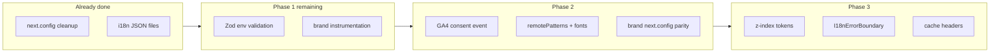

# MediaBubble Audit Fix Execution Plan

## Current state vs. the guides

A repo scan shows **2 of 8 prompts are already complete**; the guides were written against an earlier snapshot.

| Prompt | Guide says | Actual state |
|--------|------------|--------------|
| #1 Duplicate `next.config` | Critical blocker | **Done** — single export in [`apps/web-eg/next.config.js`](apps/web-eg/next.config.js) and [`apps/web-ae/next.config.js`](apps/web-ae/next.config.js) |
| #2 Missing i18n JSON | Create 4 files | **Done** — full dictionaries exist under `apps/*/lib/i18n/` |
| #3 Env validation | Replace with Zod | **Partial** — manual [`packages/shared/src/env.ts`](packages/shared/src/env.ts) + `validateEnv()` in web-eg/ae `instrumentation.ts` only |
| #4 GA4 consent race | Event-driven | **Partial** — focus-poll fallback; no `cookieConsentGranted` event |
| #5 Fonts/images | remotePatterns + Cairo weights | **Partial** — `remotePatterns: []`, Cairo still 5 weights, no `display: 'swap'` |
| #6 Z-index | CSS variables | **Partial** — tokens in `globals.css`; components use `z-[9999]`, `z-[200]`, etc. |
| #7 i18n error boundary | Create component | **Missing** |
| #8 Cache headers | Add `Cache-Control` | **Partial** — security headers only |

**Revised effort:** ~2–2.5 hours (not 3–4), because Prompts #1–#2 are verify-only.



---

## Phase 0 — Verify only (5 min)

No code changes unless verification fails.

1. Confirm each web app config has exactly one `module.exports` (already true).
2. Confirm i18n imports resolve:
   - web-eg / web-ae: `en.json`, `ar-masri.json` (web-ae also uses `ar-khaliji.json` intentionally — **do not overwrite**).
3. Baseline:

```bash
npm run typecheck
npm run build
```

---

## Phase 1 — Env validation + brand bootstrap (~30 min)

### 1a. Add Zod to shared package

- Add `zod` as a dependency of [`packages/shared/package.json`](packages/shared/package.json) (not root — keeps shared self-contained).
- Run install from repo root.

### 1b. Upgrade [`packages/shared/src/env.ts`](packages/shared/src/env.ts)

**Do not copy Prompt #3 verbatim** — it would require `NEXT_PUBLIC_GA4_ID` and break local dev when GA4 is empty in [`.env.example`](.env.example).

Adapted schema (per your choice):

- **Required:** `RESEND_API_KEY` (matches current `validateEnv()` behavior)
- **Optional with validation:** `NEXT_PUBLIC_GA4_ID` (string, warn if empty), `NEXT_PUBLIC_SITE_URL` (valid URL when set), `HUBSPOT_API_KEY`, `CONTACT_EMAIL`
- Keep exporting `validateEnv()` for [`instrumentation.ts`](apps/web-eg/instrumentation.ts) — implement it via `safeParse` + structured field errors
- Keep exporting typed `env` object for server code (Resend, HubSpot, etc.)

### 1c. Brand app env gate

Create [`apps/brand/instrumentation.ts`](apps/brand/instrumentation.ts) mirroring web-eg/ae:

```ts
if (process.env.NEXT_RUNTIME === 'nodejs') {
  const { validateEnv } = await import('@mediabubble/shared')
  validateEnv()
}
```

**Verify:** `npm run typecheck` and `nx run brand:build` (or full `npm run build`).

---

## Phase 2 — GA4, images, fonts (~45 min)

### 2a. GA4 consent (web-eg + web-ae only)

Brand has no `CookieConsent` / `GoogleAnalytics` — skip GA4 work for brand.

**[`apps/web-eg/components/CookieConsent.tsx`](apps/web-eg/components/CookieConsent.tsx)** (and web-ae copy):

In `handleChoice`, after `localStorage.setItem`:

```ts
if (choice === 'accepted') {
  window.dispatchEvent(new Event('cookieConsentGranted'))
}
```

**[`apps/web-eg/components/GoogleAnalytics.tsx`](apps/web-eg/components/GoogleAnalytics.tsx)** (and web-ae copy):

- Add `mounted` state to avoid hydration mismatch
- Listen for `cookieConsentGranted` + `storage` (cross-tab)
- Remove focus-poll workaround once event works
- Switch scripts to `strategy="lazyOnload"` and add `anonymize_ip: true` in gtag config

**Manual test:** `npm run dev:eg` → accept cookies without refocusing window → Network tab shows `gtag/js` load.

### 2b. `remotePatterns` (web-eg, web-ae, brand)

Update `images.remotePatterns` in all three `next.config.js` files:

```js
remotePatterns: [
  { protocol: 'https', hostname: 'images.unsplash.com' },
  { protocol: 'https', hostname: '**.mediabubble.co' },
],
formats: ['image/avif', 'image/webp'],
```

CSP already allows Unsplash in web configs; add equivalent when bringing brand config up to parity.

### 2c. Font optimization (all 3 apps)

In [`apps/web-eg/app/layout.tsx`](apps/web-eg/app/layout.tsx), [`apps/web-ae/app/layout.tsx`](apps/web-ae/app/layout.tsx), [`apps/brand/app/layout.tsx`](apps/brand/app/layout.tsx):

```ts
const cairo = Cairo({
  subsets: ['arabic', 'latin'],
  weight: ['400', '700', '900'],
  display: 'swap',
  variable: '--font-cairo',
})
```

**Verify:** `npm run build` — no Next Image hostname errors for testimonial photos.

---

## Phase 3 — UX hardening + performance (~45 min)

### 3a. Z-index (scoped first pass)

Per the guide, start with **CookieConsent** in web-eg and web-ae:

- Replace `z-[9999]` → `z-[var(--z-tooltip)]` (token = 600 in [`apps/web-eg/app/globals.css`](apps/web-eg/app/globals.css))

**Note:** Cookie consent should sit above modals; if banner appears under modals, bump token scale in all three `globals.css` files (e.g. add `--z-consent: 700`) rather than reverting to `9999`.

Optional follow-up (not in original 8 prompts): migrate `SiteNav.tsx`, `GitModal.tsx`, `NewsletterModal.tsx`, `FloatingCta.tsx` to tokens — defer unless you want full design-system consistency in this pass.

### 3b. i18n error boundary (web-eg, web-ae, brand)

Create [`apps/web-eg/components/I18nErrorBoundary.tsx`](apps/web-eg/components/I18nErrorBoundary.tsx) (copy to web-ae and brand).

**Fix the guide's bug:** import `Component` from `react` (guide only imports `ReactNode` but extends `React.Component`).

Wrap in:

- web-eg/ae: [`I18nLayoutWrapper.tsx`](apps/web-eg/components/I18nLayoutWrapper.tsx) — outermost wrapper around `I18nProvider`
- brand: [`apps/brand/app/layout.tsx`](apps/brand/app/layout.tsx) — wrap `<I18nProvider>{children}</I18nProvider>`

### 3c. Cache-Control headers (all 3 apps)

Extend `nextConfig.headers` in web-eg, web-ae, and brand (after adding security headers to brand). Merge with existing security block:

| Route pattern | Cache-Control |
|---------------|---------------|
| `/fonts/:path*` | `public, max-age=31536000, immutable` |
| `/images/:path*` | `public, max-age=604800` |
| `/assets/:path*` | `public, max-age=31536000, immutable` |
| `/_next/static/:path*` | `public, max-age=31536000, immutable` |
| HTML (exclude static asset paths) | `no-cache, no-store, must-revalidate` |

**Caution:** The guide's HTML regex `/:path((?!_next/static|fonts|images|assets).*)` is fragile in Next.js — prefer explicit static rules first, then a conservative catch-all for HTML. Test one built route with `curl -I`.

### 3d. Brand `next.config` parity

[`apps/brand/next.config.js`](apps/brand/next.config.js) is minimal today. Align with web apps:

- `images` block (remotePatterns + formats)
- CSP + security headers (adjust domains if brand uses fewer third parties)
- cache header rules from 3c

---

## Verification matrix

| Check | Command / action |
|-------|------------------|
| Types | `npm run typecheck` |
| All apps build | `npm run build` |
| Env validation | Start dev with missing `RESEND_API_KEY` → server should fail fast with clear Zod message |
| GA4 same-tab | Accept cookies → gtag loads without window refocus |
| Images | Build log free of "hostname not configured" for Unsplash |
| Error boundary | Temporarily throw in `I18nProvider` init → fallback UI, not white screen |
| Cache headers | `curl -I` on `/_next/static/...` and `/` after `nx run web-eg:start` |

---

## Files touched (summary)

**Create:** `apps/brand/instrumentation.ts`, `I18nErrorBoundary.tsx` (×3 apps)

**Update:** `packages/shared/package.json`, `packages/shared/src/env.ts`, `apps/*/next.config.js` (×3), `apps/*/app/layout.tsx` (×3), `CookieConsent.tsx` + `GoogleAnalytics.tsx` (web-eg/ae), `I18nLayoutWrapper.tsx` (web-eg/ae), `apps/brand/app/layout.tsx`

**Skip / verify only:** i18n JSON files, duplicate config cleanup

---

## Guide maintenance (optional, after execution)

Update [`QUICK_REFERENCE.md`](QUICK_REFERENCE.md) checkboxes to reflect completed items and note brand parity + adapted env schema — prevents re-running obsolete Prompts #1–#2.
