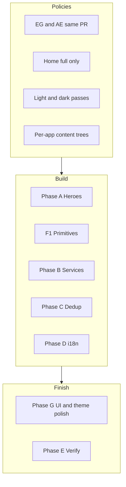
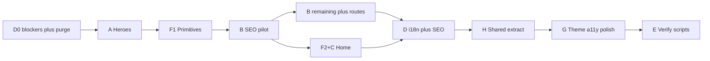

# MediaBubble — Content, Services, UI & Localization

## Executive summary

Overhaul marketing on **Egypt** ([`apps/web-eg`](apps/web-eg)) and **UAE** ([`apps/web-ae`](apps/web-ae)) with identical page structure, unique per-service layouts, deduplicated copy, full Arabic (Masri / Khaliji), and a **closing polish pass** that audits every route in **light and dark mode** before ship.

| Phase | Focus |
|-------|--------|
| **A** | Heroes — full home only; compact (`40vh`) everywhere else |
| **B** | Seven unique service pages via section registry |
| **C** | Deduplicate home / about / services index narratives |
| **D** | i18n, short CTAs, Arabic pipeline, legal, **market data purge**, technical SEO |
| **H** | **Shared component extraction** — reduce EG/AE drift |
| **F** | Design primitives + home rhythm + micro-UI foundations |
| **G** | **Final UI polish + dedicated light/dark mode passes** |
| **E** | Verification matrix (both apps, both themes, both locales) |

---

## Dual-market parity (mandatory)

**Every edit ships on both apps in the same PR slice.** No EG-only merges.

| Layer | Where | EG vs AE |
|-------|-------|----------|
| UI structure | Same routes, registry, hero policy | Identical layout order per slug |
| Primitives | [`packages/design-system`](packages/design-system) | Shared |
| Service sections | `components/features/services/sections/*` (both apps) | Same section IDs |
| Copy & SEO | `lib/content/services/*` + `public/locales/*` per app | Different EN, stats, imagery, legal, dialect |
| Theme polish | Phase G on both apps | Same token rules; market imagery only |

**Per-PR workflow:** build on `web-eg` → mirror structure to `web-ae` → fill AE content/locales → smoke both dev servers (light + dark toggle).

---

## What success looks like

1. **Seven service URLs** on both markets — bespoke layout per slug, market-specific copy.
2. **Home, About, Services index** — three distinct stories; no repeated "How we work" blocks.
3. **Hero policy** — only `/` is `100dvh`; all other routes use contact-style compact hero.
4. **Markets differ in content**, not in component architecture (Masri vs Khaliji, EG vs AE legal).
5. **Arabic** — no stray English; CTAs readable at 320px in RTL.
6. **SEO** — unique H1, meta, FAQs per URL × market.
7. **Light mode** — crisp contrast, readable navy/yellow CTAs, no gray-on-gray body text.
8. **Dark mode** — `html.dark` surfaces consistent; no static `bg-brand-*` hex that ignores theme; heroes and yellow CTAs stay legible.

---

## Codebase today

| Area | Location | Issue |
|------|----------|-------|
| Home hero | [`app/content.tsx`](apps/web-eg/app/content.tsx) | `full` — correct |
| Contact hero (reference) | [`app/contact/content.tsx`](apps/web-eg/app/contact/content.tsx) | `min-h-[40vh]` — target for non-home |
| Listing heroes | about / blog / portfolio / services | `medium` / `small` / default `full` — inconsistent |
| Service hero | [`ServicePageTemplate.tsx`](apps/web-eg/components/features/services/ServicePageTemplate.tsx) | `55vh`; hardcoded EN CTAs |
| Service body | Same template | Identical stack for all slugs |
| Service grid | [`ServicesSection.tsx`](apps/web-eg/components/sections/ServicesSection.tsx) | 7 cards; only 5 slugs in data → **broken links** (falls back to `/contact` until B6) |
| Theme | [`ThemeProvider`](packages/shared/src/theme/ThemeProvider.tsx), `mediabubble-theme`, `html.dark` | Mixed `dark:` pairs; some sections use static brand hex |
| **AE data leak** | `web-ae` testimonials, showcase, `services-data`, blog, contact | Hurghada/EG copy on UAE site |
| **AE Arabic** | `web-ae/public/locales/ar/` | Masri phrases (`عنّا`, `شوف`) — needs Khaliji pass |
| **SEO URLs** | [`sitemap.ts`](apps/web-ae/app/sitemap.ts), `robots.ts` | Both apps use `https://mediabubble.com` — wrong for per-market canonical |
| **Metadata** | `generateMetadata` on routes | Server EN meta; client AR toggle may not update `<title>` |
| Site config | [`resolveMarketSiteConfig`](packages/shared/src/site-config.ts) | EG `mediabubble.co` vs AE domain — underused in apps |



---

## Phase A — Hero system

**Rule:** `size="full"` only on `/`. All other routes → `compact` (contact height).

### A1 — `PageHero`

Extract from contact inline hero; align with [`HeroSection`](apps/web-eg/components/sections/HeroSection.tsx) `compact`:

- `min-h-[40vh]`, `pt-24 pb-14 sm:pt-32 sm:pb-16`
- Breadcrumb, kicker, H1, subtitle, optional CTAs (max 2)
- No scroll indicator off-home

**Both apps:** contact, about, services, portfolio, blog, service + detail pages.

Refactor existing heroes onto `PageHero`:

- [`ServicePageTemplate`](apps/web-eg/components/features/services/ServicePageTemplate.tsx) service hero (`55vh` today)
- [`CaseStudyHero`](apps/web-eg/components/features/blog/CaseStudyHero.tsx) on `portfolio/[slug]` (and blog detail if it uses a hero band)

### A2 — Home (full hero only)

- Keep `100dvh`; scroll cue on home only
- Inline `MetricStrip` (3 proof stats) inside hero fold

### A3 — Route map

| Route | Hero |
|-------|------|
| `/` | `full` |
| `/contact`, `/about`, `/services`, `/portfolio`, `/blog` | `compact` |
| `/services/[slug]`, `/portfolio/[slug]`, `/blog/[slug]` | `compact` |
| Legal (`/privacy`, `/terms`, `/cookies`) | `compact` |
| `/offline`, `not-found` | themed shell (no full hero) |

---

## Phase B — Unique service pages

Replace `ServicePageTemplate` with a **section registry** on both apps.

### B1 — Config (per market, same schema)

```
apps/web-eg/lib/content/services/   # EG copy
apps/web-ae/lib/content/services/   # UAE copy — no Hurghada leakage
```

`sections[]` order **must match** between EG and AE for the same slug.

### B2 — Per-service layouts (≥2 exclusive sections each)

| Service | Exclusive blocks |
|---------|------------------|
| **SEO** | rankingTimeline, localPack, auditChecklist |
| **PPC** | platformBadges, channelMatrix, budgetFramework |
| **Social** | contentCalendar, platformShowcase |
| **Branding** | beforeAfter, identityDeliverables |
| **Web** | techStack, performanceMetrics, launchChecklist |
| **Content** | editorialPillars, distributionMap |
| **Events** | eventTimeline, venueShowcase |

**Pilot:** SEO on web-eg + web-ae → roll to remaining six.

### B3 — `ServicePageRenderer` (both apps)

Registry maps `ServiceSectionId` → section component; render `config.sections` in order.

### B4 — Component sourcing

1. [`packages/design-system`](packages/design-system)
2. shadcn blocks (FAQ, stats, bento)
3. Licensed motion libs — brand tokens only
4. `components/features/services/sections/`

Log in [`docs/content/service-component-inventory.md`](docs/content/service-component-inventory.md).

### B5 — SEO

Unique H1/meta/FAQ per slug × market; FAQ JSON-LD from slug `faqs`; `arabic-seo-optimizer` before AR copy.

### B6 — Content + Events routes (both apps)

The services grid links to `content` and `events` but [`SERVICE_SLUGS`](apps/web-eg/lib/services-data.ts) only lists five slugs → 404 risk.

- Add `content.ts` + `events.ts` to each app's `lib/content/services/`
- `[slug]/page.tsx` must resolve all 7 slugs; `notFound()` for unknown slugs
- Align [`ServicesSection`](apps/web-eg/components/sections/ServicesSection.tsx) card `href`s with the registry
- Refresh per-slug `opengraph-image.tsx` when layouts change

---

## Phase C — Deduplicate pages (EG + AE)

| Page | Owns | Remove / replace |
|------|------|------------------|
| **Home** | Value, services preview, one proof band, showcase | `ProcessSection` → `WhyUsStrip` |
| **About** | Story, team, partnership angle | Generic 4-step → `AboutMethodologySection` |
| **Services index** | Grid + `ComparisonTable` | `ProcessSection` → `ServicesDeliverySection` |

**CTA rule:** one yellow `CtaSection` per page max.

### F2 — Home section order (target)

1. Hero (`full`, navy)
2. Features (light surface)
3. Showcase (proof early)
4. Services (bento/asymmetric where possible)
5. One proof band — logos **or** stats
6. `WhyUsStrip`
7. Testimonials
8. Single `CtaSection`

---

## Phase F — Design system & micro-UI foundations

Runs parallel to B; primitives before service sections.

### F1 — Primitives (design-system)

| Primitive | Used on |
|-----------|---------|
| `MetricStrip` | Home hero, service heroes, case studies |
| `TimelineSection` | SEO, Events, About |
| `BentoGrid` | Branding, Features |
| `FaqAccordion` | All service FAQs |
| `ComparisonTable` | Services index |
| `TabbedShowcase` | Social, PPC |
| `LogoMarquee` | Client logos (optional) |

**Theme requirement:** every new primitive ships with paired light + `dark:` classes using semantic tokens (`bg-brand-surface`, `text-brand-text-muted`, `border-brand-whisper-border`) — not raw hex-only `bg-brand-navy`.

### F3 — Micro-UI foundations (before final pass)

- One kicker system (yellow uppercase); no site-wide "How we work" reuse
- Card hover parity with [`ServicesSection`](apps/web-eg/components/sections/ServicesSection.tsx)
- RTL-safe horizontal motion (testimonials pattern)
- Arabic line-height on kickers; short CTAs at 320px
- EG vs AE imagery only — same components

### F4 — Anti-patterns

- Identical feature grids on every service
- 4-step process on home + about + services + every detail page
- Multiple yellow CTA bands
- Scroll animation on every section
- Static `bg-brand-*` without `dark:` on new sections

---

## Phase G — Final UI polish & theme passes

**When:** after Phases A–F and D are functionally complete (PR 7 merged). **Not** a one-line tweak — a dedicated audit pass on both apps before release.

Invoke [`impeccable`](.agents/skills/impeccable/SKILL.md) / design-taste checklist for spacing, hierarchy, and motion restraint.

### G0 — Theme contract (fix once, both apps)

| Rule | Implementation |
|------|----------------|
| Class-based dark | `html.dark` via [`ThemeProvider`](packages/shared/src/theme/ThemeProvider.tsx); key `mediabubble-theme` |
| Surfaces | `bg-brand-surface`, `bg-brand-navy/40` in dark — not naked `bg-white` / `bg-brand-off-white` blocks |
| Text | Headings `text-brand-navy dark:text-brand-off-white`; body `text-brand-secondary dark:text-brand-text-muted` |
| Borders | `border-brand-whisper-border dark:border-white/10` or `dark:border-brand-light-border` |
| CTAs | Use [`button-styles`](packages/design-system/src/lib/button-styles.ts) variants; yellow primary readable in both modes |
| Avoid | Tailwind `bg-brand-yellow` / `bg-brand-navy` alone on large surfaces without dark pair |

Audit script (manual grep per PR slice): sections missing `dark:` on `bg-`, `text-`, `border-`, or `shadow-`.

### G1 — Light-mode pass

Screenshot every route in **light** (system + forced light via theme toggle):

| Route group | Light-mode checks |
|-------------|-------------------|
| `/` | Hero gradient/text; metric strip; section alternation (navy vs off-white) |
| about, services, contact | Compact hero contrast; breadcrumb legibility |
| 7 service slugs | Exclusive sections: tables, timelines, cards — no low-contrast gray text |
| blog, portfolio (+ 1 detail each) | Cards, filters, metadata |
| legal (privacy, terms, **cookies**) | Long-form readability |
| errors / offline | Not washed out on white |

**Pass:** WCAG-ish contrast on body text; yellow CTA text stays navy; focus rings visible.

### G2 — Dark-mode pass

Repeat same route matrix with **`html.dark`** active:

| Check | Fail examples to fix |
|-------|----------------------|
| Hero overlays | Text lost on dark navy gradients |
| Cards | White cards floating on dark body without border |
| Yellow CTA band | Yellow on dark navy — verify button + link contrast |
| Images / showcases | Borders and captions in dark |
| Form inputs | [`Input.tsx`](packages/design-system/src/lib/Input.tsx) pattern on contact |
| Marquees / carousels | Testimonials, logos — border + shadow in dark |
| Service exclusives | Tables, chips, timeline nodes |

**Pass:** no "light-only" sections; theme toggle does not flash wrong colors (FOUC already handled by `THEME_INIT_SCRIPT`).

### G3 — Final UI polish (cross-cutting)

After G1 + G2 fixes:

- **Spacing rhythm:** consistent `section` padding (`py-16` / `lg:py-24`); no cramped FAQ or hero subtitle
- **Typography:** display scale on H1/H2; line-length on paragraphs (`max-w-prose` where needed)
- **Motion:** hero + one scroll reveal max; respect `prefers-reduced-motion`
- **Focus:** `focus-visible:ring-2 focus-visible:ring-brand-blue` on interactive controls
- **RTL (AR):** nav, marquees, carousel arrows, breadcrumb chevrons, form labels
- **Mobile:** 320px — nav, floating CTA, service tables scroll horizontally if needed
- **Nav + footer:** theme toggle, language switcher, active states in both modes

**Deliverable:** before/after screenshot set per market (EG + AE) × light/dark × EN (AR spot-check on home + 1 service).

### G4 — Accessibility pass (both apps)

Beyond focus rings — run once before PR 9 merge:

| Area | Check |
|------|--------|
| Contact form | Labels, `aria-invalid`, error text i18n, keyboard submit |
| `FaqAccordion` | `aria-expanded`, heading buttons |
| Carousels / marquees | Pause control or `prefers-reduced-motion: reduce` → static fallback |
| Nav | Mobile trap focus, escape close, `aria-current` on active route |
| Skip link | Present and visible on focus |
| Color | G1/G2 contrast; don't rely on color alone for audit pass/fail chips |
| Images | Meaningful `alt` on showcase/portfolio; decorative `aria-hidden` on blobs |

Optional: BrowserStack or axe spot-check on home + contact + 1 service.

---

## Phase D — Localization, markets & technical SEO

### D0 — Blockers (fix in PR 1)

1. [`web-ae` LanguageSwitcher](apps/web-ae/components/shared/LanguageSwitcher.tsx): `ar-masri` → `ar` (Arabic never loads).
2. **Quick grep gate:** zero `Hurghada` / `Red Sea` / `Egypt` in `apps/web-ae` runtime copy (exclude comments).

### D0b — Market data purge (`web-ae`)

Replace EG-leaked content with UAE-native data in **both EN and AR**:

| Source file | Fix |
|-------------|-----|
| [`lib/services-data.ts`](apps/web-ae/lib/services-data.ts) | Dubai/UAE meta, hero, case study |
| [`lib/data/case-studies.ts`](apps/web-ae/lib/data/case-studies.ts) | UAE portfolio entries |
| [`lib/data/blog-posts.ts`](apps/web-ae/lib/data/blog-posts.ts) | UAE-relevant posts (remove Hurghada tourism copy) |
| `TestimonialsSection`, `ShowcaseSection` fallbacks | Move Hurghada quotes/subtitles out of shared TSX into `lib/data/testimonials.ts` + `lib/data/showcase.ts` per app (EG Red Sea vs AE Dubai) |
| `ContactSection`, `SiteNav`, footer | UAE address, phone, logo alt |
| `public/locales/en|ar/translation.json` | Market stats, hero, about — not EG clones |

Run [`scripts/clarify-marketing-ae.mjs`](scripts/clarify-marketing-ae.mjs) after purge; EG uses [`clarify-marketing-ar-eg.mjs`](scripts/clarify-marketing-ar-eg.mjs).

### D2b — Portfolio & blog trees (per market)

Mirror service-content pattern:

```
apps/web-eg/lib/data/{case-studies,blog-posts}.ts
apps/web-ae/lib/data/{case-studies,blog-posts}.ts
```

i18n keys for listing/detail chrome; body copy can stay in data files until a later CMS migration.

### D1 — Wire hardcoded UI (both apps)

Legal, errors, offline, `FloatingCta`, service chrome, blog/portfolio labels → `t()`.

### D1b — Short CTAs

| Role | EN | AR |
|------|-----|-----|
| Primary | `Free audit` | `تقييم مجاني` |
| Secondary | `Book a call` | `احجز مكالمة` / `احجز اتصال` |

### D2 — Locale JSON

Same key structure in both apps; values differ by market/dialect.

### D1c — Metadata vs client locale

`generateMetadata` runs server-side (English defaults today). Toggling AR in the browser may not update `<title>` / OG tags.

**Options (pick in PR 6):**

1. **Document** — acceptable for v1 if H1/body are fully translated client-side; SEO titles stay EN until URL locales exist.
2. **Improve** — pass locale cookie/header into metadata helpers where Next allows; or duplicate key meta in layout client effect (last resort).

At minimum: unique **per-route** `generateMetadata` reading from market content config (not shared EG strings on AE).

### D3 — Arabic pipeline

`arabic-content-strategist` → `arabic-creator` → `arabic-seo-optimizer` → **`arabic-qa` (gate)**

Masri (`web-eg`), Khaliji (`web-ae`).

### D3b — Khaliji audit (`web-ae` AR)

Current `web-ae` Arabic locale file uses Masri register (`عنّا`, `شوف`, etc.). Full Khaliji rewrite required — not a straight copy from `web-eg` AR. Gate with `arabic-khaliji` + `arabic-qa`.

### D4 — Legal

Egypt vs UAE jurisdiction — separate EN + AR bodies.

### D5 — Technical SEO (per market)

Use [`resolveMarketSiteConfig`](packages/shared/src/site-config.ts) (`eg` → `mediabubble.co`, `ae` → AE domain):

| File | Fix |
|------|-----|
| `app/sitemap.ts` | `BASE` from market config; include all 7 service slugs after B6 |
| `app/robots.ts` | Correct sitemap URL per deployment |
| `layout.tsx` / page metadata | `metadataBase`, default title/description from market config |
| [`buildMarketJsonLd`](packages/shared/src/seo/) | Organization + LocalBusiness per market (address, areaServed) |
| [`packages/shared/src/seo/json-ld.ts`](packages/shared/src/seo/json-ld.ts) | Expand hardcoded 5-slug `SERVICE_SLUGS` to 7 (or import from app config) so `hasOfferCatalog` lists content + events |
| `opengraph-image.tsx` routes | Market-appropriate titles (not Hurghada on AE) |

**Out of scope reminder:** `/ar/` URL locales — but canonicals must still differ EG vs AE deployments.

---

## Phase H — Shared components (reduce drift)

`web-eg` and `web-ae` duplicate large trees (`SiteNav`, sections, service template). Drift caused the AE Hurghada leak.

**Strategy (incremental, same PR as the feature):**

1. **Move to `packages/design-system`** — primitives only (F1).
2. **Move to `packages/shared` or `@mediabubble/marketing-ui`** — layout + section components that are byte-identical except market config props.
3. **Keep per-app** — `lib/content/*`, locales, legal, market-specific fallbacks in testimonials/showcase until data-driven.

**Drift checklist per PR:** if you edit a file under `apps/web-eg/components/`, confirm `apps/web-ae/components/` equivalent or extract to shared.

---

## Phase E — Verification matrix

| Check | Pass (web-eg **and** web-ae) |
|-------|------------------------------|
| Heroes | Home `100dvh`; others compact |
| Services | 7 distinct `sections[]`; visual diff between slugs |
| Dedup | No shared process block across home/about/services |
| Home rhythm | Showcase before methodology; ≤1 proof band; ≤1 CTA |
| i18n | EN↔AR full page; parity script green |
| Markets | No cross-market place names in body copy |
| **Light mode** | G1 route matrix — no contrast failures |
| **Dark mode** | G2 route matrix — no unpaired surfaces |
| **RTL** | AR on home, contact, 1 service — nav/marquee/CTA OK |
| SEO | Unique title/H1 per URL; market-correct canonicals |
| **A11y** | G4 checklist — forms, accordion, nav, reduced motion |
| **Scripts** | `clarify-marketing-*`, `copy-audit`, `image-audit`; `check-i18n-parity.mjs` green |
| **Build** | `nx run web-eg:build` and `nx run web-ae:build` pass (each PR slice before merge) |
| **Routes** | All 7 service slugs 200; invalid slug 404 |
| **AE grep** | No Hurghada/EG geography in `web-ae` user-visible copy |

### Automation (Phase E prep)

| Script | When |
|--------|------|
| [`scripts/clarify-marketing-ar-eg.mjs`](scripts/clarify-marketing-ar-eg.mjs) | After EG Arabic batches |
| [`scripts/clarify-marketing-ae.mjs`](scripts/clarify-marketing-ae.mjs) | After AE EN + Khaliji AR |
| [`scripts/copy-audit.js`](scripts/copy-audit.js) | Browser console on key routes (weak CTAs, H1) |
| [`scripts/image-audit.js`](scripts/image-audit.js) | Missing alt, oversized assets |
| **`scripts/check-i18n-parity.mjs`** (create) | EN/AR key parity per app; fail CI if keys missing |

**Evidence minimum per release:** 4 routes × 2 themes × 2 locales × 2 apps = document spot-checks; full matrix before final PR 9 merge.

---

## Execution order



### PR slices (EG + AE each)

| PR | Scope |
|----|--------|
| **1** | D0 + **D0b starter** (locale switcher + grep Hurghada on AE) + Phase A heroes |
| **2** | F1 primitives + `service-component-inventory.md` + **H** policy doc |
| **3** | B pilot — SEO registry (both apps) |
| **4** | B — remaining 6 services + **B6** content/events routes + **D2b** portfolio/blog split started |
| **5** | F2 + C — home reorder, page dedup, `ComparisonTable` |
| **6** | D1/D1b/D1c — i18n wiring, short CTAs, metadata notes |
| **7** | D2–D4, **D3b** Khaliji, **D5** sitemap/robots/JSON-LD, legal, **automation scripts** |
| **8** | F3 micro-UI + **D0b complete** (all AE market data) |
| **9** | **Phase G** (G1–G4) + Phase E full matrix |

**Merge gate:** same routes updated on both apps; PR 9 required before calling the overhaul complete.

---

## Key files

| Change | web-eg | web-ae | Shared |
|--------|--------|--------|--------|
| Hero / PageHero | `HeroSection.tsx`, `PageHero.tsx` | mirror | — |
| Home | `app/content.tsx` | mirror | — |
| Dedup pages | `about/`, `services/` content | mirror | — |
| Service registry | `ServicePageRenderer.tsx`, `sections/*` | mirror | types in `packages/shared` optional |
| Content | `lib/content/services/*` | UAE tree | — |
| Portfolio/blog | `lib/data/case-studies.ts`, `blog-posts.ts` | UAE data | — |
| Technical SEO | `sitemap.ts`, `robots.ts`, layout metadata | mirror | `packages/shared/site-config.ts`, `seo/json-ld.ts` |
| Primitives | — | — | `packages/design-system` |
| Shared UI (H) | TBD extraction targets | mirror | `packages/shared` marketing-ui (incremental) |
| Theme | `app/globals.css`, layout providers | mirror | `packages/shared` ThemeProvider |
| i18n | `public/locales/*` | Khaliji AR | `scripts/check-i18n-parity.mjs` (create) |
| Automation | — | — | `clarify-marketing-*`, `copy-audit.js`, `image-audit.js` |
| AE locale bug | — | `LanguageSwitcher.tsx` | — |

---

## Out of scope

- URL-prefixed locales (`/ar/about`) — document metadata limitation in D1c instead
- Runtime machine translation
- `apps/brand`
- Unlicensed npm UI kits
- Full blog/portfolio **article** rewrites (market-correct **stubs** + i18n chrome in scope via D2b)
- Single shared codebase package for entire `apps/web-*` (incremental H only)

---

## Arabic skills (reference)

[`.cursor/skills/arabic-*`](.cursor/skills/) + [arabic-content-pipeline rule](.cursor/rules/arabic-content-pipeline.mdc):

strategist → cultural-advisor / khaliji → creator → seo-optimizer → **qa (gate)**
