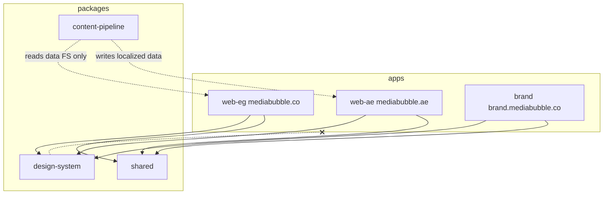
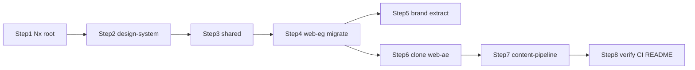

# MediaBubble Nx Monorepo Migration Plan

## Current state (verified)

- **No Nx yet** — root has single-app layout: [`app/`](app/), [`components/`](components/), [`lib/`](lib/), [`public/`](public/), [`tailwind.config.ts`](tailwind.config.ts), [`package.json`](package.json) (npm, Next 14).
- **Package manager:** npm (`package-lock.json`, [`.github/workflows/ci.yml`](.github/workflows/ci.yml)).
- **Brand + marketing coexist** — `/brand` in [`app/brand/page.tsx`](app/brand/page.tsx); will be **removed from web-eg** per your choice.
- **UI primitives** live in [`components/ui/`](components/ui/) — only `Button`, `Card`, `MasterSwatch`, `SectionHeader` move to design-system; brand-specific `ColorFamilyCard`, `ToneBarVertical`, `TooltipHint`, `utils.ts` stay in `apps/brand`.
- **Token note:** [`tailwind.config.ts`](tailwind.config.ts) uses `brand.charcoal: #333333` and `brand.deep-charcoal: #0D0F12`. The preset will follow **CONTEXT.md canonical tokens** (`brand-charcoal` → `#0D0F12`) and keep extended palette keys (`whisper-border`, semantic colors) so existing class names keep working.

## Target architecture



**Dependency rule:** `packages/design-system` and `packages/shared` must never import from `apps/*`. Enforced via `@nx/enforce-module-boundaries` + project tags.

---

## Step 1 — Nx initialization and root config

### 1.1 Install Nx into the existing repo

```bash
cd "/Users/Dorgham/Documents/Work/Devleopment/mediiabubble Main"
npx nx@latest init
```

When prompted: enable **integrated monorepo**, caching, and (if offered) ESLint plugin.

Then add plugins:

```bash
npm install -D nx @nx/next @nx/react @nx/js @nx/eslint @nx/rollup @nx/workspace eslint @nx/eslint-plugin
```

### 1.2 Root [`package.json`](package.json) — workspaces + Nx scripts

```json
{
  "name": "@mediabubble/workspace",
  "private": true,
  "workspaces": ["apps/*", "packages/*"],
  "scripts": {
    "dev": "nx run web-eg:dev",
    "dev:eg": "nx run web-eg:dev",
    "dev:ae": "nx run web-ae:dev",
    "dev:brand": "nx run brand:dev",
    "build": "nx run-many -t build",
    "lint": "nx run-many -t lint",
    "typecheck": "nx run-many -t typecheck",
    "graph": "nx graph"
  }
}
```

Hoist existing deps (`next`, `react`, `tailwindcss`, `i18next`, etc.) to root; apps reference them via workspace.

### 1.3 [`nx.json`](nx.json) — task pipelines

```json
{
  "$schema": "./node_modules/nx/schemas/nx-schema.json",
  "defaultBase": "main",
  "namedInputs": {
    "default": ["{projectRoot}/**/*", "sharedGlobals"],
    "production": [
      "default",
      "!{projectRoot}/**/*.stories.tsx",
      "!{projectRoot}/**/*.test.tsx"
    ],
    "sharedGlobals": ["{workspaceRoot}/tsconfig.base.json"]
  },
  "targetDefaults": {
    "build": {
      "dependsOn": ["^build"],
      "inputs": ["production", "^production"],
      "cache": true
    },
    "dev": { "cache": false },
    "lint": { "inputs": ["default", "{workspaceRoot}/.eslintrc.json"], "cache": true },
    "typecheck": { "dependsOn": ["^build"], "cache": true },
    "localize": { "cache": false }
  },
  "plugins": [
  ]
}
```

### 1.4 [`tsconfig.base.json`](tsconfig.base.json) — path aliases

```json
{
  "compileOnSave": false,
  "compilerOptions": {
    "rootDir": ".",
    "sourceMap": true,
    "declaration": false,
    "moduleResolution": "node",
    "emitDecoratorMetadata": true,
    "experimentalDecorators": true,
    "importHelpers": true,
    "target": "es2015",
    "module": "esnext",
    "lib": ["es2020", "dom"],
    "skipLibCheck": true,
    "skipDefaultLibCheck": true,
    "baseUrl": ".",
    "paths": {
      "@mediabubble/design-system": ["packages/design-system/src/index.ts"],
      "@mediabubble/shared": ["packages/shared/src/index.ts"],
      "@mediabubble/content-pipeline": ["packages/content-pipeline/src/index.ts"]
    },
    "strict": true,
    "jsx": "preserve",
    "esModuleInterop": true,
    "resolveJsonModule": true,
    "isolatedModules": true
  },
  "exclude": ["node_modules", "tmp"]
}
```

Each app gets its own `tsconfig.json` extending base + `@/*` → app root (e.g. `apps/web-eg/*`).

### 1.5 Module boundaries — [`.eslintrc.json`](.eslintrc.json)

```json
{
  "root": true,
  "ignorePatterns": ["**/*"],
  "plugins": ["@nx"],
  "overrides": [
    {
      "files": ["*.ts", "*.tsx", "*.js", "*.jsx"],
      "rules": {
        "@nx/enforce-module-boundaries": [
          "error",
          {
            "enforceBuildableLibDependency": true,
            "allow": [],
            "depConstraints": [
              {
                "sourceTag": "type:app",
                "onlyDependOnLibsWithTags": ["type:lib", "type:design-system"]
              },
              {
                "sourceTag": "type:design-system",
                "onlyDependOnLibsWithTags": ["type:lib"]
              },
              {
                "sourceTag": "type:lib",
                "onlyDependOnLibsWithTags": ["type:lib"]
              },
              {
                "sourceTag": "type:pipeline",
                "onlyDependOnLibsWithTags": ["type:lib"]
              },
              {
                "sourceTag": "scope:design-system",
                "notDependOnLibsWithTags": ["scope:app"]
              }
            ]
          }
        ]
      }
    }
  ]
}
```

**Tag matrix** (set in each `project.json`):

| Project | Tags |
|---------|------|
| `design-system` | `type:design-system`, `scope:design-system` |
| `shared`, `content-pipeline` | `type:lib`, `scope:shared` |
| `web-eg`, `web-ae`, `brand` | `type:app`, `scope:app` |

The `notDependOnLibsWithTags: ["scope:app"]` rule on design-system enforces **packages/design-system CANNOT import from apps/**.

---

## Step 2 — Publishable design system (`packages/design-system`)

### 2.1 Generate library (your choice: React + Rollup)

```bash
nx g @nx/react:library design-system \
  --directory=packages/design-system \
  --bundler=rollup \
  --importPath=@mediabubble/design-system \
  --unitTestRunner=none \
  --no-interactive
```

### 2.2 [`packages/design-system/src/tailwind-preset.ts`](packages/design-system/src/tailwind-preset.ts)

```ts
import type { Config } from 'tailwindcss'
import tailwindcssRtl from 'tailwindcss-rtl'

export const mbPreset: Partial<Config> = {
  darkMode: ['class'],
  theme: {
    extend: {
      fontFamily: {
        sans: ['var(--font-inter)', 'system-ui', 'sans-serif'],
        display: ['var(--font-poppins)', 'system-ui', 'sans-serif'],
        mono: ['var(--font-mono)', 'monospace'],
        arabic: ['var(--font-cairo)', 'system-ui', 'sans-serif'],
      },
      colors: {
        brand: {
          yellow: '#FFC107',
          blue: '#2196F3',
          'dark-blue': '#1565C0',
          navy: '#072A6B',
          charcoal: '#0D0F12',
          canvas: '#FAFAFA',
          // preserve extended tokens used in codebase
          'yellow-dark': '#92610B',
          'deep-charcoal': '#0D0F12',
          'muted-steel': '#9E9E9E',
          secondary: '#666666',
          'light-border': '#F5F5F5',
          'whisper-border': '#E8E8E8',
          'input-border': '#E0E0E0',
          surface: '#FFFFFF',
          success: '#16A34A',
          'success-bg': '#DCFCE7',
          warning: '#CA8A04',
          'warning-bg': '#FEF9C3',
          error: '#DC2626',
          'error-bg': '#FEE2E2',
          info: '#0369A1',
          'info-bg': '#E0F2FE',
        },
      },
      borderRadius: { lg: '12px', xl: '16px' },
    },
  },
  plugins: [tailwindcssRtl],
}

export default mbPreset
```

### 2.3 Move primitives

From [`components/ui/`](components/ui/) → `packages/design-system/src/lib/`:

- `Button.tsx`, `Card.tsx`, `MasterSwatch.tsx`, `SectionHeader.tsx`

[`packages/design-system/src/index.ts`](packages/design-system/src/index.ts):

```ts
export * from './lib/Button'
export * from './lib/Card'
export * from './lib/MasterSwatch'
export * from './lib/SectionHeader'
export { mbPreset, default as mbTailwindPreset } from './tailwind-preset'
```

Add `"use client"` only where components need it (Button/Card).

### 2.4 NPM-ready [`packages/design-system/package.json`](packages/design-system/package.json)

```json
{
  "name": "@mediabubble/design-system",
  "version": "0.1.0",
  "type": "module",
  "main": "./dist/index.cjs.js",
  "module": "./dist/index.esm.js",
  "types": "./dist/index.d.ts",
  "exports": {
    ".": {
      "import": "./dist/index.esm.js",
      "require": "./dist/index.cjs.js",
      "types": "./dist/index.d.ts"
    },
    "./tailwind-preset": {
      "import": "./dist/tailwind-preset.esm.js",
      "require": "./dist/tailwind-preset.cjs.js",
      "types": "./dist/tailwind-preset.d.ts"
    },
    "./package.json": "./package.json"
  },
  "peerDependencies": {
    "react": "^18.2.0",
    "react-dom": "^18.2.0",
    "tailwindcss": "^3.3.0"
  },
  "files": ["dist", "README.md"]
}
```

Configure Rollup entry for `tailwind-preset.ts` in `project.json` / `rollup.config` so preset ships separately.

---

## Step 3 — Shared utilities (`packages/shared`)

### 3.1 Generate

```bash
nx g @nx/js:lib shared --directory=packages/shared --bundler=none --importPath=@mediabubble/shared --no-interactive
```

### 3.2 Move from [`lib/`](lib/)

| Source | Destination |
|--------|-------------|
| `lib/utils/*` | `packages/shared/src/utils/` |
| `lib/ga4-events.ts` | `packages/shared/src/ga4-events.ts` |
| `lib/env.ts` | `packages/shared/src/env.ts` |
| `lib/rate-limit.ts` | `packages/shared/src/rate-limit.ts` |

### 3.3 Extract API clients (new files)

Refactor logic out of [`app/api/contact/route.ts`](app/api/contact/route.ts) and [`app/api/hubspot/route.ts`](app/api/hubspot/route.ts):

- `packages/shared/src/hubspot-client.ts` — `upsertContact`, `patchContact`
- `packages/shared/src/resend-client.ts` — `sendContactEmail`

API routes in apps become thin wrappers:

```ts
import { sendContactEmail } from '@mediabubble/shared/resend-client'
import { upsertContact } from '@mediabubble/shared/hubspot-client'
```

### 3.4 Shared i18n core (enables Step 6)

Move **framework only** (not locale JSON) to shared:

- `I18nProvider.tsx`, `useLanguage.ts`, `createI18nInstance(resources, options)`

Each app passes its own `en` + dialect JSON at bootstrap.

[`packages/shared/src/index.ts`](packages/shared/src/index.ts) re-exports utils, env, clients, i18n factory.

---

## Step 4 — Migrate monolith → `apps/web-eg`

### 4.1 Generate app

```bash
nx g @nx/next:app web-eg --directory=apps/web-eg --style=tailwind --no-interactive
```

### 4.2 Move files (git mv preferred)

| From (root) | To |
|-------------|-----|
| `app/*` **except** `app/brand/` | `apps/web-eg/app/` |
| `components/marketing/` | `apps/web-eg/components/marketing/` |
| `components/I18nLayoutWrapper.tsx`, `CookieConsent.tsx`, `GoogleAnalytics.tsx`, `LanguageSwitcher.tsx` | `apps/web-eg/components/` |
| `components/layout/Sidebar.tsx` | `apps/web-eg/components/layout/` |
| `lib/data/`, `lib/services-data.ts` | `apps/web-eg/lib/` |
| `lib/i18n/en.json`, `ar-masri.json` | `apps/web-eg/lib/i18n/` |
| `public/` | `apps/web-eg/public/` |
| `instrumentation.ts` | `apps/web-eg/instrumentation.ts` |
| `next.config.js`, `postcss.config.js`, `app/globals.css` | `apps/web-eg/` |

**Do not move:** `components/BrandGuidelinesApp.tsx`, `components/sections/*`, `components/skill-tree/*`, `components/constants.ts`, `components/sizes.ts`, brand-only `components/ui/*`.

### 4.3 [`apps/web-eg/tailwind.config.ts`](apps/web-eg/tailwind.config.ts)

```ts
import type { Config } from 'tailwindcss'
import { mbPreset } from '@mediabubble/design-system/tailwind-preset'

const config: Config = {
  presets: [mbPreset as Config],
  content: [
    './app/**/*.{ts,tsx}',
    './components/**/*.{ts,tsx}',
    '../../packages/design-system/src/**/*.{ts,tsx}',
  ],
  plugins: [require('tailwindcss-animate')],
}
export default config
```

### 4.4 Import rewrites (codemod)

Replace across `apps/web-eg`:

- `@/components/ui/Button` etc. → `@mediabubble/design-system`
- `@/lib/env`, `@/lib/rate-limit`, `@/lib/ga4-events`, `@/lib/utils/*` → `@mediabubble/shared`
- Keep `@/*` for app-local paths (`@/components/marketing`, `@/lib/data`)

### 4.5 Preserve critical features

- [`I18nLayoutWrapper`](components/I18nLayoutWrapper.tsx) — wire to shared i18n + Masri JSON
- [`Phase3Provider`](components/marketing/Phase3Provider.tsx) / `InteractiveCursor` — stay in web-eg marketing
- JSON-LD `LocalBusiness` in [`app/layout.tsx`](app/layout.tsx) — keep in web-eg layout (update `metadataBase` → `https://mediabubble.co`)

### 4.6 Delete root monolith artifacts

After verification: remove root `app/`, `components/`, `lib/`, `public/`, root `next.config.js`, root `tailwind.config.ts`, root `tsconfig.json` (replaced by base + app configs).

---

## Step 5 — Extract `apps/brand`

### 5.1 Generate

```bash
nx g @nx/next:app brand --directory=apps/brand --style=tailwind --no-interactive
```

### 5.2 Move brand-only code

| Source | Destination |
|--------|-------------|
| `components/BrandGuidelinesApp.tsx` | `apps/brand/components/` |
| `components/sections/*` | `apps/brand/components/sections/` |
| `components/skill-tree/*` | `apps/brand/components/skill-tree/` |
| `components/constants.ts`, `sizes.ts` | `apps/brand/components/` |
| `components/ui/ColorFamilyCard.tsx`, `TooltipHint.tsx`, `ToneBarVertical.tsx`, `utils.ts` | `apps/brand/components/ui/` |
| `lib/data/arabic-taxonomy.ts`, `arabic-agents.ts` | `apps/brand/lib/data/` |
| `lib/utils/fuzzy-search.ts`, `enrich-node.ts`, `taxonomy-export.ts`, `use-progress.ts` | `apps/brand/lib/utils/` (brand-specific; shared keeps debounce/fuzzy if used by marketing) |

App entry: `apps/brand/app/page.tsx` renders `<BrandGuidelinesApp />` (no `/brand` subpath — app root **is** the guidelines).

Tailwind: same `mbPreset` pattern as web-eg.

Brand can share `LanguageSwitcher` + i18n via `@mediabubble/shared` with its own locale JSON (can copy Masri files initially).

---

## Step 6 — Clone `apps/web-ae` (structural parity)

### 6.1 Generate empty shell

```bash
nx g @nx/next:app web-ae --directory=apps/web-ae --style=tailwind --no-interactive
```

### 6.2 [`scripts/clone-eg-to-ae.ts`](scripts/clone-eg-to-ae.ts)

```ts
#!/usr/bin/env npx tsx
import { cpSync, existsSync, rmSync } from 'node:fs'
import { join, resolve } from 'node:path'

const ROOT = resolve(__dirname, '..')
const SRC = join(ROOT, 'apps/web-eg')
const DST = join(ROOT, 'apps/web-ae')
const DIRS = ['app', 'components', 'lib'] as const

for (const dir of DIRS) {
  const target = join(DST, dir)
  if (existsSync(target)) rmSync(target, { recursive: true, force: true })
  cpSync(join(SRC, dir), target, { recursive: true })
  console.log(`Cloned ${dir}/ → apps/web-ae/${dir}/`)
}

console.log('\nDone. Next: customize web-ae i18n + metadata for UAE.')
```

**You run after web-eg migration is green:**

```bash
npx tsx scripts/clone-eg-to-ae.ts
```

Also copy `public/` and `instrumentation.ts` in the same script (add to `DIRS` or separate `cpSync` calls).

### 6.3 Post-clone UAE deltas (manual, not content pipeline yet)

- `apps/web-ae/tailwind.config.ts` — `mbPreset` (identical to web-eg)
- `apps/web-ae/lib/i18n/` — add `ar-khaliji.json` (or `ar-uae.json`); update i18n bootstrap:
  - `supportedLngs: ['en', 'ar']`
  - `ar` resource → Khaliji/MSA file (not `ar-masri.json`)
- `apps/web-ae/app/layout.tsx` — `metadataBase: https://mediabubble.ae`, JSON-LD address → UAE
- `apps/web-ae/project.json` — `dev` on port `3001` to run alongside web-eg

**Do not** hand-edit 100+ cloned files in the plan — clone script handles structure; localization is Step 7.

---

## Step 7 — Content pipeline (`packages/content-pipeline`)

### 7.1 Generate

```bash
nx g @nx/js:lib content-pipeline --directory=packages/content-pipeline --bundler=none --importPath=@mediabubble/content-pipeline --no-interactive
```

Tag: `type:pipeline`, `scope:shared`.

### 7.2 [`packages/content-pipeline/src/localize-for-uae.ts`](packages/content-pipeline/src/localize-for-uae.ts)

- Read from `apps/web-eg/lib/data/*.ts` and `apps/web-eg/lib/services-data.ts` (parse exported constants or JSON sidecars).
- `localizeForUAE(text: string): Promise<string>` — stub with optional `OPENAI_API_KEY` / AI gateway; falls back to passthrough + console warning in dev.
- Write outputs to `apps/web-ae/lib/data/` (JSON files preferred for pipeline output; TS re-exports in web-ae can import JSON).

### 7.3 [`packages/content-pipeline/project.json`](packages/content-pipeline/project.json) target

```json
{
  "targets": {
    "localize": {
      "executor": "nx:run-commands",
      "options": {
        "command": "tsx packages/content-pipeline/src/localize-for-uae.ts"
      }
    }
  }
}
```

Add devDep: `tsx`.

---

## Step 8 — Verification, CI, README

### 8.1 Verification commands

```bash
npm install
nx run design-system:build
nx run web-eg:build
npx tsx scripts/clone-eg-to-ae.ts   # if not run yet
nx run web-ae:build
nx run brand:build
nx graph
```

### 8.2 Update [`.github/workflows/ci.yml`](.github/workflows/ci.yml)

```yaml
- run: npm ci
- run: npx nx run-many -t build --projects=design-system,web-eg,web-ae,brand
- run: npx nx run-many -t lint,typecheck
```

Use `nx affected` on PRs once stable.

### 8.3 Vercel (3 projects)

| App | Domain | Root directory |
|-----|--------|--------------|
| `web-eg` | mediabubble.co | `apps/web-eg` |
| `web-ae` | mediabubble.ae | `apps/web-ae` |
| `brand` | brand.mediabubble.co | `apps/brand` |

Each app: `vercel.json` with `buildCommand: "cd ../.. && npx nx build <app>"`.

### 8.4 Update root [`README.md`](README.md)

Document:

- **3 apps** — Egypt marketing, UAE clone, brand guidelines
- **3 packages** — design-system (NPM Track C), shared, content-pipeline
- **Clone and Diverge** — structural clone via script; content via `nx run content-pipeline:localize`
- Dev commands per app

---

## Execution order (recommended)



Work on a feature branch; keep `npm run build` green after each step.

## Risks and mitigations

| Risk | Mitigation |
|------|------------|
| Hundreds of `@/` import breaks | Run `jscodeshift` or `sed` batch after each move; typecheck gate |
| Tailwind misses classes in design-system | Include `packages/design-system/src/**` in every app `content` array |
| React "use client" boundaries in shared lib | Mark client modules; keep server-only code (env, rate-limit) in separate entry points |
| `lib/rate-limit.ts` needs `downlevelIteration` | Set `target: es2015` in base tsconfig (already planned) |
| Clone copies Egypt metadata to UAE | Post-clone checklist for layout JSON-LD + `NEXT_PUBLIC_SITE_URL` |

## Out of scope (later phase)

- Full UAE content localization (pipeline stub only)
- Open-source NPM publish CI for design-system
- Removing orphan `.test.tsx` / Storybook files
- Mega-menu, AI chat agent, CMS migration
