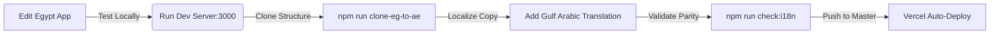
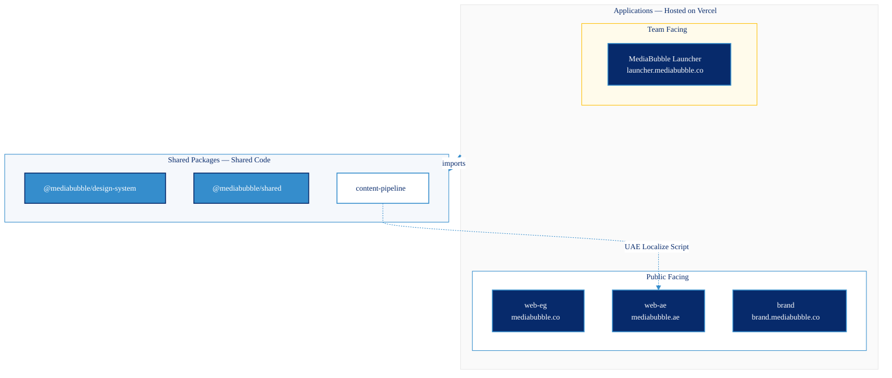

<div align="center">


# MediaBubble Workspace

**Welcome to the MediaBubble monorepo! This single codebase houses our bilingual marketing websites, brand guidelines, and our internal operations hub (MediaBubble Launcher).**

[](https://github.com/mediabubble-adv/mediaBubble/actions/workflows/ci.yml)
[](https://nextjs.org/)
[](https://react.dev/)
[](https://www.typescriptlang.org/)
[](https://tailwindcss.com/)
[](https://nx.dev/)

[mediabubble.co (Egypt)](https://mediabubble.co) · [mediabubble.ae (UAE)](https://mediabubble.ae) · [brand.mediabubble.co](https://brand.mediabubble.co) · [launcher.mediabubble.co](https://launcher.mediabubble.co)

---

</div>

## 💡 Quick Overview: What is this repository?

For our non-technical team members, a **monorepo** (monolithic repository) simply means that we keep all our agency's digital assets, websites, and tools in one single folder structure. This makes it incredibly easy to share design patterns, translate text between Arabic dialects, and ensure everything stays perfectly in sync.

### Our Digital Ecosystem

| Product / App | Path in Code | Live Production Link | Who is it for? | What does it do? |
| :--- | :--- | :--- | :--- | :--- |
| **MediaBubble Egypt** | `apps/web-eg` | [mediabubble.co](https://mediabubble.co) | Public (Egypt Market) | Primary marketing website. Features routes for agency services, portfolio showcases, a blog, and client inquiry forms. |
| **MediaBubble UAE** | `apps/web-ae` | [mediabubble.ae](https://mediabubble.ae) | Public (UAE Market) | UAE marketing clone. Tailored with local SEO metadata and localized copy in Gulf Arabic (Khaliji). |
| **MediaBubble Brand** | `apps/brand` | [brand.mediabubble.co](https://brand.mediabubble.co) | Designers & Partners | Interactive brand guidelines book. Showcases visual identity, design tokens, and CSS component systems. |
| **MediaBubble Launcher** | `apps/launcher` | [launcher.mediabubble.co](https://launcher.mediabubble.co) | **All Employees** (Internal) | Our custom operations hub. Contains tasks, boards, timesheets, CRM client trackers, financial ledgers, and team chat. |

---

## 👥 Role-Based Quick Guides

Choose your role below to see how this workspace fits into your daily routine.

### ✍️ For Copywriters, Content Strategists & Translators
We build sites that speak the local dialect. Egypt (`web-eg`) runs on **Egyptian Arabic (Masri)** while the UAE (`web-ae`) uses **Gulf Arabic (Khaliji)**.
* **Daily Workflow:** All content changes are typically authored for the Egypt website first. Once finalized, we run automated scripts to clone the structure and apply Gulf Arabic localization to the UAE app.
* **Dialect Files:** The translations are stored in `lib/i18n/*.json` files within each app. 
* **Key Commands:** Run the translation check script before requesting a merge (`npm run check:i18n`) to make sure both markets have exactly matching keys.

### 🎨 For UI/UX Designers
Our design language is built around the **MediaBubble Design System** package.
* **Interactive Brand Guidelines:** Run `npm run dev:brand` to open the Brand Guidelines locally. This showcases our color palette, typography choices, and interactive components.
* **Semantic Tokens:** We style elements using semantic classes like `bg-brand-surface` and `text-brand-text-muted` rather than hardcoding colors. This makes changing themes (like Dark Mode) seamless across all platforms.

### 📊 For Project Managers, HR & Account Managers
You will spend most of your time interacting with the production deployment of **MediaBubble Launcher**.
* **What's inside:** You can manage task boards, log time, generate client quotations, track invoices, review capacity sheets, and participate in internal agency chats.
* **Need a local test account?** If you are running the project locally for testing, we seed the database with pre-configured employee accounts. You can log in using `creative@mediabubble.co` with password `Launch@2026` (Manager accounts are seeded under `manager@mediabubble.co`).

### 💻 For Software Engineers & Developers
Get up and running in minutes, manage local environment variables, test services, and deploy updates. Read the detailed [Technical Setup](#-technical-setup-for-developers) section below.

---

## 🚀 Technical Setup (For Developers)

### Prerequisites
Before you start, make sure you have installed:
* **Node.js 22+** (required to run build tools)
* **npm 10+** (handles our package installation)
* **pnpm 9+** (optional: handy for quick local scripts)
* A **Supabase project** (only required if you are working on the database features inside MediaBubble Launcher)

> [!WARNING]  
> **Local Dependency Rule:** Only run `npm` or `pnpm` commands from the **repo root**. Running package installs inside individual folders (like `apps/launcher`) will break dependency links and fail CI builds.

### 1. Installation
Clone the repository and install all node packages:
```bash
git clone https://github.com/mediabubble-adv/mediaBubble.git
cd mediaBubble
npm ci
```
*Note: We commit a `package-lock.json` file. Please use `npm ci` rather than `npm install` for a clean install matching our production environment.*

### 2. Environment Variables
1. **Marketing apps and brand:** Copy the template file and fill in required keys:
   ```bash
   cp .env.example .env.local
   ```
2. **MediaBubble Launcher:** Copy the template specifically for the operations app:
   ```bash
   cp apps/launcher/.env.example apps/launcher/.env.local
   ```
   *For local UI testing, HubSpot, Resend, and Google Analytics variables can remain blank.*

### 3. Spin up Dev Servers
To run any of our applications locally in development mode, run the corresponding command in your terminal:

| App | Terminal Command | Local URL | Port |
| :--- | :--- | :--- | :--- |
| **Egypt Website** | `npm run dev:eg` (or just `npm run dev`) | [http://localhost:3000](http://localhost:3000) | 3000 |
| **UAE Website** | `npm run dev:ae` | [http://localhost:3001](http://localhost:3001) | 3001 |
| **Brand Guidelines** | `npm run dev:brand` | [http://localhost:3002](http://localhost:3002) | 3002 |
| **MediaBubble Launcher** | `npm run dev:launcher` | [http://localhost:3003](http://localhost:3003) | 3003 |

> [!TIP]  
> **WebSocket Server:** If you are testing Launcher Chat real-time messages locally, open a second terminal and spin up the Redis WS gateway:
> ```bash
> npm run ws:launcher
> ```

---

## 🛠️ Common Employee Workflows

Here are step-by-step guides for the most common procedures.

### Workflow A: Updating Marketing Site Content (Egypt & UAE Sync)
Because `web-ae` shares structure with `web-eg`, any changes to marketing content layout should follow this lifecycle:



1. Make edits to layouts or service pages inside `apps/web-eg`.
2. Check your changes locally by visiting `localhost:3000`.
3. Sync the layout changes to the UAE project:
   ```bash
   npx tsx scripts/clone-eg-to-ae.ts
   ```
4. Edit the copy inside `apps/web-ae` to fit Gulf Arabic (Khaliji) terminology.
5. Verify translation keys are perfectly aligned:
   ```bash
   npm run check:i18n
   ```
6. Commit and open a Pull Request.

### Workflow B: Managing the Launcher Database
If you are adding database fields or working on CRM/Task board features in the Launcher:
* **Apply Migrations:** To pull down the current DB schema and apply migrations to your local instance:
  ```bash
  npm run db:deploy
  ```
* **Seed Database:** Populate mock tasks, cash transactions, and team members:
  ```bash
  npm run db:seed
  ```
* **Visual Database Viewer:** Launch Prisma Studio to inspect data records in a clean web UI:
  ```bash
  npm run db:studio
  ```
* **Schema Modifications:** To generate a new migration file after editing `prisma.schema`:
  ```bash
  npm run db:migrate
  ```

### Workflow C: Resolving Dev Caches & Webpack Crashes
Sometimes Webpack or stale service workers can crash your dev server with `Cannot read properties of undefined (reading 'call')`. Run clean commands to wipe caches and restart:
```bash
npm run dev:eg:clean         # Wipes Egypt cache and starts dev
npm run dev:ae:clean         # Wipes UAE cache and starts dev
npm run dev:launcher:clean   # Wipes Launcher cache and starts dev
```
*After running a clean command, reload your browser tab in an Incognito window to clear cached browser state.*

---

## 🏗️ Architecture & Project Layout

Here is how code moves and imports are constrained in our workspace.

### Monorepo Dependency Rules
Apps are allowed to import packages (`packages/*`), but packages must **never** import from applications. Doing so will violate Nx boundaries and fail the build.



### Folder Layout
```
mediabubble Main/
├── apps/
│   ├── web-eg/              Egypt marketing website
│   ├── web-ae/              UAE marketing website (dialect localized)
│   ├── brand/               Interactive brand identity reference
│   └── launcher/            MediaBubble Launcher (operations app)
├── packages/
│   ├── design-system/       Shared React UI primitives and theme styles
│   ├── shared/              Shared utility code (HubSpot API, email templates)
│   └── content-pipeline/    Automated cloning and localization logic
├── scripts/                 Daily utility scripts (translations, cloner)
├── docs/                    Planning sheets, specs, and roadmap audits
├── .github/workflows/       Continuous Integration (CI) test configs
└── package.json             Main repository configuration
```

---

## 🛠️ Reference Guides: What should I read?

Need detailed specifications? We maintain dedicated guides for each component:

* **[docs/CONTEXT.md](./docs/CONTEXT.md):** The master development document. Start here for a status update on what's currently finished vs planned.
* **[docs/getting-started/README_START_HERE.md](./docs/getting-started/README_START_HERE.md):** The guide for making visual edits and optimization checks on our public marketing sites.
* **[docs/launcher/LAUNCHER_COMPREHENSIVE_GUIDE.md](./docs/launcher/LAUNCHER_COMPREHENSIVE_GUIDE.md):** The design specs, auth models, and schema details for the MediaBubble Launcher.
* **[apps/launcher/README.md](./apps/launcher/README.md):** Production Vercel deploy checklist, migration setups, and Redis variables.
* **[packages/shared/README.md](./packages/shared/README.md):** Developer guide for importing CSP middleware, GA4 tracking scripts, and Hubspot clients.
* **[AGENTS.md](./AGENTS.md):** Developer conventions, module boundaries, and environment variables rules.

---

## 🚀 Continuous Integration & Deployment

### Vercel Hosting
Each of our four applications is connected to an independent Vercel project:
* **MediaBubble Egypt:** linked to the `apps/web-eg` root
* **MediaBubble UAE:** linked to the `apps/web-ae` root
* **Brand Guidelines:** linked to the `apps/brand` root
* **MediaBubble Launcher:** linked to the `apps/launcher` root

> [!NOTE]  
> Launcher deploys run database migrations and generate static assets using the `vercel-build:launcher` script before launching to ensure no downtime.

### GitHub Actions
When you push code or open a Pull Request, our CI checks run automated validations:
1. Installs clean packages with `npm ci`
2. Builds all shared packages and apps: `nx run-many -t build`
3. Checks code style rules: `npm run lint`
4. Compiles types: `npm run typecheck`
5. Runs test suits (Jest + React Testing Library): `npm run test`

---

## 📞 Key Contacts

* **Yasser Dorgham** — [yasser@mediabubble.co](mailto:yasser.dorgham@gmail.com)
* **Agency Website** — [mediabubble.co](https://mediabubble.co) (Hurghada, Egypt)

<div align="center">

*Private Repository · © MediaBubble*

</div>
