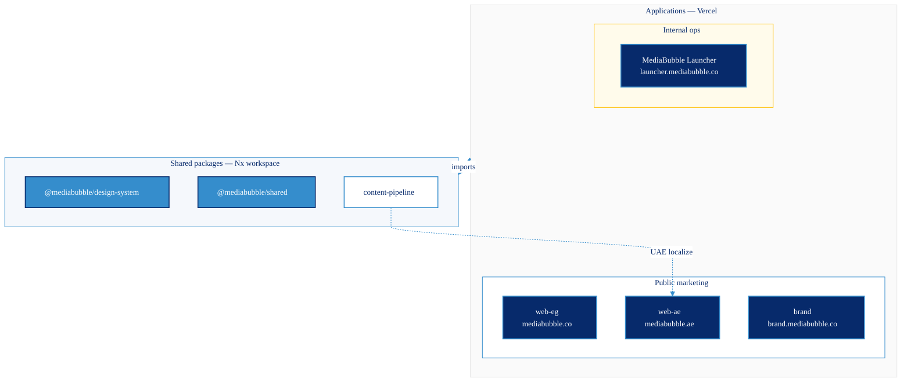
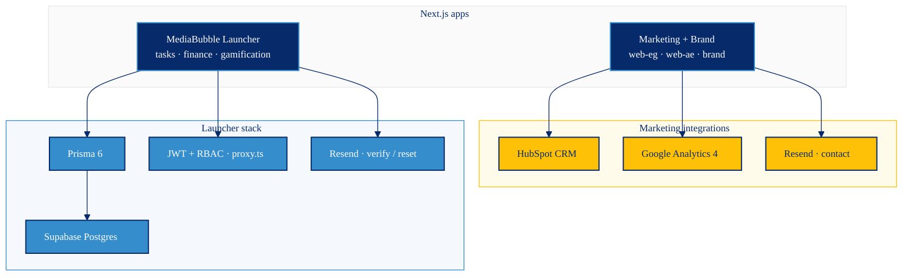

<div align="center">


# MediaBubble

**Bilingual marketing platform and internal ops hub — Egypt, UAE, brand guidelines, and MediaBubble Launcher in one Nx monorepo.**

[](https://github.com/mediabubble-adv/mediaBubble/actions/workflows/ci.yml)
[](https://nextjs.org/)
[](https://react.dev/)
[](https://www.typescriptlang.org/)
[](https://tailwindcss.com/)
[](https://nx.dev/)
[](https://nodejs.org/)
[](https://vercel.com/)

[mediabubble.co](https://mediabubble.co) · [mediabubble.ae](https://mediabubble.ae) · [brand.mediabubble.co](https://brand.mediabubble.co) · [launcher.mediabubble.co](https://launcher.mediabubble.co)

</div>

---

## Overview

[MediaBubble](https://mediabubble.co) is a Hurghada-based full-service marketing agency (est. 2015). This repository is the **digital platform workspace** that powers:

- **Market websites** for Egypt and the UAE — conversion-focused, bilingual, RTL-aware Next.js apps replacing a legacy WordPress stack
- **Brand guidelines** — an interactive reference app for identity, tokens, components, and AI-assisted design workflows
- **MediaBubble Launcher** — internal ops app ([launcher.mediabubble.co](https://launcher.mediabubble.co)): task board, finance dashboard, gamification, JWT auth, Supabase + Prisma
- **Shared packages** — design system, env validation, API integrations, and localization tooling used across all surfaces

The monorepo is built for **parallel market delivery**: Egypt (`web-eg`) ships first with Egyptian Arabic (Masri); UAE (`web-ae`) is a structural clone with Khaliji Arabic and UAE-specific metadata, kept in sync via scripts and an i18n parity gate. **MediaBubble Launcher** is the team-facing ops surface on the same design system and shared packages.

---

## Applications

| Product | App path | URL | Audience |
|---------|----------|-----|----------|
| **MediaBubble Egypt** | `apps/web-eg` | [mediabubble.co](https://mediabubble.co) | Public — Egypt market |
| **MediaBubble UAE** | `apps/web-ae` | [mediabubble.ae](https://mediabubble.ae) | Public — UAE market |
| **MediaBubble Brand** | `apps/brand` | [brand.mediabubble.co](https://brand.mediabubble.co) | Brand book — identity & tokens |
| **MediaBubble Launcher** | `apps/launcher` | [launcher.mediabubble.co](https://launcher.mediabubble.co) | Internal — tasks, finance, gamification |

---

## What's in the repo

| Layer | Path | Production URL | Status |
|-------|------|----------------|--------|
| Egypt marketing site | `apps/web-eg` | [mediabubble.co](https://mediabubble.co) | Primary market app — routes, services, blog, contact |
| UAE marketing site | `apps/web-ae` | [mediabubble.ae](https://mediabubble.ae) | Structural clone — Khaliji `ar` locale, UAE config |
| Brand guidelines | `apps/brand` | [brand.mediabubble.co](https://brand.mediabubble.co) | Interactive brand book (14 sections, search, copy tools) |
| **MediaBubble Launcher** | `apps/launcher` | [launcher.mediabubble.co](https://launcher.mediabubble.co) | Phase 1 MVP — Task Board, Finance, Gamification, auth |
| Design system | `packages/design-system` | — | Shared UI primitives + Tailwind preset (Rollup build) |
| Shared library | `packages/shared` | — | Env, HubSpot/Resend clients, i18n factory, security headers |
| Content pipeline | `packages/content-pipeline` | — | UAE localization (`nx run content-pipeline:localize`) |

### MediaBubble Launcher (`apps/launcher`)

**MediaBubble Launcher** is the agency’s unified internal operations platform — team-facing, auth-gated, and separate from the public marketing sites. Built on **Next.js 16** with **Supabase Postgres + Prisma**, custom **JWT auth** (RBAC), and **Resend** for verify/reset email. Phase 1 (merged) includes:

| Module | Features |
|--------|----------|
| **Task Board** | Kanban (Backlog → Done), drag-and-drop, comments, inline timer → `time_entries` |
| **Finance** | Transactions ledger, KPI strip, EGP/AED/USD switcher, cash-flow + expense charts |
| **Gamification** | XP/levels, login streak, leaderboard podium, achievements |
| **Auth** | Signup, login, email verify, password reset; route gate via `proxy.ts` |

Env lives in `apps/launcher/.env.local` (not the repo root). See [apps/launcher/README.md](./apps/launcher/README.md) and [LAUNCHER_PLAN_V2.md](./LAUNCHER_PLAN_V2.md) for setup, deploy, and Phase 2 roadmap.

### Live service pages (both market apps)

`seo` · `ppc` · `social` · `branding` · `web` — routed at `/services/[slug]`. Additional services (`content`, `events`) are planned; see `docs/content/service-component-inventory.md`.

### Core marketing routes

`/`, `/about`, `/services`, `/portfolio`, `/blog`, `/contact`, `/privacy`, `/terms`, `/cookies` — plus dynamic `[slug]` pages for services, portfolio, and blog.

---

## Architecture

Two views: **monorepo dependencies** (how Nx apps consume shared packages) and **runtime integrations** (external services per surface).

### Monorepo topology

Apps import shared packages only — `packages/*` never import from `apps/*` (`@nx/enforce-module-boundaries`).



### Deployment & data plane

Marketing apps share HubSpot, GA4, and Resend (contact). **MediaBubble Launcher** adds its own Postgres data layer and JWT auth gate.



**Client vs server imports:** In `'use client'` files, import hooks and browser utilities from `@mediabubble/shared/client` (not the root barrel). Server Components and API routes use `@mediabubble/shared/server` or package subpaths to avoid pulling server-only code into the client bundle.

**CSP / route protection:** Market apps and brand use `middleware.ts` with `createCspMiddleware` from `@mediabubble/shared/csp-middleware`. **MediaBubble Launcher** uses `proxy.ts` for JWT route gating (Next.js 16 builder). Keep `export const config.matcher` as an **inlined literal** in each middleware file—Next.js cannot statically analyze imported matcher constants.

---

## Tech stack

| Category | Choices |
|----------|---------|
| Framework | Next.js 14–16 (App Router), React 18 — market apps on 14; launcher on 16 |
| Language | TypeScript 5.3+ |
| Styling | Tailwind CSS 3, `tailwindcss-rtl`, semantic `brand-*` tokens + dark mode (`html.dark`) |
| Monorepo | Nx 22+, npm workspaces |
| i18n | i18next + react-i18next — English + dialect locales (`ar-masri` EG, `ar` Khaliji AE) |
| UI | Radix primitives, Lucide / React Icons, shared design-system components |
| Forms & CRM | HubSpot API (contacts, newsletter), Resend (transactional email) |
| Launcher data | Prisma 6 + Supabase Postgres (`DATABASE_URL` pooler + `DIRECT_URL` for migrations) |
| Launcher auth | Custom JWT (HS256), scrypt passwords, RBAC middleware via `proxy.ts` |
| PWA | `@ducanh2912/next-pwa` (market apps + brand) |
| CI | GitHub Actions — build, lint, typecheck, Jest |
| Hosting | Vercel (one project per app) |

---

## Prerequisites

- **Node.js 20** (matches CI)
- **npm** (lockfile: `package-lock.json`)
- Optional: [Vercel CLI](https://vercel.com/docs/cli) for env pull and deploys

---

## Quick start

```bash
git clone https://github.com/mediabubble-adv/mediaBubble.git
cd mediaBubble
npm install
cp .env.example .env.local   # fill in keys — see Environment variables
npm run dev:eg               # http://localhost:3000
```

### Run each app locally

| Command | App | Port |
|---------|-----|------|
| `npm run dev:eg` | Egypt (`web-eg`) | 3000 |
| `npm run dev:ae` | UAE (`web-ae`) | 3001 |
| `npm run dev:brand` | Brand guidelines | 3002 |
| `npm run dev:launcher` | **MediaBubble Launcher** | 3003 |

**MediaBubble Launcher — first-time setup:**

```bash
cp apps/launcher/.env.example apps/launcher/.env.local
# Set DATABASE_URL, DIRECT_URL, JWT_SECRET
npm run db:deploy && npm run db:seed
npm run dev:launcher   # http://localhost:3003 — seed login: creative@mediabubble.co / Launch@2026
```

### Clean dev restart (after webpack / PWA cache issues)

Stale service workers or overlapping prod builds can cause `Cannot read properties of undefined (reading 'call')` in dev. Use:

```bash
npm run dev:eg:clean   # kills :3000, wipes .next + webpack cache + stale SW
npm run dev:ae:clean   # same for :3001
npm run dev:launcher:clean   # kills :3003, wipes .next/cache (e.g. after Playwright E2E)
```

Then hard-refresh the browser or use an incognito window for `localhost`.

---

## Environment variables

Copy [`.env.example`](./.env.example) to `.env.local` in the repo root (gitignored). Key variables:

| Variable | Purpose |
|----------|---------|
| `NEXT_PUBLIC_SITE_URL` | Canonical site URL (per deploy) |
| `NEXT_PUBLIC_BUSINESS_PHONE` | E.164 phone for JSON-LD and contact UI |
| `NEXT_PUBLIC_GA4_ID` | Google Analytics 4 measurement ID |
| `RESEND_API_KEY` | Contact form email delivery |
| `CONTACT_EMAIL` | Inbox for form submissions (default: `hello@mediabubble.com`) |
| `HUBSPOT_API_KEY` | CRM upsert for `/api/contact` and `/api/hubspot` |
| `IMPECCABLE_CONTEXT_DIR` | Design-agent context path (`docs/planning`) |

**MediaBubble Launcher** uses a separate env file — copy [`apps/launcher/.env.example`](./apps/launcher/.env.example) to `apps/launcher/.env.local`:

| Variable | Purpose |
|----------|---------|
| `DATABASE_URL` | Supabase transaction pooler (6543, `?pgbouncer=true`) or Vercel Prisma Compute URL |
| `DIRECT_URL` | Session/direct pooler (5432) for migrations — on Vercel, duplicate `DATABASE_URL` if Prisma Compute only injects one URL |
| `JWT_SECRET` | JWT signing secret (`openssl rand -base64 48`) |
| `RESEND_API_KEY` | Verify/reset email in production |
| `REDIS_URL` | Reserved for Phase 2 (rate limiting, pub/sub) |

Root `db:*` scripts source `apps/launcher/.env.local` automatically.

On Vercel, set variables per project, then:

```bash
vercel env pull .env.local --yes
```

---

## Scripts

| Command | Description |
|---------|-------------|
| `npm run dev` / `dev:eg` | Egypt marketing site (port 3000) |
| `npm run dev:ae` | UAE marketing site (port 3001) |
| `npm run dev:brand` | Brand guidelines (port 3002) |
| `npm run dev:launcher` | MediaBubble Launcher (port 3003) |
| `npm run dev:eg:clean` / `dev:ae:clean` / `dev:launcher:clean` | Reset dev server + caches |
| `npm run db:deploy` | Apply MediaBubble Launcher Prisma migrations (Supabase) |
| `npm run db:seed` | Seed Launcher departments, users, finance sample data |
| `npm run db:migrate` | Create/apply Launcher dev migrations |
| `npm run db:studio` | Prisma Studio for Launcher schema |
| `npm run test:launcher` | Jest unit tests for `apps/launcher/lib/**` |
| `npm run build` | Build all Nx projects |
| `npm run start` | Production server for `web-eg` |
| `npm run lint` | ESLint across workspace |
| `npm run typecheck` | TypeScript check all projects |
| `npm run test` | Jest test suite |
| `npm run test:security` | Shared security-headers tests |
| `npm run check:i18n` | EG/AE locale key parity gate |
| `npm run graph` | Open Nx dependency graph |
| `npm run format` | Prettier write |

---

## Packages

### `@mediabubble/design-system`

Shared UI primitives and Tailwind preset. Built with Rollup (`nx build design-system`). Import components and tokens in all apps for visual consistency.

### `@mediabubble/shared`

Cross-app utilities. Prefer **subpath imports** (not the root barrel in client code):

| Subpath | Use for |
|---------|---------|
| `@mediabubble/shared/client` | `useI18n()`, theme provider, browser hooks, GA4 helpers |
| `@mediabubble/shared/server` | Server Components, API routes, env validation |
| `@mediabubble/shared/csp-middleware` | Next.js `middleware.ts` — nonce CSP (`createCspMiddleware`) |
| `@mediabubble/shared/hubspot-client` | HubSpot CRM API |
| `@mediabubble/shared/resend-client` | Resend transactional email |
| `@mediabubble/shared/ui/marketing-kicker` | Marketing kicker CSS classes |

Also includes rate limiting, GA4 event helpers, and `security-headers.cjs` wired from each app’s `next.config.js`.

**TypeScript:** `tsconfig.base.json` defines shared path aliases. Each app `tsconfig.json` redeclares `paths`—when adding a new `@mediabubble/shared/*` subpath, mirror it in `apps/web-eg`, `apps/web-ae`, `apps/brand`, and `apps/launcher` where needed (see `csp-middleware`).

See [packages/shared/README.md](./packages/shared/README.md) for usage examples.

### `content-pipeline`

UAE localization tooling:

```bash
npx nx run content-pipeline:localize
```

For targeted Khaliji register fixes on AE Arabic locales, use `scripts/apply-khaliji-ae-ar.mjs` — do **not** run `scripts/clarify-marketing-ae.mjs` on finalized AE files (it Masri-swaps EG templates).

---

## Egypt → UAE workflow

`web-ae` is a **structural clone** of `web-eg`. After Egypt changes land:

```bash
npx tsx scripts/clone-eg-to-ae.ts
```

Then apply UAE-specific metadata, URLs (`mediabubble.ae`), and Khaliji copy in `apps/web-ae`. Before merge:

```bash
npm run check:i18n
```

---

## Internationalization & RTL

| Market | App | Arabic locale | Register |
|--------|-----|---------------|----------|
| Egypt | `web-eg` | `ar-masri` | Egyptian Arabic (Masri) |
| UAE | `web-ae` | `ar` (+ `ar-khaliji.json`) | Gulf Arabic (Khaliji) |

Locales merge per-app `lib/i18n/*.json` with `public/locales/*/translation.json`. RTL layouts use `tailwindcss-rtl`; infinite-scroll marquees keep animation tracks `dir="ltr"` for loop math while card content respects Arabic direction.

Arabic content skills live under `.claude/skills/arabic-*` (symlinked to `.cursor/skills/`). Sync with:

```bash
bash scripts/sync-cursor-arabic-skills.sh
```

---

## Deployment (Vercel)

Each app is a **separate Vercel project** with root directory set to the app folder:

| Vercel root | Domain |
|-------------|--------|
| `apps/web-eg` | mediabubble.co |
| `apps/web-ae` | mediabubble.ae |
| `apps/brand` | brand.mediabubble.co |
| `apps/launcher` | launcher.mediabubble.co (MediaBubble Launcher) |

Each market/brand `vercel.json` uses a monorepo-aware build:

```json
"buildCommand": "cd ../.. && npx nx build <app>"
```

**MediaBubble Launcher** runs migrations + generate before build (`vercel-build:launcher`). **Required Vercel env:** `DATABASE_URL`, `DIRECT_URL`, `JWT_SECRET`, `RESEND_API_KEY`. If deploy fails with missing `DIRECT_URL`, set it to the same value as `DATABASE_URL` (Prisma Compute) or the Supabase session pooler URL. See [apps/launcher/README.md](./apps/launcher/README.md).

Avoid running production builds while a dev server is active on the same app.

---

## Quality & CI

**Repository:** [github.com/mediabubble-adv/mediaBubble](https://github.com/mediabubble-adv/mediaBubble) (private). The README uses a **static** [shields.io CI badge](https://img.shields.io/badge/CI-GitHub%20Actions-2088FF?logo=githubactions&logoColor=white)—GitHub’s workflow status badge returns 404 on private repos. CI can also be triggered manually via `workflow_dispatch` in [`.github/workflows/ci.yml`](./.github/workflows/ci.yml).

On push/PR to `master`, GitHub Actions runs:

1. `npm ci`
2. `nx run-many -t build` (design-system, web-eg, web-ae, brand — **launcher** pending CI addition)
3. `npm run lint`
4. `npm run typecheck`
5. `npm run test`

Pre-commit: Husky + lint-staged (ESLint + related Jest tests on staged TS/TSX).

### README on GitHub

- Brand icon: `apps/web-eg/public/assets/Logo/logo-favicon.svg`
- Mermaid node labels containing `@` must be double-quoted (e.g. `DS["@mediabubble/design-system"]`)

---

## Project layout

```
mediabubble Main/
├── apps/
│   ├── web-eg/              Egypt marketing → mediabubble.co
│   ├── web-ae/              UAE marketing → mediabubble.ae
│   ├── brand/               Brand guidelines → brand.mediabubble.co
│   └── launcher/            MediaBubble Launcher → launcher.mediabubble.co
├── packages/
│   ├── design-system/       @mediabubble/design-system
│   ├── shared/              @mediabubble/shared
│   └── content-pipeline/    UAE localization
├── scripts/                 Clone, i18n, Arabic skill sync
├── docs/                    Planning, audits, brand, website specs
├── LAUNCHER_PLAN_V2.md      Launcher Phase 1–2 scope (single source of truth)
├── .github/workflows/       CI
├── .env.example             Env template (copy → .env.local)
├── nx.json
└── package.json             @mediabubble/workspace
```

---

## Documentation

**For AI assistants and deep context:** start with **[docs/CONTEXT.md](./docs/CONTEXT.md)** — structure, progress, and reading order.

| Document | When to use it |
|----------|----------------|
| [docs/CONTEXT.md](./docs/CONTEXT.md) | Full repo handoff — what's built vs planned |
| [docs/README.md](./docs/README.md) | Documentation index |
| [docs/getting-started/README_START_HERE.md](./docs/getting-started/README_START_HERE.md) | Website improvement entry guide |
| [docs/getting-started/EXECUTION_START_HERE.md](./docs/getting-started/EXECUTION_START_HERE.md) | Audit fixes with Cursor/Claude |
| [docs/audits/COMPREHENSIVE_AUDIT_REPORT.md](./docs/audits/COMPREHENSIVE_AUDIT_REPORT.md) | Codebase audit report |
| [docs/planning/MASTER_DEVELOPMENT_PLAN.md](./docs/planning/MASTER_DEVELOPMENT_PLAN.md) | 12-week development roadmap |
| [docs/website/README.md](./docs/website/README.md) | Website transformation & conversions |
| [AGENTS.md](./AGENTS.md) | Agent/workspace conventions learned in-repo |
| [LAUNCHER_PLAN_V2.md](./LAUNCHER_PLAN_V2.md) | MediaBubble Launcher Phase 1 status + Phase 2 roadmap |
| [apps/launcher/README.md](./apps/launcher/README.md) | MediaBubble Launcher setup, DB, deploy, and test commands |

| [LAUNCHER_PLAN_V2.md](./LAUNCHER_PLAN_V2.md) | MediaBubble Launcher Phase 1 status + Phase 2 roadmap |
| [apps/launcher/README.md](./apps/launcher/README.md) | MediaBubble Launcher setup, DB, deploy, and test commands |

---

## Roadmap (high level)

- Expand service pages beyond the current five live slugs
- HubSpot + Resend + GA4 fully configured in all environments
- **MediaBubble Launcher Phase 2** — Time Management, CRM, AI Tools, Communication Hub (see `LAUNCHER_PLAN_V2.md`)
- Lighthouse 95+, formal WCAG AA audit
- AI chat agent for lead qualification (spec in `docs/business/`)
- Open-source design system and website template (strategy docs in `docs/business/strategy/`)

See [docs/CONTEXT.md](./docs/CONTEXT.md) §2 for estimated completion percentages per initiative.

---

## Contact

**Yasser Dorgham** — [yasser@mediabubble.co](mailto:yasser.dorgham@gmail.com)

**Agency** — [mediabubble.co](https://mediabubble.co) · Hurghada, Egypt

---

<div align="center">

Private repository · © MediaBubble

</div>
