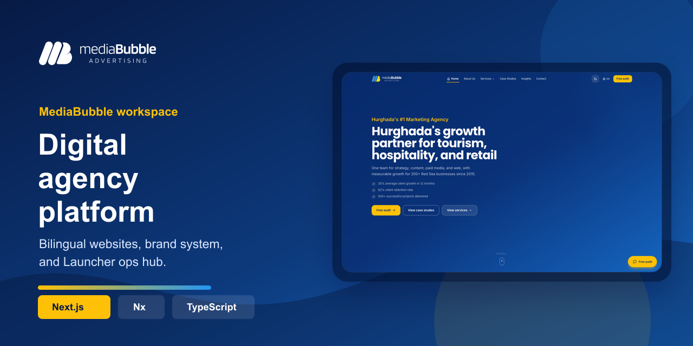
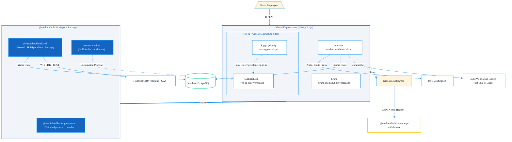

# MediaBubble Workspace

**Bilingual marketing sites, the brand system, and the internal operations hub in one Nx monorepo.**



[](https://github.com/mediabubble-adv/mediaBubble/actions/workflows/ci.yml) [](https://nextjs.org/) [](https://react.dev/) [](https://www.typescriptlang.org/) [](https://tailwindcss.com/) [](https://nx.dev/)

[web-eg.vercel.app (Egypt)](https://web-eg.vercel.app) · [web-ae-nine.vercel.app (UAE)](https://web-ae-nine.vercel.app) · [brand-mediabubble.vercel.app (Brand)](https://brand-mediabubble.vercel.app) · [launcher-peach.vercel.app (Launcher)](https://launcher-peach.vercel.app)

---

## Deployments (Vercel)

<table width="100%">
  <thead>
    <tr>
      <th align="left">App / Service</th>
      <th align="left">Vercel Console Project</th>
      <th align="left">Deployment Preview URL</th>
    </tr>
  </thead>
  <tbody>
    <tr>
      <td><strong>MediaBubble Egypt</strong></td>
      <td><a href="https://vercel.com/mediabubble/web-eg">web-eg</a></td>
      <td><a href="https://web-eg.vercel.app">web-eg.vercel.app</a></td>
    </tr>
    <tr>
      <td><strong>MediaBubble UAE</strong></td>
      <td><a href="https://vercel.com/mediabubble/web-ae">web-ae</a></td>
      <td><a href="https://web-ae-nine.vercel.app">web-ae-nine.vercel.app</a></td>
    </tr>
    <tr>
      <td><strong>MediaBubble Brand</strong></td>
      <td><a href="https://vercel.com/mediabubble/brand">brand</a></td>
      <td><a href="https://brand-mediabubble.vercel.app">brand-mediabubble.vercel.app</a></td>
    </tr>
    <tr>
      <td><strong>MediaBubble Launcher</strong></td>
      <td><a href="https://vercel.com/mediabubble/launcher">launcher</a></td>
      <td><a href="https://launcher-peach.vercel.app">launcher-peach.vercel.app</a></td>
    </tr>
  </tbody>
</table>

## What lives here

<table width="100%">
  <thead>
    <tr>
      <th align="left">Workspace Area</th>
      <th align="left">Codebase Path</th>
      <th align="left">System Purpose & Scope</th>
    </tr>
  </thead>
  <tbody>
    <tr>
      <td><strong>MediaBubble Egypt</strong></td>
      <td><code>apps/web-eg</code></td>
      <td>Public Egyptian market site, bilingually optimized (Masri Arabic + English)</td>
    </tr>
    <tr>
      <td><strong>MediaBubble UAE</strong></td>
      <td><code>apps/web-ae</code></td>
      <td>Public UAE market site clone, localized for Gulf (Khaliji) Arabic dialectical copy</td>
    </tr>
    <tr>
      <td><strong>MediaBubble Brand</strong></td>
      <td><code>apps/brand</code></td>
      <td>Interactive brand guidelines showcasing design tokens, visual assets, and UI components</td>
    </tr>
    <tr>
      <td><strong>MediaBubble Launcher</strong></td>
      <td><code>apps/launcher</code></td>
      <td>Internal operations center for tasks, timesheets, CRM ledger, and agency chat</td>
    </tr>
    <tr>
      <td><strong>Shared Modules</strong></td>
      <td><code>packages/</code></td>
      <td>Monorepo libraries, including the shared Design System, shared API wrappers, and localization helpers</td>
    </tr>
    <tr>
      <td><strong>Planning & Docs</strong></td>
      <td><code>docs/</code></td>
      <td>Consolidated roadmap audits, technical specifications, and strategic AI handoff documentation</td>
    </tr>
  </tbody>
</table>

## 💻 Local Installation & Setup

Follow these structured instructions to set up the MediaBubble monorepo workspace on your local machine.

### 📋 Prerequisites & Local Requirements

Before installing, ensure your environment meets the following requirements:

#### 1. System Engines
- **Node.js**: Version **22+** (matching the CI environment).
- **Package Manager**: **npm 10+** (committed lockfile is npm-native) or **pnpm 9+** for local utility scripts.

#### 2. Command Line Interfaces (CLIs)
- **Vercel CLI**: Required to link and push environment variables to Vercel deployments.
  ```bash
  npm install -g vercel
  ```
- **Nx CLI**: Optional (can run via `npx nx`), but installing globally is recommended:
  ```bash
  npm install -g nx
  ```

#### 3. Database Server (PostgreSQL)
Required for the internal **MediaBubble Launcher** operational database.
- **Local Installation**:
  - *Homebrew (macOS)*: `brew install postgresql@15` followed by `brew services start postgresql@15`.
  - *Docker (Cross-Platform)*: Run a containerized instance:
    ```bash
    docker run --name mediabubble-db -e POSTGRES_PASSWORD=mysecret -p 5432:5432 -d postgres:15
    ```
- **Remote Option**: Use a remote Supabase project.
- **Configuration**: Prisma expects two pooled connection strings in your `apps/launcher/.env.local`:
  - `DATABASE_URL`: Transaction pooler URL (e.g. port `6543` with `?pgbouncer=true`).
  - `DIRECT_URL`: Direct session connection URL (e.g. port `5432` for running migrations).

#### 4. Cache & WebSocket Server (Redis)
Required to run the real-time team chat gateway (`ws:launcher`).
- **Local Installation**:
  - *Homebrew (macOS)*: `brew install redis` followed by `brew services start redis`.
  - *Docker (Cross-Platform)*: Run a containerized instance:
    ```bash
    docker run --name mediabubble-redis -p 6379:6379 -d redis
    ```

---

### ⚙️ Step-by-Step Installation

#### 1. Clone & Install Dependencies
Clone the private monorepo and run a clean installer at the root directory:
```bash
git clone https://github.com/mediabubble-adv/mediaBubble.git
cd mediaBubble
npm ci
```
*Note: Always install packages from the root directory to keep monorepo symlinks aligned. Avoid running package installs inside individual app folders.*

#### 2. Configure Environment Files
Duplicate the environment template files for the monorepo root and the launcher:
```bash
cp .env.example .env.local
cp apps/launcher/.env.example apps/launcher/.env.local
```
*Fill in the database URLs, JWT secret keys, and API credentials as needed.*

#### 3. Run Migrations & Seed Database
Setup the database tables and seed mock employees, teams, and CRM records:
```bash
npm run db:deploy    # Apply Prisma schema migrations
npm run db:seed      # Populate departments and default accounts
```
*Mock login accounts generated: manager@mediabubble.co / creative@mediabubble.co (Password: Launch@2026).*

#### 4. Spin Up Dev Servers
Start any of the applications in local development mode:

<table width="100%">
  <thead>
    <tr>
      <th align="left">Application Surface</th>
      <th align="left">CLI Development Command</th>
      <th align="left">Local Host Interface</th>
      <th align="center">Port</th>
    </tr>
  </thead>
  <tbody>
    <tr>
      <td><strong>Egypt Marketing Site</strong></td>
      <td><code>npm run dev:eg</code></td>
      <td><a href="http://localhost:3000">http://localhost:3000</a></td>
      <td align="center"><code>3000</code></td>
    </tr>
    <tr>
      <td><strong>UAE Marketing Site</strong></td>
      <td><code>npm run dev:ae</code></td>
      <td><a href="http://localhost:3001">http://localhost:3001</a></td>
      <td align="center"><code>3001</code></td>
    </tr>
    <tr>
      <td><strong>Brand Guidelines App</strong></td>
      <td><code>npm run dev:brand</code></td>
      <td><a href="http://localhost:3002">http://localhost:3002</a></td>
      <td align="center"><code>3002</code></td>
    </tr>
    <tr>
      <td><strong>MediaBubble Launcher</strong></td>
      <td><code>npm run dev:launcher</code></td>
      <td><a href="http://localhost:3003">http://localhost:3003</a></td>
      <td align="center"><code>3003</code></td>
    </tr>
  </tbody>
</table>

#### 5. Start the WebSocket Server (Optional)
If you are developing or testing real-time chat in the Launcher, run the Redis WebSocket bridge:
```bash
npm run ws:launcher
```

#### 6. Troubleshooting Local Caches
If Next.js compilation or Webpack encounters stale worker errors, run the clean restart scripts:
```bash
npm run dev:eg:clean         # Restart Egypt app clearing cache
npm run dev:ae:clean         # Restart UAE app clearing cache
npm run dev:launcher:clean   # Restart Launcher clearing cache
```

## Working Rules

- Install from the repo root only. Do not add a second package install inside `apps/*`.
- Keep `package-lock.json` in sync with any dependency changes.
- Treat `apps/web-eg` as the source market site and sync structural changes to `apps/web-ae`.
- Launcher-specific setup, seeds, and deploy steps live in [apps/launcher/README.md](apps/launcher/README.md).
- Design and product context for the launcher lives in [PRODUCT.md](PRODUCT.md) and [docs/brand/DESIGN.md](docs/brand/DESIGN.md).

## 🏗️ Architecture & Project Layout

Here is how code moves, imports are constrained, and requests are processed in our workspace.

[](https://www.prisma.io/) [](https://www.postgresql.org/) [](https://supabase.com/) [](https://redis.io/)

### Monorepo Dependency Rules
Apps are allowed to import packages (`packages/*`), but packages must **never** import from applications. Doing so will violate Nx boundaries and fail the build.



### Folder Layout
```text
mediabubble Main/
├── apps/
│   ├── web-eg/
│   ├── web-ae/
│   ├── brand/
│   └── launcher/
├── packages/
│   ├── design-system/
│   ├── shared/
│   └── content-pipeline/
├── scripts/
├── docs/
├── AGENTS.md
├── PRODUCT.md
└── README.md
```

## Documentation

<table width="100%">
  <thead>
    <tr>
      <th align="left">Reference Guide</th>
      <th align="left">Context & Why It Matters</th>
    </tr>
  </thead>
  <tbody>
    <tr>
      <td><a href="docs/README.md">docs/README.md</a></td>
      <td>Complete documentation registry, subfolder directories, and maps</td>
    </tr>
    <tr>
      <td><a href="docs/CONTEXT.md">docs/CONTEXT.md</a></td>
      <td>Master AI handoff containing historical development timeline, current monorepo milestones, and feature statuses</td>
    </tr>
    <tr>
      <td><a href="apps/launcher/README.md">apps/launcher/README.md</a></td>
      <td>Detailed local environment guidelines, Prisma schema configurations, database seeder, and Vercel CLI deploy checklists for the operations app</td>
    </tr>
    <tr>
      <td><a href="docs/website/README.md">docs/website/README.md</a></td>
      <td>Marketing site optimizations, Phase 1-3 visual specs, translation pipelines, and PWA checklists</td>
    </tr>
    <tr>
      <td><a href="docs/brand/DESIGN.md">docs/brand/DESIGN.md</a></td>
      <td>Obsidian Creative Studio brand system colors, custom theme variables, Poppins/Cairo typography standards, and layout guides</td>
    </tr>
  </tbody>
</table>

## GitHub Notes

[](https://eslint.org/) [](https://jestjs.io/)

- This repository is private, so the CI badge uses a static shields.io link.
- The root is intentionally small. The only files that should stay at the top level are `README.md`, `AGENTS.md`, and `PRODUCT.md`, plus normal config files.
- Extra planning material belongs under `docs/`.

## Support

Primary contact: Yasser Dorgham - yasser.dorgham@gmail.com

[](https://www.hubspot.com/) [](https://resend.com/)

Live deployments (Vercel):

- [MediaBubble Egypt](https://web-eg.vercel.app)
- [MediaBubble UAE](https://web-ae-nine.vercel.app)
- [MediaBubble Brand](https://brand-mediabubble.vercel.app)
- [MediaBubble Launcher](https://launcher-peach.vercel.app)
