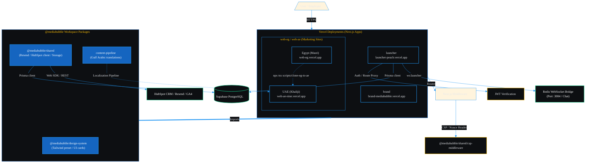

# MediaBubble Workspace

**Bilingual marketing sites, the brand system, and the internal operations hub in one Nx monorepo.**

**DevOps & Workflow**  
[](https://github.com/mediabubble-adv/mediaBubble/actions/workflows/ci.yml)
[](https://nx.dev/)

**Frontend Core**  
[](https://nextjs.org/)
[](https://react.dev/)
[](https://www.typescriptlang.org/)
[](https://tailwindcss.com/)

**Database & Real-time**  
[](https://www.prisma.io/)
[](https://www.postgresql.org/)
[](https://supabase.com/)
[](https://redis.io/)

**APIs & Quality**  
[](https://www.hubspot.com/)
[](https://resend.com/)
[](https://eslint.org/)
[](https://jestjs.io/)


[web-eg.vercel.app (Egypt)](https://web-eg.vercel.app) · [web-ae-nine.vercel.app (UAE)](https://web-ae-nine.vercel.app) · [brand-mediabubble.vercel.app (Brand)](https://brand-mediabubble.vercel.app) · [launcher-peach.vercel.app (Launcher)](https://launcher-peach.vercel.app)

---

## Deployments (Vercel)

| App | Custom domain | Vercel |
| --- | --- | --- |
| MediaBubble Egypt | [mediabubble.co](https://mediabubble.co) | [web-eg.vercel.app](https://web-eg.vercel.app) |
| MediaBubble UAE | [mediabubble.ae](https://mediabubble.ae) | [web-ae-nine.vercel.app](https://web-ae-nine.vercel.app) |
| MediaBubble Brand | [brand.mediabubble.co](https://brand.mediabubble.co) | [brand-mediabubble.vercel.app](https://brand-mediabubble.vercel.app) |
| MediaBubble Launcher | [launcher.mediabubble.co](https://launcher.mediabubble.co) | [launcher-peach.vercel.app](https://launcher-peach.vercel.app) |

## What lives here

| Area | Path | Purpose |
| --- | --- | --- |
| MediaBubble Egypt | `apps/web-eg` | Public Egyptian market site |
| MediaBubble UAE | `apps/web-ae` | Public UAE market site |
| MediaBubble Brand | `apps/brand` | Interactive brand guidelines |
| MediaBubble Launcher | `apps/launcher` | Internal ops hub for the agency team |
| Shared UI and helpers | `packages/` | Reusable design system and shared utilities |
| Planning and handoffs | `docs/` | Strategy, specs, audits, and implementation notes |

## Quick Start

1. Install dependencies from the repository root:

   ```bash
   npm ci
   ```

2. Copy the environment templates you need:

   ```bash
   cp .env.example .env.local
   cp apps/launcher/.env.example apps/launcher/.env.local
   ```

3. Start the app you want to work on:

   | App | Command | Local URL |
   | --- | --- | --- |
   | Egypt site | `npm run dev:eg` | http://localhost:3000 |
   | UAE site | `npm run dev:ae` | http://localhost:3001 |
   | Brand app | `npm run dev:brand` | http://localhost:3002 |
   | Launcher | `npm run dev:launcher` | http://localhost:3003 |

4. Use the clean restart helpers when caches get in the way:

   ```bash
   npm run dev:eg:clean
   npm run dev:ae:clean
   npm run dev:brand
   npm run dev:launcher:clean
   ```

## Working Rules

- Install from the repo root only. Do not add a second package install inside `apps/*`.
- Keep `package-lock.json` in sync with any dependency changes.
- Treat `apps/web-eg` as the source market site and sync structural changes to `apps/web-ae`.
- Launcher-specific setup, seeds, and deploy steps live in [apps/launcher/README.md](apps/launcher/README.md).
- Design and product context for the launcher lives in [PRODUCT.md](PRODUCT.md) and [docs/brand/DESIGN.md](docs/brand/DESIGN.md).

## 🏗️ Architecture & Project Layout

Here is how code moves, imports are constrained, and requests are processed in our workspace.

### Monorepo Dependency Rules
Apps are allowed to import packages (`packages/*`), but packages must **never** import from applications. Doing so will violate Nx boundaries and fail the build.



### Folder Layout
```text
mediabubble Main/
├── apps/
│   ├── web-eg/
│   ├── web-ae/
│   ├── brand/
│   └── launcher/
├── packages/
│   ├── design-system/
│   ├── shared/
│   └── content-pipeline/
├── scripts/
├── docs/
├── AGENTS.md
├── PRODUCT.md
└── README.md
```

## Documentation

| Read next | Why it matters |
| --- | --- |
| [docs/README.md](docs/README.md) | Full docs index and directory map |
| [docs/CONTEXT.md](docs/CONTEXT.md) | AI handoff with repo status, structure, and priorities |
| [apps/launcher/README.md](apps/launcher/README.md) | Launcher install, database, and deploy guide |
| [docs/website/README.md](docs/website/README.md) | Website conversion and UX workstream |
| [docs/brand/DESIGN.md](docs/brand/DESIGN.md) | Brand system, tokens, and visual rules |

## GitHub Notes

- This repository is private, so the CI badge uses a static shields.io link.
- The root is intentionally small. The only files that should stay at the top level are `README.md`, `AGENTS.md`, and `PRODUCT.md`, plus normal config files.
- Extra planning material belongs under `docs/`.

## Support

Primary contact: Yasser Dorgham - yasser.dorgham@gmail.com

Live deployments (Vercel):

- [MediaBubble Egypt](https://web-eg.vercel.app)
- [MediaBubble UAE](https://web-ae-nine.vercel.app)
- [MediaBubble Brand](https://brand-mediabubble.vercel.app)
- [MediaBubble Launcher](https://launcher-peach.vercel.app)
