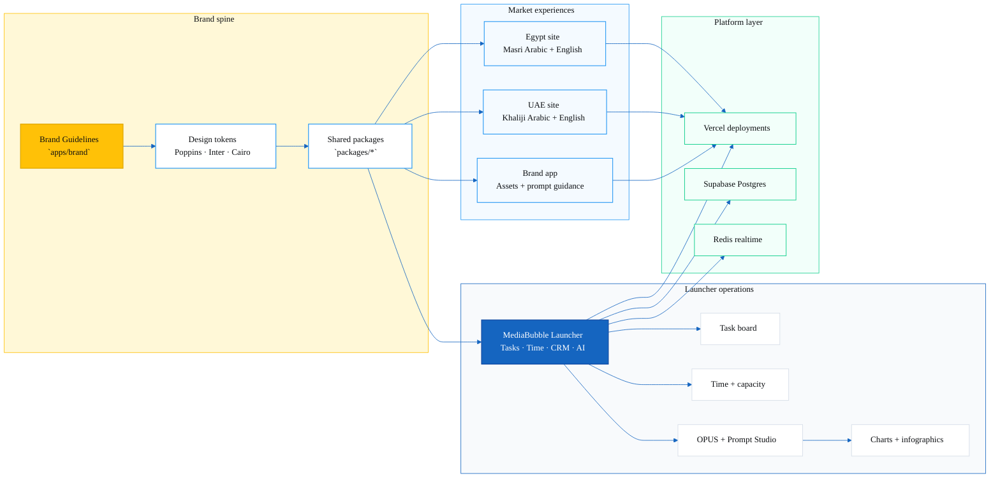
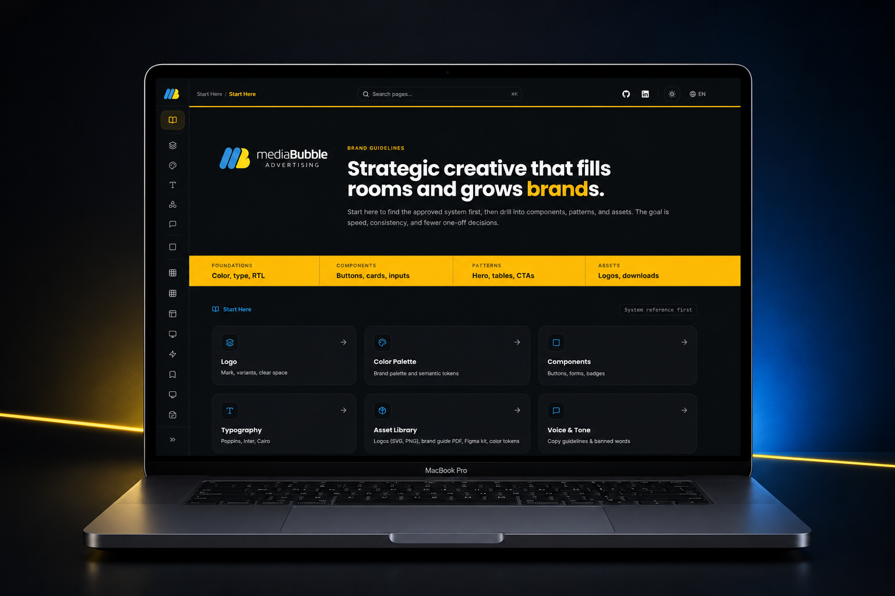
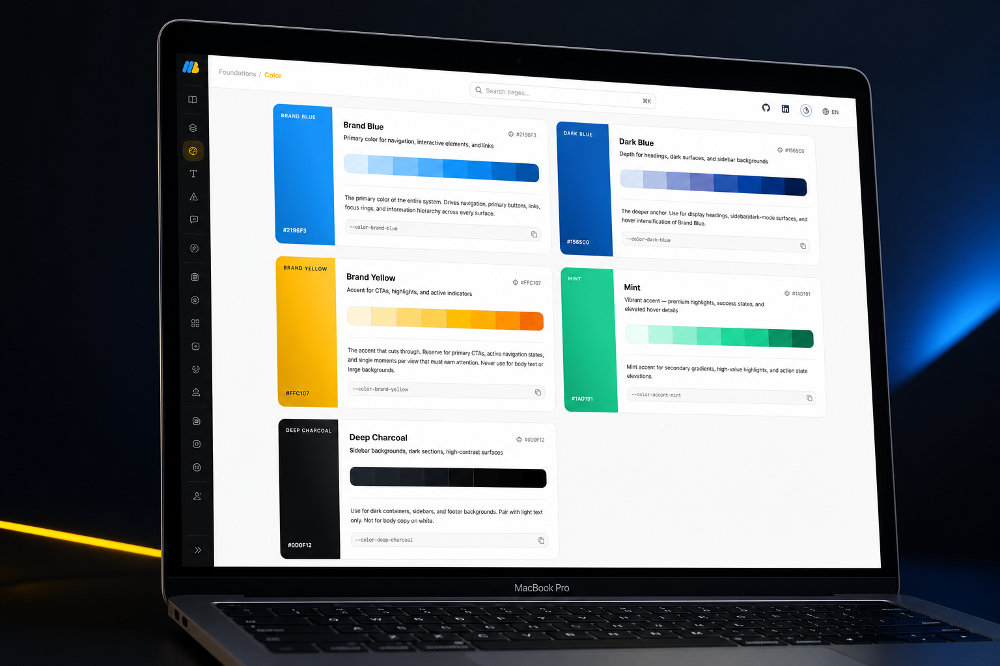

<div align="center">


# MediaBubble Workspace

**One Nx monorepo for the public market sites, the Brand Guidelines studio, and the internal Launcher.**

[](https://github.com/mediabubble-adv/mediaBubble/actions/workflows/ci.yml) [](https://nextjs.org/) [](https://react.dev/) [](https://www.typescriptlang.org/) [](https://tailwindcss.com/) [](https://nx.dev/)

[MediaBubble Egypt](https://web-eg.vercel.app) · [MediaBubble UAE](https://web-ae-nine.vercel.app) · [MediaBubble Brand](https://brand-mediabubble.vercel.app) · [MediaBubble Launcher](https://launcher-peach.vercel.app)


</div>

## What This Repo Is

MediaBubble is a bilingual agency workspace built for daily use, not just demos.

It combines:

- `apps/web-eg` for the Egyptian market site
- `apps/web-ae` for the UAE market site
- `apps/brand` for the brand guidelines experience
- `apps/launcher` for internal operations, tasks, time, AI, and team coordination
- `packages/` for shared design, UI, auth, and utility code
- `docs/` for planning, references, and implementation guidance

## Deployments (Vercel)

| Surface | Purpose | Live URL |
| :--- | :--- | :--- |
| MediaBubble Egypt | Public Egyptian market site | [web-eg.vercel.app](https://web-eg.vercel.app) |
| MediaBubble UAE | Public UAE market site | [web-ae-nine.vercel.app](https://web-ae-nine.vercel.app) |
| MediaBubble Brand | Brand system, assets, and guidance | [brand-mediabubble.vercel.app](https://brand-mediabubble.vercel.app) |
| MediaBubble Launcher | Internal operations hub | [launcher-peach.vercel.app](https://launcher-peach.vercel.app) |

## Brand Guidelines

The Brand app is the visual source of truth for MediaBubble. It keeps the studio voice, palette, typography, and component rules in one place.

Use it when you need:

- The brand palette and surface tokens
- Typography and spacing direction
- Component styling cues
- Searchable brand assets and AI prompt guidance

## Launcher Workflow

The Launcher is the daily driver for the agency team. It is where work gets owned, tracked, reviewed, and moved forward.

### Core workflow

1. Capture work as tasks.
2. Track time against real client and internal work.
3. Review capacity, leave, and workload before assigning more.
4. Use AI tools to draft, summarize, classify, and accelerate repeatable work.
5. Turn approved output into client-ready work products.

### What the Launcher manages

- Tasks and task comments
- Time entries, approvals, capacity, and availability
- CRM records and client-facing finance surfaces
- Team chat and realtime updates
- Workflow automation and operational follow-up
- AI-assisted drafting through OPUS and related tooling

### Where generative AI fits

Generative AI is part of the workflow, not a separate novelty layer. In practice, it can help with:

- Drafting task briefs and follow-up copy
- Summarizing work and surfacing next steps
- Creating charts, diagrams, and infographics from structured inputs
- Turning raw notes into presentation-ready visual assets

The rule is simple: AI accelerates the work, people own the result.

## Architecture At A Glance



## Local Setup

### Prerequisites

- Node.js 22+
- npm 10+
- PostgreSQL for Launcher data
- Redis if you want realtime chat locally

### Install

```bash
npm ci
cp .env.example .env.local
cp apps/launcher/.env.example apps/launcher/.env.local
```

### Product Close-Ups

<table>
  <tr>
    <td width="50%">
      
      <br />
      <sub><strong>Brand Guidelines</strong></sub>
    </td>
    <td width="50%">
      
      <br />
      <sub><strong>Color System</strong></sub>
    </td>
  </tr>
</table>

### Database

```bash
npm run db:deploy
npm run db:seed
```

### Dev servers

| App | Command | URL |
| :--- | :--- | :--- |
| Egypt site | `npm run dev:eg` | http://localhost:3000 |
| UAE site | `npm run dev:ae` | http://localhost:3001 |
| Brand app | `npm run dev:brand` | http://localhost:3002 |
| Launcher | `npm run dev:launcher` | http://localhost:3003 |

### Realtime chat

```bash
npm run ws:launcher
```

### Clean restarts

Use these when stale caches or old workers get in the way:

```bash
npm run dev:eg:clean
npm run dev:ae:clean
npm run dev:launcher:clean
```

## Working Rules

- Install from the repo root only.
- Keep `package-lock.json` in sync with dependency changes.
- Treat `apps/web-eg` as the source market site and sync structural changes to `apps/web-ae`.
- Launcher-specific setup, seeds, and deploy steps live in [apps/launcher/README.md](apps/launcher/README.md).
- Product context for the Launcher lives in [PRODUCT.md](PRODUCT.md) and [docs/brand/DESIGN.md](docs/brand/DESIGN.md).
- Keep planning material under `docs/`.

## Repo Map

| Area | Path | Purpose |
| :--- | :--- | :--- |
| Egypt site | `apps/web-eg` | Public Egyptian market site |
| UAE site | `apps/web-ae` | Public UAE market site |
| Brand app | `apps/brand` | Brand guidelines, assets, and prompts |
| Launcher | `apps/launcher` | Internal operations platform |
| Shared code | `packages/` | Design system, shared helpers, and common utilities |
| Docs | `docs/` | Planning, references, and implementation notes |

## Documentation

| Doc | Why it matters |
| :--- | :--- |
| [docs/README.md](docs/README.md) | Main documentation index |
| [docs/CONTEXT.md](docs/CONTEXT.md) | Repo-wide AI handoff and status |
| [apps/launcher/README.md](apps/launcher/README.md) | Launcher setup, database, and deploy steps |
| [docs/brand/DESIGN.md](docs/brand/DESIGN.md) | Brand system, tokens, and visual rules |

## Notes

- The repository is private, so the CI badge uses a static shields.io link.
- The root should stay lean. Keep only `README.md`, `AGENTS.md`, and `PRODUCT.md` at the top level, plus normal config files.
- Extra planning material belongs under `docs/`.

## Support

Primary contact: Yasser Dorgham - yasser.dorgham@gmail.com

[](https://www.hubspot.com/) [](https://resend.com/)
