# MediaBubble AI Agents Hierarchy - Mermaid Diagrams
**Visual Architecture of Organizational Structure**

---

## 1. OVERALL ORGANIZATIONAL HIERARCHY (5-Tier Structure)

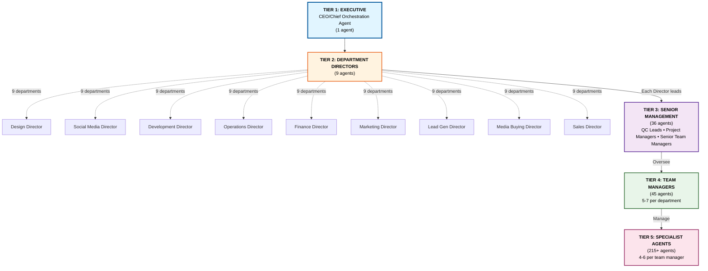

---

## 2. SPAN OF CONTROL BY LEVEL

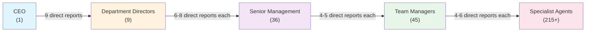

---

## 3. DESIGN DEPARTMENT HIERARCHY (33 agents)

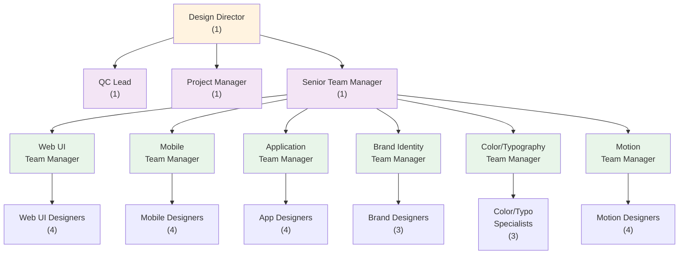

---

## 4. SOCIAL MEDIA DEPARTMENT HIERARCHY (50 agents)

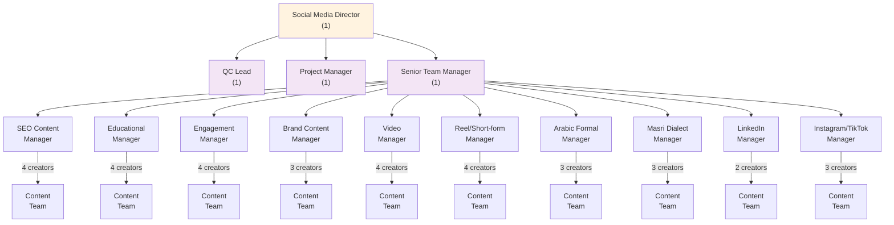

---

## 5. DEVELOPMENT DEPARTMENT HIERARCHY (45 agents)

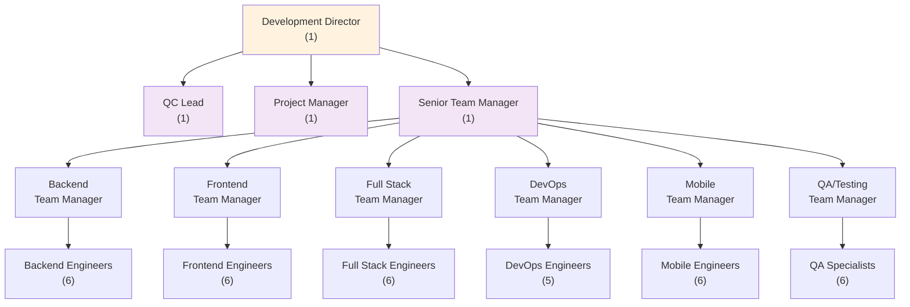

---

## 6. DECISION AUTHORITY BY LEVEL

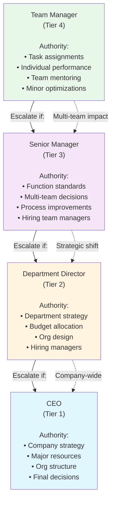

---

## 7. OPERATIONS DEPARTMENT HIERARCHY (28 agents)

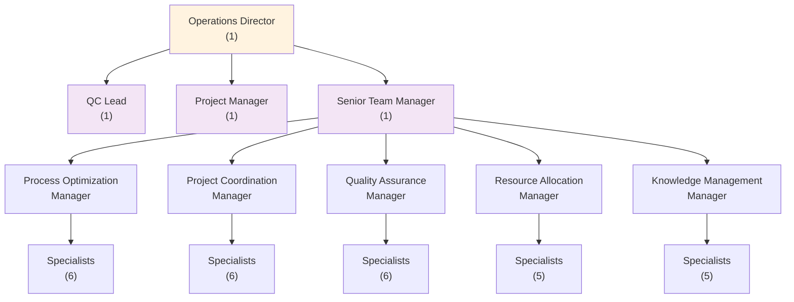

---

## 8. ESCALATION PATHWAYS

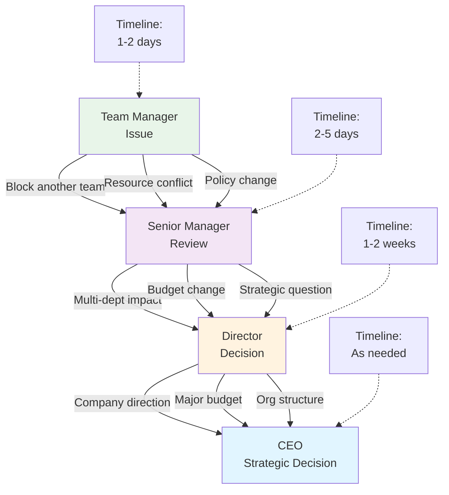

---

## 9. CROSS-DEPARTMENT COMMUNICATION MATRIX

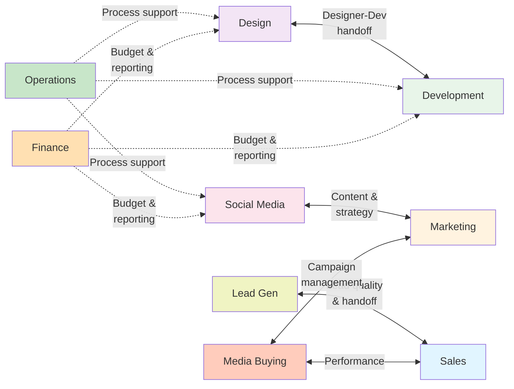

---

## 10. MANAGER RESPONSIBILITIES BY TIER

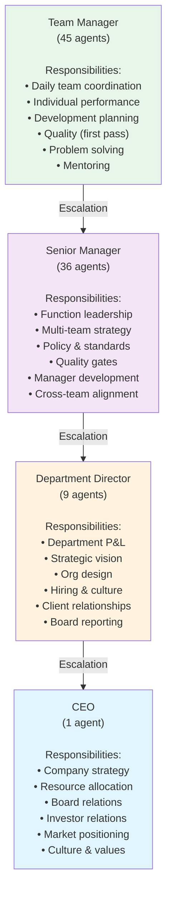

---

## 11. QUALITY ASSURANCE HIERARCHY

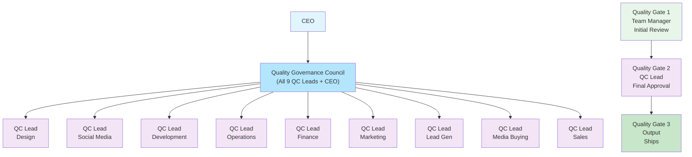

---

## 12. AGENT DISTRIBUTION BY DEPARTMENT

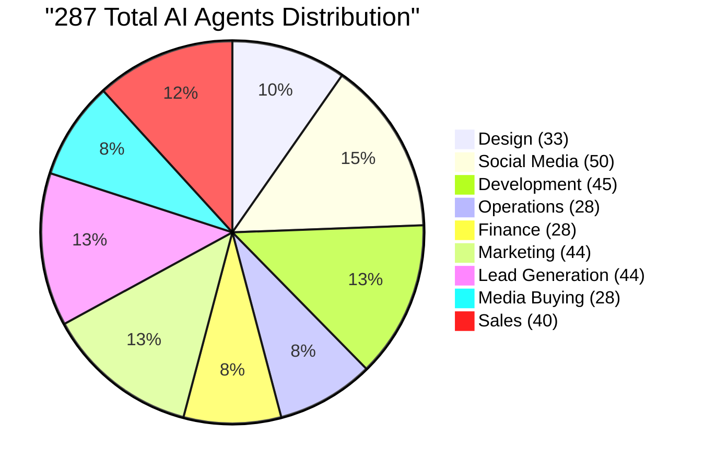

---

## 13. AGENT DISTRIBUTION BY TIER

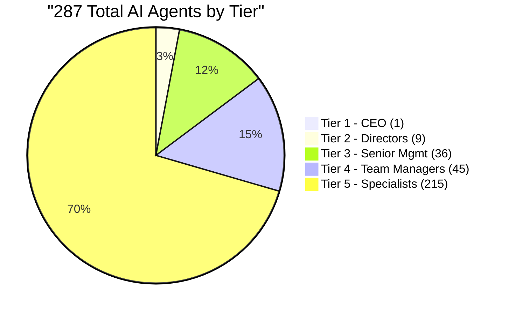

---

## 14. REPORTING STRUCTURE: FULL VIEW

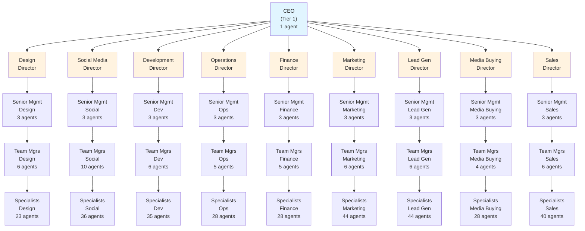

---

## 15. GROWTH & SCALING MODEL

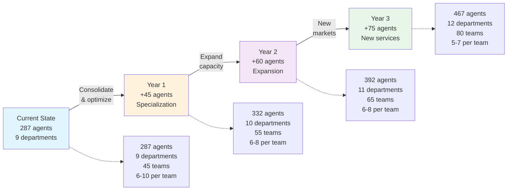

---

**All diagrams ready for documentation, presentations, and training materials.**

