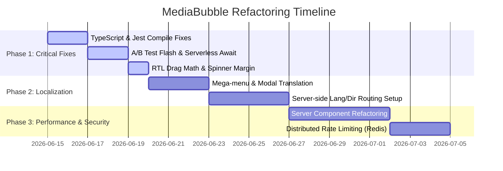

# MediaBubble Performance & Architecture Audit

**Prepared by:** Antigravity AI  
**Date:** June 15, 2026  
**Project:** MediaBubble Marketing Website + Brand Guidelines App (Next.js 14 App Router, Tailwind CSS, i18next bilingual EN + Egyptian Arabic Masri, RTL support)

---

## 1. Executive Summary

This comprehensive audit evaluates the technical architecture, performance profile, code quality, SEO, and bilingual/RTL support of the MediaBubble monorepo. The codebase exhibits a modern setup (Nx, App Router, shared npm packages), but contains critical architectural bottlenecks and bugs that impact security, localization, test execution, and core performance metrics.

### Priority 1-5 Critical Issues

1. **Static HTML Language & Direction declarations (CLS & SEO Penalty)**  
   Both `web-eg` and `web-ae` layouts hardcode `<html lang="en" dir="ltr">`. The language is flipped client-side during hydration. This triggers a severe Cumulative Layout Shift (CLS) for Arabic visitors and indexation errors for search engine crawlers (RSC-client mismatch).
2. **Untranslated Core Components (i18n Gaps)**  
   The entire services mega-menu in [SiteNav.tsx](file:///Users/Dorgham/Documents/Work/Devleopment/mediiabubble%20Main/apps/web-eg/components/layout/SiteNav.tsx) (and AE), the global conversion [NewsletterModal.tsx](file:///Users/Dorgham/Documents/Work/Devleopment/mediiabubble%20Main/apps/web-eg/components/shared/NewsletterModal.tsx), and all dynamic services page templates render completely in English without translating their text blocks or headers.
3. **Inverted Drag-to-Resize Math in RTL**  
   The resizable sidebar in the Brand Guidelines app uses LTR mouse delta math. In RTL mode, dragging the mouse right *shrinks* the sidebar instead of expanding it, and dragging left *expands* it.
4. **Vulnerable Rate Limiting & HubSpot Sync (Security & Reliability)**  
   The rate-limiting middleware parses the first item in the client-sent `X-Forwarded-For` header, allowing IP-spoofing to bypass limitations. Furthermore, HubSpot sync is fired without being awaited inside Serverless Route Handlers, leading to silent container suspension and lost leads on Vercel.
5. **Typescript Compilation & Test Suite Failures (CI/CD Blockers)**  
   The typecheck command fails due to direct index access of `process.env.NODE_ENV` in strict mode, and the monorepo typecheck command skips the applications entirely. Symmetrically, `office-hours.test.ts` attempts to import from `vitest` which is not installed, while Jest ignores all tests in `apps/web-ae` due to a misconfigured `roots` array.

---

## 2. Critical Bugs & Breaking Issues

### 2.1 TypeScript Compilation Error
Strict typecheck rules prevent compile success in the shared package because `process.env.NODE_ENV` is accessed via property access instead of index access:
* **File:** [use-dev-service-worker-cleanup.ts](file:///Users/Dorgham/Documents/Work/Devleopment/mediiabubble%20Main/packages/shared/src/hooks/use-dev-service-worker-cleanup.ts#L8)
* **Code:** `if (process.env.NODE_ENV !== 'development') return`
* **Fix:** Use index signatures:
  ```typescript
  if (process.env['NODE_ENV'] !== 'development') return
  ```

### 2.2 Broken Jest Test Runner Configuration
Running `npm run test` skips all test cases inside the UAE application `apps/web-ae` (e.g. [HeroSection.test.tsx](file:///Users/Dorgham/Documents/Work/Devleopment/mediiabubble%20Main/apps/web-ae/components/sections/HeroSection.test.tsx)) and the Brand Guidelines app.
* **File:** [jest.config.cjs](file:///Users/Dorgham/Documents/Work/Devleopment/mediiabubble%20Main/jest.config.cjs#L4)
* **Root Cause:** The `roots` array is hardcoded to only include `web-eg` and the `shared` package:
  ```javascript
  roots: ['<rootDir>/packages/shared', '<rootDir>/apps/web-eg/components', '<rootDir>/apps/web-eg/lib']
  ```
* **Fix:** Add wildcard directories or append the correct workspace application folders to `roots`:
  ```javascript
  roots: [
    '<rootDir>/packages/shared',
    '<rootDir>/apps/web-eg/components',
    '<rootDir>/apps/web-eg/lib',
    '<rootDir>/apps/web-ae/components',
    '<rootDir>/apps/web-ae/lib'
  ]
  ```

### 2.3 Orphan Vitest Import in Jest Test Suite
* **File:** [office-hours.test.ts](file:///Users/Dorgham/Documents/Work/Devleopment/mediiabubble%20Main/packages/shared/src/office-hours.test.ts#L1)
* **Root Cause:** The file attempts to import test blocks from `vitest` which is not declared in `package.json` dependencies:
  ```typescript
  import { describe, expect, it } from 'vitest'
  ```
  Since the test runner runs on Jest, this causes compilation errors during execution.
* **Fix:** Remove the import statement entirely. Jest injects `describe`, `expect`, and `it` globally:
  ```diff
  -import { describe, expect, it } from 'vitest'
  ```

### 2.4 Brand Guidelines App Instrumentation Dependency Leak
The Brand guidelines app crashes or fails to build if `RESEND_API_KEY` is missing, despite having no email functionality.
* **File:** [apps/brand/instrumentation.ts](file:///Users/Dorgham/Documents/Work/Devleopment/mediiabubble%20Main/apps/brand/instrumentation.ts#L5)
* **Root Cause:** It imports `validateEnv()` from `@mediabubble/shared/server`. The shared Zod schema mandates `RESEND_API_KEY` as a required string:
  ```typescript
  RESEND_API_KEY: z.string().min(1, 'RESEND_API_KEY is required')
  ```
* **Fix:** Make the key optional in the validation schema or create a separate schema specifically for the brand app configuration.

---

## 3. Performance Audit

### 3.1 Client-Side Rendering Monoliths (marketing service pages)
* **Files:** [content.tsx](file:///Users/Dorgham/Documents/Work/Devleopment/mediiabubble%20Main/apps/web-eg/app/services/%5Bslug%5D/content.tsx#L1) and [ServicePageTemplate.tsx](file:///Users/Dorgham/Documents/Work/Devleopment/mediiabubble%20Main/apps/web-eg/components/features/services/ServicePageTemplate.tsx#L1)
* **Issue:** Declared with `'use client'`. The entire service details page, all sections, and FAQs are loaded as client-side JavaScript. This leads to large bundle sizes and slow Largest Contentful Paint (LCP) scores.
* **Estimated Gains:** ~40-50% reduction in client-side JavaScript bundle sizes and ~15-20% faster LCP.
* **Recommendation:** Make `ServicePageTemplate.tsx` a server component. Extract tracking logic and accordions into small interactive client islands.
  ```typescript
  // Move tracking to a tiny client component:
  'use client'
  import { useEffect } from 'react'
  import { trackServiceViewed } from '@mediabubble/shared/client'
  export function ServiceTracker({ kicker }: { kicker: string }) {
    useEffect(() => { trackServiceViewed(kicker) }, [kicker])
    return null
  }
  ```

### 3.2 Animation Frame Class Toggling in InteractiveCursor
* **File:** [InteractiveCursor.tsx](file:///Users/Dorgham/Documents/Work/Devleopment/mediiabubble%20Main/apps/web-eg/components/shared/InteractiveCursor.tsx#L41-L45)
* **Issue:** Class list modifications are executed on every single frame loop:
  ```typescript
  if (isHovering.current) {
    ringEl.classList.add('cursor-ring--hover')
  } else {
    ringEl.classList.remove('cursor-ring--hover')
  }
  ```
  This causes continuous DOM access and style recalculation, leading to high CPU usage on pages.
* **Fix:** Cache the hover state and update classes only when it changes:
  ```typescript
  const wasHovering = useRef(false)
  // Inside tick():
  if (isHovering.current !== wasHovering.current) {
    wasHovering.current = isHovering.current
    ringEl.classList.toggle('cursor-ring--hover', isHovering.current)
  }
  ```

### 3.3 IntersectionObserver Re-creation Loop
* **File:** [Phase3Provider.tsx](file:///Users/Dorgham/Documents/Work/Devleopment/mediiabubble%20Main/apps/web-eg/components/shared/Phase3Provider.tsx#L42-L70)
* **Issue:** The `setup()` function instantiates a new `IntersectionObserver` on every DOM mutation:
  ```typescript
  observer = new IntersectionObserver(...)
  ```
  Revealing elements triggers classes (`reveal-visible`) which change the DOM, triggering the `MutationObserver`, executing `setup()`, and instantiating another observer. This circular loop causes memory leaks and performance drops.
* **Fix:** Use a single persistent observer instance that lives throughout the lifecycle of the component.

### 3.4 Raw Images in Testimonials
* **File:** [TestimonialsSection.tsx](file:///Users/Dorgham/Documents/Work/Devleopment/mediiabubble%20Main/apps/web-eg/components/sections/TestimonialsSection.tsx#L39)
* **Issue:** Uses standard HTML `` elements:
  ```html
  
  ```
* **Fix:** Replace with the monorepo's [OptimizedImage](file:///Users/Dorgham/Documents/Work/Devleopment/mediiabubble%20Main/apps/web-eg/components/ui/OptimizedImage.tsx) to automatically serve resized WebP/AVIF formats.

---

## 4. Code Quality & Architecture Issues

### 4.1 Monorepo Application Typechecking is Skipped
The `npm run typecheck` command executes `nx run-many -t typecheck`, but because `apps/web-eg/project.json`, `apps/web-ae/project.json`, and `apps/brand/project.json` do not define a `typecheck` target, **none of the monorepo application files are checked**.
* **Fix:** Add the typecheck target to their `project.json` files:
  ```json
  "typecheck": {
    "executor": "nx:run-commands",
    "options": {
      "command": "tsc -p apps/web-eg/tsconfig.json --noEmit"
    }
  }
  ```

### 4.2 Fragmented / Duplicate Custom Hooks
* **Files:** [LogoMarquee.tsx](file:///Users/Dorgham/Documents/Work/Devleopment/mediiabubble%20Main/packages/design-system/src/lib/LogoMarquee.tsx#L5) and [TestimonialsSection.tsx](file:///Users/Dorgham/Documents/Work/Devleopment/mediiabubble%20Main/apps/web-eg/components/sections/TestimonialsSection.tsx) both define/import custom hooks for checking user motion preferences (`usePrefersReducedMotion`).
* **Fix:** Keep the hook unified in `@mediabubble/shared/client` and remove duplicate code inside the UI packages.

### 4.3 Hardcoded Swatch Color Checks
* **File:** [MasterSwatch.tsx](file:///Users/Dorgham/Documents/Work/Devleopment/mediiabubble%20Main/packages/design-system/src/lib/MasterSwatch.tsx#L9)
* **Issue:** It uses a static array of colors to check if a color is light or dark:
  ```javascript
  const isLight = ['#FFFFFF', '#FAFAFA', ...].includes(selectedColor)
  ```
  If color configurations change in the system, this will fail.
* **Fix:** Move the relative luminance checker (`relativeLuminance`) from the brand guidelines app into the design system and use it programmatically.

### 4.4 Nx Module Boundary Violations in Middleware — **Resolved (Jun 2026)**
* **Files:** `apps/brand/middleware.ts`, `apps/web-ae/middleware.ts`, and `apps/web-eg/middleware.ts`
* **Issue:** Direct relative import of `packages/shared/csp-middleware.cjs` violates the Nx lint rule `@nx/enforce-module-boundaries`. Crossing package boundaries using relative paths breaks workspace modularity boundaries.
* **Fix:** Add a path mapping to `tsconfig.base.json` for `@mediabubble/shared/csp-middleware` and update the middleware files to import from the path alias:
  ```json
  // tsconfig.base.json paths
  "@mediabubble/shared/csp-middleware": ["packages/shared/csp-middleware.cjs"]
  ```
  Then import as:
  ```typescript
  import { createCspMiddleware } from '@mediabubble/shared/csp-middleware'
  ```

> **Status:** Implemented — see `packages/shared/README.md` and root `README.md` (Packages / CSP middleware).

## 5. SEO / i18n / RTL Findings

### 5.1 Static Layout Direction and Hydration Layout Shift (CLS)
* **Files:** Layout templates in [web-eg](file:///Users/Dorgham/Documents/Work/Devleopment/mediiabubble%20Main/apps/web-eg/app/layout.tsx#L83) and [web-ae](file:///Users/Dorgham/Documents/Work/Devleopment/mediiabubble%20Main/apps/web-ae/app/layout.tsx#L81)
* **Issue:** Hardcoded `<html lang="en" dir="ltr">`. The browser starts loading the site in LTR. After JavaScript loads, `I18nProvider` updates direction to RTL, causing elements to jump to the opposite side of the screen.
* **Fix:** Detect locale in the routing layer or use headers / URL parameters to render the correct direction on the server:
  ```typescript
  // Read direction dynamically from headers or cookies
  const dir = locale === 'ar-masri' ? 'rtl' : 'ltr';
  return <html lang={locale === 'ar-masri' ? 'ar' : 'en'} dir={dir}>
  ```

### 5.2 Missing Translations in Mega-Menu & Mobile Drawer
* **File:** [SiteNav.tsx](file:///Users/Dorgham/Documents/Work/Devleopment/mediiabubble%20Main/apps/web-eg/components/layout/SiteNav.tsx#L24)
* **Issue:** The list items inside `MEGA_MENU_COLUMNS` contain hardcoded titles, descriptions, and labels in English. In `MobileAccordionSection.tsx` and the mega-menu, these are output directly:
  ```typescript
  {col.label} / {item.label} / {item.desc}
  ```
  None of these items are translated, causing navigation menus to display in English even when the site language is switched to Arabic.
* **Fix:** Map these keys into `t()` and add corresponding keys to `translation.json`.

### 5.3 Inverted Drag-to-Resize Calculations in RTL
* **File:** [BrandGuidelinesApp.tsx](file:///Users/Dorgham/Documents/Work/Devleopment/mediiabubble%20Main/apps/brand/components/BrandGuidelinesApp.tsx#L39-L43)
* **Issue:**
  ```typescript
  const delta = e.clientX - dragStartX.current
  setSidebarWidth(Math.min(360, Math.max(180, dragStartWidth.current + delta)))
  ```
  In RTL, the sidebar is placed on the right. Dragging the mouse right (positive delta) moves towards the viewport edge, which should shrink the sidebar. However, the addition of delta increases the width.
* **Fix:** Invert the delta calculation when the document is in RTL mode:
  ```typescript
  const isRtl = document.documentElement.dir === 'rtl'
  const delta = e.clientX - dragStartX.current
  const nextWidth = isRtl ? dragStartWidth.current - delta : dragStartWidth.current + delta
  setSidebarWidth(Math.min(360, Math.max(180, nextWidth)))
  ```

### 5.4 Missing Service Slugs in Sitemap
* **File:** [sitemap.ts](file:///Users/Dorgham/Documents/Work/Devleopment/mediiabubble%20Main/apps/web-eg/app/sitemap.ts#L25)
* **Issue:** The sitemap only maps services returned by `getRegistrySlugs()`. The core services defined in `SERVICE_SLUGS` are omitted from the sitemap.
* **Fix:** Include the full set of services:
  ```typescript
  const allSlugs = Array.from(new Set([...SERVICE_SLUGS, ...getRegistrySlugs()]))
  ```

### 5.5 Physical Coordinates vs Logical Coordinates (FloatingCta)
* **Files:** [FloatingCta.tsx (web-eg)](file:///Users/Dorgham/Documents/Work/Devleopment/mediiabubble%20Main/apps/web-eg/components/features/contact/FloatingCta.tsx) and [FloatingCta.tsx (web-ae)](file:///Users/Dorgham/Documents/Work/Devleopment/mediiabubble%20Main/apps/web-ae/components/features/contact/FloatingCta.tsx)
* **Issue:** Hardcoded physical positioning class `right-6` places the floating button on the right side of the screen regardless of layout direction. In RTL Arabic layouts, floating CTA components should align on the left side of the page to fit proper RTL scanning patterns.
* **Fix:** Replace physical coordinate class `right-6` with logical coordinate class `end-6`:
  ```diff
  - 'fixed bottom-6 right-6 z-[200]',
  + 'fixed bottom-6 end-6 z-[200]',
  ```

---

## 6. Accessibility & UX Issues

### 6.1 Vulnerable Focus Trap on Unmount in NewsletterModal
* **File:** [NewsletterModal.tsx](file:///Users/Dorgham/Documents/Work/Devleopment/mediiabubble%20Main/apps/web-eg/components/shared/NewsletterModal.tsx#L98)
* **Issue:** The focus trap queries elements on Tab keypress. When the newsletter form is submitted successfully, the form inputs are unmounted and replaced with a success message. At that point, the focused element becomes the `body`, allowing keyboard users to tab out of the modal and focus elements in the background, violating focus trap requirements.
* **Fix:** Focus the close button explicitly upon submission success:
  ```typescript
  if (status === 'success') {
    closeButtonRef.current?.focus()
  }
  ```

### 6.2 Hardcoded Physical Margins in Design System Spinner
* **File:** [Button.tsx](file:///Users/Dorgham/Documents/Work/Devleopment/mediiabubble%20Main/packages/design-system/src/lib/Button.tsx#L47)
* **Issue:** The spinner inside `Button` uses `-ml-0.5` instead of logical spacing:
  ```html
  <svg className="animate-spin -ml-0.5 h-4 w-4" ... />
  ```
  In RTL, this hardcoded margin remains on the left, causing formatting errors.
* **Fix:** Swap it to logical spacing:
  ```html
  <svg className="animate-spin -ms-0.5 h-4 w-4" ... />
  ```

---

## 7. Security & Reliability

### 7.1 X-Forwarded-For Spoofing Vulnerability
* **File:** [rate-limit.ts](file:///Users/Dorgham/Documents/Work/Devleopment/mediiabubble%20Main/packages/shared/src/rate-limit.ts#L53)
* **Issue:**
  ```typescript
  export function getClientIp(headers: Headers): string {
    return (
      headers.get('x-forwarded-for')?.split(',')[0].trim() ??
      headers.get('x-real-ip') ??
      'unknown'
    )
  }
  ```
  `X-Forwarded-For` can be spoofed by attackers. By sending randomly generated IPs in the header, they can completely bypass rate limits on forms.
* **Fix:** Prioritize `x-real-ip` (overwritten and validated by Vercel/proxies) or fetch the last element of `x-forwarded-for`:
  ```typescript
  export function getClientIp(headers: Headers): string {
    return (
      headers.get('x-real-ip') ??
      headers.get('x-forwarded-for')?.split(',').pop()?.trim() ??
      'unknown'
    )
  }
  ```

### 7.2 In-Memory Rate Limiter in Serverless Functions
* **File:** [rate-limit.ts](file:///Users/Dorgham/Documents/Work/Devleopment/mediiabubble%20Main/packages/shared/src/rate-limit.ts#L6)
* **Issue:** Uses `const store = new Map<string, Entry>()`. In serverless hosting (Vercel), memory is wiped out as containers scale down or cycle. Thus, rate limiting is not shared across instances and fails to protect against automated spam attacks.
* **Fix:** Utilize a shared storage engine (e.g. Vercel KV, Redis, Upstash) or implement Edge Middleware rate-limiting.

### 7.3 Unawaited Promises in Serverless Route Handlers
* **File:** [route.ts](file:///Users/Dorgham/Documents/Work/Devleopment/mediiabubble%20Main/apps/web-eg/app/api/contact/route.ts#L65)
* **Issue:**
  ```typescript
  syncContactToHubSpot({ ... }).catch((err) => console.error('[Contact] HubSpot sync error:', err))
  ```
  The promise is not awaited. When hosted on Vercel, the function container is suspended immediately after returning `NextResponse.json()`. As a result, the HubSpot sync can be terminated mid-execution and silently fail.
* **Fix:** Use `await` or `Promise.all` to ensure all execution pipelines finish before returning the response:
  ```typescript
  await Promise.all([
    sendContactEmail(body),
    syncContactToHubSpot(body).catch((err) => console.error('[Contact] HubSpot sync error:', err))
  ])
  ```

---

## 8. Quick Wins vs Long-term Refactors

| Strategy | Action | Target File / Component | Complexity | Impact |
| :--- | :--- | :--- | :--- | :--- |
| **Quick Win** | Fix compile error by updating process.env access | [use-dev-service-worker-cleanup.ts](file:///Users/Dorgham/Documents/Work/Devleopment/mediiabubble%20Main/packages/shared/src/hooks/use-dev-service-worker-cleanup.ts) | Low | High (fixes build) |
| **Quick Win** | Update `roots` in Jest configuration to include UAE | [jest.config.cjs](file:///Users/Dorgham/Documents/Work/Devleopment/mediiabubble%20Main/jest.config.cjs) | Low | Medium (restores tests) |
| **Quick Win** | Await CRM sync promise inside Route Handler | [/api/contact/route.ts](file:///Users/Dorgham/Documents/Work/Devleopment/mediiabubble%20Main/apps/web-eg/app/api/contact/route.ts) | Low | High (lead reliability) |
| **Quick Win** | Invert drag resize delta values in RTL | [BrandGuidelinesApp.tsx](file:///Users/Dorgham/Documents/Work/Devleopment/mediiabubble%20Main/apps/brand/components/BrandGuidelinesApp.tsx) | Low | High (fixes sidebar) |
| **Quick Win** | Fix `tel:` href formatting (strip spaces) | [ContactSection.tsx](file:///Users/Dorgham/Documents/Work/Devleopment/mediiabubble%20Main/apps/web-eg/components/features/contact/ContactSection.tsx) | Low | Medium (working link) |
| **Quick Win** | Resolve Nx module boundary lint errors in middleware | Middleware files | Low | Medium (clean lint) |
| **Quick Win** | Fix physical coordinates in FloatingCta to use end-6 | FloatingCta components | Low | Medium (correct RTL float) |
| **Refactor** | Convert dynamic service templates to Server Components | [ServicePageTemplate.tsx](file:///Users/Dorgham/Documents/Work/Devleopment/mediiabubble%20Main/apps/web-eg/components/features/services/ServicePageTemplate.tsx) | Medium | High (LCP performance) |
| **Refactor** | Translate Mega-Menu and Accordion sub-links | [SiteNav.tsx](file:///Users/Dorgham/Documents/Work/Devleopment/mediiabubble%20Main/apps/web-eg/components/layout/SiteNav.tsx) | Medium | High (Arabic i18n) |
| **Refactor** | Server-side locale & direction routing | Layout files / Middleware | High | High (prevents CLS) |
| **Refactor** | Connect KV/Redis store for rate limiter | [rate-limit.ts](file:///Users/Dorgham/Documents/Work/Devleopment/mediiabubble%20Main/packages/shared/src/rate-limit.ts) | Medium | High (spam prevention) |

---

## 9. Prioritized Improvement Roadmap



### Phase 1: Critical Fixes (Effort: 3 days | Impact: Critical)
* Fix index signature compilation error in `useDevServiceWorkerCleanup`.
* Update Jest roots to include `web-ae` and fix Vitest imports in `office-hours.test.ts`.
* Await the HubSpot CRM sync inside `/api/contact/route.ts` to prevent silent lead drops.
* Invert delta mouse calculations on drag-to-resize inside `BrandGuidelinesApp` when direction is RTL.
* Replace physical margin in the loading spinner with logical margins (`-ms-0.5`).
* Resolve Nx module boundary lint errors in middleware files.
* Replace physical coordinates in FloatingCta with logical coordinates (`end-6`).

### Phase 2: Translation & Layout Polish (Effort: 5 days | Impact: High)
* Wrap all services mega-menu links and descriptions in `t()` translations.
* Set up cookie/URL-based language detection on the server to output matching `lang` and `dir` values in initial HTML, resolving layout shift.
* Standardize all `object-position` properties to `start` for RTL compatibility.

### Phase 3: Performance & Security Enhancements (Effort: 8 days | Impact: High)
* Shift `ServicePageTemplate` and dynamic service sub-sections to Server Components, extracting interaction and analytics tracking to lightweight clients.
* Connect a serverless-friendly Redis/KV store to `rate-limit.ts` and switch the IP detection priority to `X-Real-IP`.
