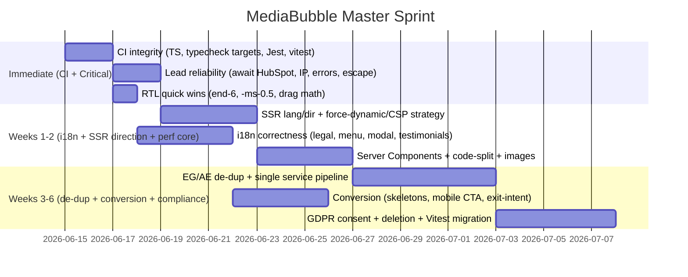

# MediaBubble — Comprehensive Audit & Enhancement Plan

**Master synthesis of three independent technical audits**

|                   |                                                                                                                                     |
| ----------------- | ----------------------------------------------------------------------------------------------------------------------------------- |
| **Prepared by**   | Master Technical Auditor (synthesis)                                                                                                |
| **Date**          | 2026-06-15                                                                                                                          |
| **Project**       | MediaBubble — bilingual marketing platform + brand-guidelines app                                                                   |
| **Stack**         | Nx monorepo · Next.js 14 (App Router) · React 18 · TypeScript · Tailwind CSS · i18next (EN + Egyptian Masri / UAE Khaliji) · Vercel |
| **Apps in scope** | `apps/web-eg` (Egypt), `apps/web-ae` (UAE clone), `apps/brand` (guidelines), `packages/shared`, `packages/design-system`            |

### Source audits consolidated

1. **Antigravity** — _Performance & Architecture Audit_ (`MEDIA_BUBBLE_ANTIGRAVITY_AUDIT.md`) — strongest on build/CI blockers, RTL drag math, serverless reliability, Nx boundaries.
2. **Cursor** — _Code Quality Audit_ (`MEDIA_BUBBLE_CURSOR_CODE_QUALITY_AUDIT.md`) — strongest on i18n correctness bugs, API security, EG/AE duplication, content-pipeline debt.
3. **OpenCode** — _Arabic-first / Middle-East Audit_ (`MEDIA_BUBBLE_OPENCODE_AUDIT.md`) — strongest on Core Web Vitals, RTL/SEO, conversion & GDPR compliance.

> **How to read this document.** Each finding carries a **consensus tag** showing which auditors independently flagged it: **[A]** Antigravity, **[C]** Cursor, **[O]** OpenCode. Triple-flagged items (**[A][C][O]**) are the highest-confidence, highest-priority work. Where the audits disagreed on severity or remedy, a **⚖️ Reconciliation** note explains the unified decision.

---

## 1. Executive Summary

MediaBubble's foundation is **architecturally sound** — all three auditors independently agree on this. The Nx monorepo, shared server/client import boundaries, CSP middleware, ISR on detail routes, an exhaustive `switch + never` service renderer, and a working design system are genuine strengths. The problems are not structural rot; they are **a concentrated set of correctness, localization, performance, and reliability defects** that disproportionately harm the two things this business depends on: **Arabic UX** and **lead generation**.

The audits converge on five themes:

1. **The build and test pipeline is not trustworthy.** A TypeScript strict-mode error blocks `shared:typecheck`, the Nx app typecheck targets are missing entirely (apps are never type-checked in CI), Jest only sees `web-eg` + `shared`, and a stray `vitest` import breaks a shared test. **CI is currently green by omission, not by correctness.** This is the single most dangerous finding because it masks every other regression.

2. **Arabic is structurally second-class despite being the primary market.** The `<html lang/dir>` is hardcoded LTR/English and only corrected after hydration (flash of wrong direction + SEO/screen-reader mis-identification); the EG legal pages never render Arabic (`locale === 'ar'` vs `ar-masri`); the mega-menu, newsletter modal, testimonial bodies, blog CTA, OG image, and `global-error` are English-only or English-fallback; and RTL physical-coordinate bugs (`right-6`, `-ml-0.5`, inverted drag math) break the layout for the audience the company most wants to convert.

3. **Lead-generation reliability is at risk in production.** HubSpot sync is fired-and-not-awaited inside a serverless route (Vercel suspends the container → silent lost leads); the rate limiter is an in-memory `Map` that resets per lambda; `X-Forwarded-For[0]` is trivially spoofable; HubSpot vendor errors leak to the browser; and Resend admin emails interpolate unescaped user HTML.

4. **Performance leaves measurable Core Web Vitals on the table.** `force-dynamic` at the root opts the whole tree out of static/edge caching; heavy `'use client'` boundaries ship server-eligible UI as client JS; below-fold and per-slug service sections are imported eagerly; `react-icons` is unoptimized; testimonials use raw ``; and a global `main` entrance animation plus a self-retriggering `IntersectionObserver`/`MutationObserver` loop cause CLS and CPU churn.

5. **Maintenance cost is doubling silently.** ~69 mirrored EG/AE components and a verbatim 457-line `services-data.ts` per app mean every fix ships twice and drift is already visible (the legal-locale bug, AE-shows-Egypt copy, AE test gap). Three overlapping service-content pipelines compound this.

**Bottom line:** none of these require re-architecture. A disciplined 6-week sprint — starting with restoring CI integrity, then closing the Arabic/RTL correctness gaps and lead-reliability holes, then performance and de-duplication — converts a fragile-feeling codebase into a hardened, fast, genuinely bilingual product.

### Consensus heat map

| Theme                           | Findings | Triple-flagged                                                    | Net severity |
| ------------------------------- | -------- | ----------------------------------------------------------------- | ------------ |
| Build / test / CI integrity     | 5        | TS `NODE_ENV` **[A][O]**                                          | 🔴 Critical  |
| i18n / RTL correctness          | 12+      | `html` lang/dir **[A][C][O]**, Floating CTA `end-6` **[A][C][O]** | 🔴 Critical  |
| API security & lead reliability | 6        | rate limiter **[A][C][O]**                                        | 🔴 Critical  |
| Performance / CWV               | 9        | testimonials `` **[A][C][O]**, `force-dynamic` **[C][O]**    | 🟠 High      |
| Code quality / duplication      | 8        | EG/AE duplication **[C][O]**                                      | 🟠 High      |
| Conversion / UX / GDPR          | 9        | — (OpenCode-led)                                                  | 🟡 Medium    |

---

## 2. Consolidated Critical Bugs

These are correctness/security/reliability defects that should be fixed **before** any feature work. Ordered by net severity and consensus.

### CB-1 — Static `<html lang="en" dir="ltr">`; direction flips only after hydration **[A][C][O]** 🔴

**Files:** `apps/web-eg/app/layout.tsx:83`, `apps/web-ae/app/layout.tsx:81`, `packages/shared/src/i18n/I18nProvider.tsx`

The document ships LTR/English and is corrected client-side in a `useEffect`. Consequences flagged across all three audits: **CLS / flash of incorrect direction and Latin fonts** for returning Arabic users (Antigravity, Cursor), **screen readers announce English**, **search engines index the wrong language**, browser auto-translate misfires, and document-level RTL behaviors (scrollbars, `text-wrap: balance`) stay LTR (OpenCode).

**Unified fix (server-authoritative direction):**

```tsx
// app/layout.tsx — read locale from cookie before paint
import { cookies } from 'next/headers'
import { getInitialLocale } from '@/lib/i18n/server'

const locale = getInitialLocale(cookies())
const dir  = locale.startsWith('ar') ? 'rtl' : 'ltr'   // ar, ar-masri, ar-khaliji
const lang = dir === 'rtl' ? 'ar' : 'en'
return <html lang={lang} dir={dir} suppressHydrationWarning>…
```

Additionally, have `I18nProvider` keep `document.documentElement.lang`/`dir` in sync on runtime locale change (defensive, for client-side switches). Write the locale to the same cookie the server reads so SSR and client agree before paint.

> ⚖️ **Reconciliation.** Cursor rated this **P1** and OpenCode **High**; the cookie-driven SSR approach (Cursor §5.8) is the correct mechanism, but it is **coupled to CB-9 `force-dynamic`** — reading a cookie already forces dynamic rendering, so do these two together. Treat as **P0** because it is both a UX _and_ an SEO defect in the primary market.

---

### CB-2 — TypeScript strict-mode failure blocks `shared:typecheck` **[A][O]** 🔴

**File:** `packages/shared/src/hooks/use-dev-service-worker-cleanup.ts:8`

```ts
if (process.env.NODE_ENV !== "development") return;
// TS4111: 'NODE_ENV' comes from an index signature → must use ['NODE_ENV']
```

**Fix:** `if (process.env['NODE_ENV'] !== 'development') return` (or add a typed `env.ts` accessor in `packages/shared`).

> ⚖️ **Reconciliation.** Antigravity rated this a **build-blocker (High)**; OpenCode rated it **Medium**. Because it fails `typecheck` and therefore gates CI, the unified rating is **P0 / Critical** — it is the literal first thing blocking a trustworthy pipeline.

---

### CB-3 — Monorepo apps are never type-checked **[A]** 🔴

**Files:** `apps/web-eg/project.json`, `apps/web-ae/project.json`, `apps/brand/project.json`

`npm run typecheck` runs `nx run-many -t typecheck`, but none of the three apps define a `typecheck` target, so **zero application code is checked**. This is why app-level type errors (e.g. CB-1's locale handling, non-null assertions in `app/services/[slug]/page.tsx`) never surface in CI.

**Fix — add to each app's `project.json`:**

```json
"typecheck": {
  "executor": "nx:run-commands",
  "options": { "command": "tsc -p apps/web-eg/tsconfig.json --noEmit" }
}
```

---

### CB-4 — Jest config skips `web-ae` and `brand` entirely **[A][O]** 🔴

**File:** `jest.config.cjs:4`

```js
roots: [
  "<rootDir>/packages/shared",
  "<rootDir>/apps/web-eg/components",
  "<rootDir>/apps/web-eg/lib",
];
```

All `web-ae` tests (e.g. `HeroSection.test.tsx`) and the brand app are silently unrun. OpenCode additionally notes the `lint-staged` `jest --bail` hook makes `npm test` hang/time out and blocks commits for minutes.

**Fix:** Add the missing roots (short-term), and decide the runner strategy (see ⚖️ below):

```js
roots: [
  "<rootDir>/packages/shared",
  "<rootDir>/apps/web-eg/components",
  "<rootDir>/apps/web-eg/lib",
  "<rootDir>/apps/web-ae/components",
  "<rootDir>/apps/web-ae/lib",
];
```

> ⚖️ **Reconciliation.** Antigravity/Cursor say "fix Jest roots"; OpenCode says "migrate to Vitest and drop Jest from `lint-staged`." **Unified decision:** do the _minimal Jest roots fix now_ (P0, unblocks AE regression safety this sprint) and _schedule the Vitest workspace migration_ as a Phase-3 quality item (CB-4 does not block on it). Regardless of runner, **remove `jest --bail` from `lint-staged`** immediately — pre-commit should run lint + related tests fast, not the whole suite.

---

### CB-5 — Orphan `vitest` import breaks a shared test under Jest **[A]** 🔴

**File:** `packages/shared/src/office-hours.test.ts:1`

```ts
import { describe, expect, it } from "vitest"; // vitest not installed
```

**Fix:** delete the import — Jest injects these globals. (If the Vitest migration in CB-4 proceeds, this file becomes correct as-is; until then, remove it.)

---

### CB-6 — EG legal pages never render Arabic **[C]** 🔴

**File:** `apps/web-eg/components/features/legal/LegalDocument.tsx:17`

```ts
const content = locale === "ar" ? document.ar : document.en; // EG locale is 'ar-masri'
```

Privacy, terms, and cookies stay **English** when an Egyptian user selects Arabic — a **compliance/trust** defect. UAE (`ar`) is unaffected, which is exactly why it escaped notice.

**Fix (use `dir` as the single source of truth):**

```tsx
const { locale, dir } = useI18n();
const isArabic = dir === "rtl" || locale === "ar" || locale === "ar-masri";
const content = isArabic ? document.ar : document.en;
```

---

### CB-7 — HubSpot sync is fired without `await` → silent lost leads **[A]** 🔴

**File:** `apps/web-eg/app/api/contact/route.ts:65` (byte-identical in AE)

```ts
syncContactToHubSpot({…}).catch(err => console.error('[Contact] HubSpot sync error:', err))
return NextResponse.json(…)   // Vercel suspends the container here → sync may be killed
```

**Fix:** await all side effects before responding.

```ts
await Promise.all([
  sendContactEmail(body),
  syncContactToHubSpot(body).catch((err) =>
    console.error("[Contact] HubSpot sync error:", err),
  ),
]);
```

> _Vercel note:_ on Fluid Compute, prefer `await`; if you genuinely need fire-and-forget, use `after()` from `next/server` (durable post-response work) rather than a bare floating promise.

---

### CB-8 — In-memory rate limiter + spoofable client IP **[A][C][O]** 🔴

**File:** `packages/shared/src/rate-limit.ts` (`:6` store, `:53` `getClientIp`)

Two compounding defects: (a) `const store = new Map()` resets whenever a serverless instance cycles → limits are per-lambda, not global; (b) `getClientIp` reads `x-forwarded-for.split(',')[0]` — the **client-controlled** first hop, so attackers spoof random IPs to bypass limits entirely.

**Fix (short-term IP hardening):**

```ts
export function getClientIp(headers: Headers): string {
  return (
    headers.get("x-real-ip") ?? // proxy-set, trustworthy on Vercel
    headers.get("x-forwarded-for")?.split(",").pop()?.trim() ?? // last hop, not first
    "unknown"
  );
}
```

**Fix (production hardening):** move the store to **Upstash / Vercel KV / Redis** (or Vercel Firewall rate-limit rules) so limits are shared across instances. Also add **field max-lengths** on `/api/contact` (Cursor P1) and **disable the submit button on first click** (OpenCode §7.3) to kill double-submits.

---

### CB-9 — `force-dynamic` root layout disables static/edge/ISR **[C][O]** 🟠→🔴

**Files:** `apps/web-eg/app/layout.tsx:54`, `apps/web-ae/app/layout.tsx:54`

```ts
export const dynamic = "force-dynamic"; // needed today to read headers().get('x-nonce')
```

Forces every page into per-request rendering, nullifying SSG, edge caching, and the ISR already configured on blog/portfolio/service routes (which "fight this pattern," per Cursor). OpenCode estimates **~200–500ms avoidable TTFB** and degraded LCP.

> ⚖️ **Reconciliation — the one genuine cross-audit tension.** OpenCode (High) says _remove `force-dynamic`_; Cursor (P4) says it is _required for the CSP nonce_ and rates it lower-priority/large-effort. Both are right about facts. **Unified decision:** treat as **High**, and because it is **entangled with CB-1** (cookie-driven SSR direction also forces dynamic), tackle the nonce + direction together. Preferred path, in order of desirability:
>
> 1. **Hash-based CSP** for first-party inline scripts (theme init, JSON-LD) → removes the nonce dependency → layout can be static. Best long-term outcome.
> 2. If a nonce must stay: scope `force-dynamic` to only the segments that truly need it, or inject the nonce via middleware into a static shell, keeping ISR child routes static.
>
> Do **not** simply delete `force-dynamic` without resolving the nonce, or you reintroduce a CSP gap.

---

### CB-10 — GA4 script injected imperatively, bypassing CSP nonce + `next/script` **[O]** 🟠

**File:** `packages/shared/src/hooks/use-ga.ts:21`

```ts
const script = document.createElement("script");
script.src = `…/gtag/js?id=${gaId}`;
document.head.appendChild(script);
```

Bypasses the CSP nonce, plus Next's dedup/preload/loading-strategy. **Fix:** render via `next/script` inside a client island, passing the nonce from the server (data attribute or context).

---

### CB-11 — Resend admin emails interpolate unescaped user HTML **[C]** 🔴(security)

**File:** `packages/shared/src/resend-client.ts:20`

```ts
const html = `…<td>${payload.firstName} ${payload.lastName}</td>…<p>${payload.message}</p>`;
```

HTML/script injection into the admin notification inbox (operational, not end-user XSS). **Fix:** `escapeHtml()` every user field, or use Resend's text-only path for notifications.

---

### CB-12 — HubSpot API leaks raw vendor errors to the browser **[C]** 🔴(security)

**File:** `apps/web-eg/app/api/hubspot/route.ts:65` (identical in AE; surfaced to users via `BlogNewsletterCta`)

```ts
const message = err instanceof Error ? err.message : "Internal error";
return NextResponse.json({ error: message }, { status: 500 });
```

**Fix:** log server-side, return a generic message: `{ error: 'Unable to save your details. Please try again later.' }`.

---

### CB-13 — Inverted drag-to-resize math in RTL (Brand app) **[A]** 🔴(UX)

**File:** `apps/brand/components/BrandGuidelinesApp.tsx:39`

Sidebar sits on the right in RTL; LTR delta math means dragging right _grows_ it (should shrink). **Fix:**

```ts
const isRtl = document.documentElement.dir === "rtl";
const delta = e.clientX - dragStartX.current;
const next = isRtl
  ? dragStartWidth.current - delta
  : dragStartWidth.current + delta;
setSidebarWidth(Math.min(360, Math.max(180, next)));
```

### CB-14 — Brand app crashes without `RESEND_API_KEY` despite having no email **[A]** 🟠

**File:** `apps/brand/instrumentation.ts:5` → `validateEnv()` mandates `RESEND_API_KEY`. **Fix:** make the key optional in the shared Zod schema, or give the brand app its own env schema.

### CB-15 — Newsletter `hasShownToday()` uses UTC date (double-fires across Cairo/Dubai midnight) **[O]** 🟡

**File:** `apps/web-eg/components/shared/NewsletterModal.tsx:25`. **Fix:** compare against `toLocaleDateString('en-CA', { timeZone: 'Africa/Cairo' })` or store a timestamp and gate on `>24h`.

---

## 3. Performance & Optimization Plan

Ordered by impact-to-effort. Estimated gains are the auditors' figures, to be validated with `@next/bundle-analyzer` + Lighthouse before/after.

### P-1 — Resolve `force-dynamic` → restore static/edge/ISR **[C][O]** (High impact)

See **CB-9**. Biggest single CWV win: removes ~200–500ms TTFB and lets blog/portfolio/service routes actually serve from cache. Gate behind the hash-based-CSP or scoped-nonce decision.

### P-2 — Convert client monoliths to Server Components + small islands **[A][O]** (High)

**Files:** `ServicePageTemplate.tsx`, `content.tsx`, `MainLayout`, `PageHero`, `ContactSection`. These are `'use client'` but mostly render static markup; the client boundary drags the whole subtree into hydration. Extract only interactive bits (form state, modals, scroll/tracking) into islands.

```tsx
"use client";
export function ServiceTracker({ kicker }: { kicker: string }) {
  useEffect(() => {
    trackServiceViewed(kicker);
  }, [kicker]);
  return null;
}
```

**Antigravity estimate:** ~40–50% client-JS reduction on service pages, ~15–20% faster LCP.

### P-3 — Code-split below-fold + per-slug service sections **[C]** (High)

`ServicePageRenderer` statically imports **every** exclusive section for all slugs; homepage imports all sections eagerly. Use `next/dynamic` for sections not used on every slug, and split the 474-line `ServiceExclusiveSections.tsx` into per-section files for cleaner chunks.

### P-4 — Testimonial avatars: raw `` → `next/image`/`OptimizedImage` **[A][C][O]** (Medium, triple-flagged)

**File:** `TestimonialsSection.tsx:39`. Swap to the monorepo's `OptimizedImage` (or `next/image` with `sizes="80px"`, `placeholder="blur"`) for WebP/AVIF + no layout shift. Low effort, unanimous.

### P-5 — Remove global `main` entrance animation (CLS) **[O]** (Medium)

**File:** `apps/web-eg/app/globals.css:513` — `main { animation: page-enter .5s … }` animates the whole page on every nav → CLS + jank on low-end devices. Replace with targeted element transitions (`next-view-transitions` / `AnimatePresence`).

### P-6 — Fix the IntersectionObserver / MutationObserver re-creation loop **[A][C]** (Medium)

**File:** `Phase3Provider.tsx:42`. `setup()` builds a new `IntersectionObserver` on every DOM mutation; revealing nodes mutates the DOM → retriggers `setup()` → new observer (memory leak + CPU). **Fix:** one persistent observer for the component lifecycle. Also gate `ScrollReveal` on `prefers-reduced-motion` (Cursor §4.5 / §6.3).

### P-7 — Cache hover state in `InteractiveCursor` **[A]** (Low)

**File:** `InteractiveCursor.tsx:41` toggles classes every frame. Only mutate on state change:

```ts
if (isHovering.current !== wasHovering.current) {
  wasHovering.current = isHovering.current;
  ringEl.classList.toggle("cursor-ring--hover", isHovering.current);
}
```

> Note: Cursor flags `InteractiveCursor` as **dead/never-mounted** (§3.3). Confirm whether it's on the roadmap — if not, **delete it** (RQ-7) instead of optimizing it.

### P-8 — Extend `optimizePackageImports` **[C][O]** (Low)

**File:** `next.config.js:16` lists only `lucide-react`. Add `react-icons` (barrel-import bloat) and `@mediabubble/shared`. Audit with `@next/bundle-analyzer`.

### P-9 — Add `loading.tsx` / `error.tsx` route skeletons **[O]** (Medium)

Blank flash on navigation (worse on Egypt/UAE networks). Add root + per-segment `loading.tsx` skeletons matching final layout; add segment `error.tsx` on `/blog`, `/services` (Cursor P3).

### P-10 — Trim fat i18n client bundles **[C]** (Medium)

`lib/i18n/provider.tsx` merges full `en.json` + `ar-masri/ar-khaliji.json` (~836 brand-heritage keys) into market bundles that mostly use dotted `public/locales` keys → dead dictionary weight. Split brand-only dictionaries to `apps/brand`.

### P-11 — Brand app: reduce four Google font families **[C]** (Low)

`apps/brand/app/layout.tsx` loads more font weight than the market apps → heavier LCP for a single-page tool. Subset/reduce families.

### P-12 — Run dev SW cleanup once per session **[O]** (Low)

`use-dev-service-worker-cleanup.ts` enumerates registrations/caches on every mount → FOUC during HMR. Gate with a `sessionStorage` flag.

---

## 4. Code Quality & Refactoring Roadmap

### RQ-1 — Kill EG/AE duplication (~69 mirrored components) **[C][O]** (Large, structural)

Byte-identical across markets: `middleware.ts`, all three API routes per app (6 files / 3 unique impls), `ServicePageRenderer`, `InteractiveCursor`, `Phase3Provider`, many service sections. Every fix ships twice; drift is **already real** (CB-6 legal bug, AE-shows-Egypt copy, AE test gap).

- **API/middleware:** move to `packages/shared`; apps thin-re-export: `export { POST } from '@mediabubble/shared/api/contact'`.
- **Shared marketing UI:** extract a package consumed by both EG and AE; keep market specifics (currency, geo, case-study names, HubSpot pipeline) in per-app config/env.

### RQ-2 — Collapse three service-content pipelines into one **[C][O]** (Large)

Today: `lib/services-data.ts` (457 lines) **+** `lib/content/services/*` registry **+** `ServicesSection.tsx` local array. `ppc.ts` imports legacy `services-data`; `seo.ts` duplicates strings; `ServicePageTemplate`'s fallback branch is **dead** for all live slugs. Choose the registry (`ServicePageConfig`) as the single source; derive or delete `services-data.ts`; remove the dead template path after verification. Add a build-time check that registry slugs and `SERVICE_SLUGS`/`opengraph-image` stay in sync (fixes CB-related `content`/`events` slug drift — OpenCode §4.6, Cursor §3.2).

### RQ-3 — `services-data.ts` factory **[O]** (Medium, subset of RQ-1/RQ-2)

If a full pipeline collapse is deferred, at minimum replace the verbatim 457-line-per-app file with `createServiceData(market: 'eg' | 'ae')` in `packages/shared`, market overrides in a small JSON.

### RQ-4 — Resolve Nx module-boundary violations in middleware **[A]** (Low) — **Resolved (Jun 2026)**

`apps/*/middleware.ts` import `packages/shared/csp-middleware.cjs` via **relative path**, violating `@nx/enforce-module-boundaries`. Add a `tsconfig.base.json` path alias `@mediabubble/shared/csp-middleware` and import through it.

> **Status:** Fixed — apps import `@mediabubble/shared/csp-middleware`; alias in `tsconfig.base.json`, per-app `tsconfig.json`, and `packages/shared/package.json` export + `csp-middleware.d.ts`.

### RQ-5 — Unify duplicated hooks & hardcoded logic **[A]** (Low)

- `usePrefersReducedMotion` is defined/imported in both `LogoMarquee.tsx` and `TestimonialsSection.tsx` → keep one copy in `@mediabubble/shared/client`.
- `MasterSwatch.tsx:9` hardcodes a light-color allow-list → move the `relativeLuminance` checker into the design system and compute it.

### RQ-6 — Type-safety hardening **[C]** (Medium)

`as any` on union state in `InteractivePromptBuilder.tsx`; `Locale = string` (no branded per-app union); unused `slug` prop on `ServiceHeroSection`; non-null assertions in `app/services/[slug]/page.tsx`. Introduce branded locale unions per app and remove the assertions once CB-3 makes apps type-checked.

### RQ-7 — Delete dead modules **[C]** (Low)

`Sidebar.tsx` (zero imports, uses react-i18next not `useI18n`), `InteractiveCursor.tsx` (never mounted), `GitModal.tsx` (only referenced in a comment), `Navigation.tsx` (tests-only; `SiteNav` is live). Confirm roadmap, then remove (or wire `GitModal` if intended).

### RQ-8 — Decompose oversized components **[C]** (Medium)

`SiteNav.tsx` (720) → split mega-menu / mobile drawer / scroll-RAF / focus-trap / swipe; `ServiceExclusiveSections.tsx` (474, also helps P-3); `HeroSection.tsx` (372); `BrandGuidelinesApp.tsx` (325); `ContactSection.tsx` (348).

### RQ-9 — Structured API error contracts **[O]** (Low–Medium)

`mapServerError` in `ContactSection.tsx:33` string-matches messages (`lower.includes('name')`) — brittle. Return error **codes** (`{ code: 'FIRST_NAME_REQUIRED' }`) from `/api/contact` and map them client-side.

### RQ-10 — Global client error boundary **[O]** (Low)

Only `I18nErrorBoundary` exists. Wrap `AppProviders` in a general `ErrorBoundary`; make `global-error.tsx` RTL-aware (see i18n §5).

---

## 5. i18n / RTL & Bilingual Improvements

> The single most business-relevant section: Arabic is the **primary** market, yet it is the most defective surface. Treat untranslated `aria-label`s and English fallbacks as **bugs, not polish**.

### Correctness (must-fix this sprint)

| ID   | Issue                                                             | File                                                  | Tag       |
| ---- | ----------------------------------------------------------------- | ----------------------------------------------------- | --------- |
| I-1  | `html` lang/dir hardcoded LTR (→ CB-1)                            | `app/layout.tsx`, `I18nProvider.tsx`                  | [A][C][O] |
| I-2  | EG legal pages never Arabic (→ CB-6)                              | `LegalDocument.tsx:17`                                | [C]       |
| I-3  | Floating CTA `right-6` → `end-6`                                  | `FloatingCta.tsx` (EG+AE)                             | [A][C][O] |
| I-4  | Spinner `-ml-0.5` → `-ms-0.5`                                     | `design-system/Button.tsx:47`                         | [A]       |
| I-5  | Mega-menu + mobile drawer hardcoded English                       | `SiteNav.tsx:24`                                      | [A][C]    |
| I-6  | Testimonial bodies fall back to English (12 cards)                | `lib/data/testimonials.ts`, `TestimonialsSection.tsx` | [A][C]    |
| I-7  | `BlogNewsletterCta` hardcoded English **and shows "Egypt" on AE** | `features/blog/BlogNewsletterCta.tsx`                 | [C]       |
| I-8  | Newsletter modal hardcoded English                                | `NewsletterModal.tsx`                                 | [O]       |
| I-9  | Blog detail chrome (categories, back links, reading-time) English | `app/blog/[slug]/content.tsx`                         | [C]       |
| I-10 | `global-error.tsx` / `not-found.tsx` English-only                 | `app/global-error.tsx`, `app/not-found.tsx`           | [O]       |
| I-11 | OG image English-only ("Hurghada, Egypt. Since 2015.")            | `app/opengraph-image.tsx`                             | [O]       |
| I-12 | Cross-market `localStorage` locale → silent English fallback      | `I18nProvider.tsx`                                    | [C]       |

**Cross-market locale normalization (I-12):** EG stores `ar-masri`, AE stores `ar`; the other app's dictionary lacks that id → English fallback after switching markets.

```ts
function normalizeStoredLocale(
  saved: string,
  dicts: Record<string, TranslationDict>,
) {
  if (dicts[saved]) return saved;
  if (saved === "ar-masri" && dicts["ar"]) return "ar";
  if (saved === "ar" && dicts["ar-masri"]) return "ar-masri";
  return defaultLocale;
}
```

### SEO / discoverability

- **I-13 Sitemap omits core service slugs** **[A]** — `sitemap.ts:25` only maps `getRegistrySlugs()`; merge with `SERVICE_SLUGS`: `Array.from(new Set([...SERVICE_SLUGS, ...getRegistrySlugs()]))`.
- **I-14 Missing `hreflang` / `alternates`** **[O]** — add `alternates.languages` to metadata (`en`, `ar-EG` for web-eg; `en`, `ar-AE` for web-ae).

### Dialect & dictionary hygiene **[C]**

- `ar-khaliji.json` is ≈ a Masri clone → regenerate from Khaliji source; run `scripts/apply-khaliji-ae-ar.mjs` on AE `public/locales/ar` only.
- Egyptian geography (الغردقة) appears in AE copy → market-specific overrides.
- Delete/justify unused `apps/web-ae/lib/i18n/ar-masri.json`.
- Audit overused `fallback` values in `ar-masri.json` (1019 lines but home hero / service / CTA strings fall back) — OpenCode §5.7.

### RTL interaction & a11y gaps **[A][C]**

- Mega-menu: open on Enter/Space, Esc closes, not hover-only; respect `prefers-reduced-motion` for `SiteNav` smooth scroll and `Phase3Provider` reveals.
- `FloatingCta`, `object-position` → standardize to logical `start`/`end`.
- Brand `ColorsPage` clickable `<div>` → `role="button"`, `tabIndex={0}`, keyboard handlers.
- Hardcoded English `aria-label`s across service sections, `ClientLogosSection`, `LanguageSwitcher` → wrap in `t()`.
- **Keep correct as-is:** testimonial marquee track `dir="ltr"` + per-card `dir={dir}` (OpenCode §5.5 confirms this matches the AGENTS.md rule — _do not "fix" it_).

### Tooling — extend `check:i18n` **[C][O]**

`scripts/check-i18n-parity.mjs` only diffs `public/locales/en ↔ ar` per app. Extend to: validate `lib/i18n/*.json` flat keys (~836), grep `t('…')` keys against merged dictionaries (catches I-6 testimonials), lint AE for Masri markers, and flag `locale === 'ar'` vs `ar-masri` patterns (would have caught I-2).

---

## 6. Conversion & UX Enhancements

OpenCode-led; these are growth levers, not defects. Sequence after correctness/perf.

| ID   | Enhancement                                                                | File / Area              | Effort |
| ---- | -------------------------------------------------------------------------- | ------------------------ | ------ |
| UX-1 | Route-transition skeletons (also P-9)                                      | `loading.tsx`            | M      |
| UX-2 | Scroll-progress indicator on long service pages                            | nav / `reading-progress` | S      |
| UX-3 | Mobile exit-intent (scroll-up / back-button) for newsletter                | `NewsletterModal.tsx`    | M      |
| UX-4 | Always-visible bottom-bar CTA on mobile (`<768px`)                         | layout                   | S      |
| UX-5 | Social proof near contact submit ("we reply in 24h", office-open badge)    | `ContactSection.tsx`     | S      |
| UX-6 | 2-step progressive contact form (name+email → service+message)             | `ContactSection.tsx`     | M      |
| UX-7 | Real A/B platform integration (PostHog/Optimizely) vs `useExperiment` stub | `useExperiment`          | M      |
| UX-8 | Disable submit button on first click (also CB-8)                           | forms                    | S      |

### Compliance / GDPR **[O]**

- **GDPR-1** Granular 3-tier cookie consent (Essential / Analytics / Marketing) replacing binary Accept/Decline; wire `hasAnalyticsConsent` + new `hasMarketingConsent`. `apps/web-eg/components/providers/CookieConsent.tsx`.
- **GDPR-2** Self-service data-deletion request flow (form → DPO email or HubSpot workflow).
- **SEC-misc** `CSP style-src 'unsafe-inline'` — evaluate hash-based/external-CSS reduction (ties to CB-9 CSP strategy); validate JSON-LD with Zod before `dangerouslySetInnerHTML`; ensure `.env.local` is git-ignored and only `.env.example` is committed; remove confusing `/brand/` from `robots.ts`.

---

## 7. Phased Implementation Plan

> **Guiding principle:** restore the safety net _first_. Until CI type-checks the apps and runs all tests, every later change is unverifiable. Then fix what hurts the Arabic primary market and lead pipeline, then performance, then growth.



### Phase 0 — Immediate (Days 1–3): Restore CI integrity + critical reliability

**Goal: green-for-real CI and no silent lead loss.**

1. CB-2 `process.env['NODE_ENV']`; CB-3 add app `typecheck` targets; CB-4 fix Jest roots **and** drop `jest --bail` from `lint-staged`; CB-5 remove stray `vitest` import. _(CI now type-checks apps + runs all tests.)_
2. CB-7 await HubSpot; CB-8 IP hardening (`x-real-ip` / last hop) + submit-button disable; CB-11 escape Resend HTML; CB-12 generic HubSpot 500s.
3. RTL quick wins: I-3 `end-6`, I-4 `-ms-0.5`, CB-13 invert drag math, RQ-4 Nx middleware alias, CB-14 brand env optional, CB-15 newsletter TZ.
4. I-13 sitemap merge.

**Exit criteria:** `npm run typecheck` covers all apps and passes; `npm test` runs EG+AE+brand; contact form persists to HubSpot under load test; no physical-coordinate RTL classes in CTAs/spinner.

### Phase 1 — Weeks 1–2: Bilingual correctness + SSR direction + performance core

1. **CB-1 + CB-9 together** — cookie-driven SSR `lang`/`dir`; resolve nonce via hash-based CSP (preferred) or scoped dynamic; verify ISR routes go static. I-14 `hreflang`/`alternates`.
2. **i18n correctness sweep** — CB-6 legal; I-5 mega-menu/drawer; I-6 testimonials keys; I-7 BlogNewsletterCta (+ AE geo); I-8 newsletter modal; I-9 blog detail chrome; I-10 error/not-found; I-11 Arabic OG; I-12 locale normalization. Extend `check:i18n` to enforce going forward.
3. **Performance core** — P-2 Server Components + islands; P-3 code-split service sections; P-4 `next/image` testimonials; P-5 remove `main` animation; P-6 single observer + reduced-motion; P-8 `optimizePackageImports`; P-9 loading/error skeletons.

**Exit criteria:** Lighthouse mobile LCP/CLS improved vs Phase-0 baseline; Arabic renders correctly server-side with no flash; `check:i18n` blocks untranslated `t()` keys in CI.

### Phase 2 — Weeks 3–6: De-duplication, conversion, compliance

1. **RQ-1/RQ-2/RQ-3** — shared API routes + middleware; single service-content pipeline; `createServiceData` factory; delete dead template branch + RQ-7 dead modules; RQ-8 decompose oversized components; RQ-5 unify hooks; RQ-6 branded locales; RQ-9 structured API errors; RQ-10 global error boundary.
2. **Conversion** — UX-1…UX-8 (skeletons, scroll progress, mobile exit-intent, bottom CTA, social proof, 2-step form, real A/B, debounce).
3. **Compliance + testing** — GDPR-1 granular consent; GDPR-2 deletion flow; CSP `unsafe-inline` reduction; **Vitest workspace migration** (completes CB-4 long-term); AE test parity with EG; brand-app parity (CSP nonce, `not-found`, SEO routes).
4. **Perf polish** — P-7 (or delete InteractiveCursor), P-10 trim i18n bundles, P-11 brand fonts, P-12 session-scoped SW cleanup.

**Exit criteria:** no byte-identical EG/AE source files except thin config; one service pipeline; granular consent live; formal WCAG 2.1 AA pass (axe-core/Lighthouse); bundle-analyzer report archived.

### Cross-audit severity reconciliation (quick reference)

| Finding             | A             | C                       | O                 | Unified                                             |
| ------------------- | ------------- | ----------------------- | ----------------- | --------------------------------------------------- |
| TS `NODE_ENV`       | build-blocker | —                       | Medium            | **P0** (gates CI)                                   |
| `force-dynamic`     | —             | P4 (required for nonce) | High (remove)     | **High**, paired w/ CB-1, via hash-CSP/scoped nonce |
| `html` lang/dir     | High (CLS)    | P1                      | High (SEO/SR)     | **P0**                                              |
| Rate limiter / IP   | High          | P1/P3                   | Medium            | **P0** short fix + **P3** KV                        |
| Jest runner         | fix roots     | —                       | migrate to Vitest | **P0** roots now, **P3** Vitest                     |
| Testimonial `` | flagged       | flagged                 | flagged           | **P-4**, low effort, unanimous                      |

---

## 8. Claude Code Execution Recommendations

Practical guidance for executing this plan with Claude Code in the next sprint.

**1. Branch & checkpoint discipline.** One branch per phase (`fix/phase-0-ci-integrity`, `feat/phase-1-i18n-ssr`, `refactor/phase-2-dedup`). Land Phase 0 as small, individually-revertable PRs (one per CB) so a regression in, say, the IP-header change doesn't block the typecheck fix.

**2. Phase 0 is the gate — do it literally first.** Until CB-2/3/4/5 land, Claude Code cannot trust `typecheck`/`test` to verify its own work. Have it run `npm run typecheck && npm test` after _every_ subsequent change; before Phase 0 those commands are misleadingly green.

**3. Use the entanglements, don't fight them.** CB-1 (SSR direction) and CB-9 (`force-dynamic`) share the cookie/nonce mechanism — instruct Claude Code to design the CSP strategy (hash-based vs scoped nonce) **before** touching either, and implement them in one PR. Don't let it delete `force-dynamic` in isolation.

**4. Lead with tests for the reliability fixes.** For CB-7/8/11/12 use TDD: write a failing test that asserts (a) HubSpot is awaited before the 200 returns, (b) spoofed `X-Forwarded-For` doesn't reset the limit, (c) `<script>` in a contact field is escaped, (d) the HubSpot 500 body is generic. These are exactly the behaviors that silently regress.

**5. Let the i18n tooling enforce itself.** Have Claude Code extend `scripts/check-i18n-parity.mjs` (grep `t('…')` keys) **before** the translation sweep, then add keys until it's green — the script becomes the definition of done for I-5…I-12 and prevents reintroduction.

**6. De-dup with a guardrail.** Before RQ-1/RQ-2, ask Claude Code to generate a diff report of EG vs AE files (`diff -r`) to confirm which are byte-identical vs intentionally divergent (currency, geo, HubSpot pipeline). Extract only the proven-identical set; keep divergence in config. This avoids accidentally erasing market-specific copy.

**7. Verify in a real browser, both directions.** For every RTL fix (I-3, I-4, CB-1, CB-13), use the preview/Playwright tools to load the page in `dir="rtl"` and confirm visually — physical-coordinate bugs look fine in code review and only show up rendered. Screenshot before/after.

**8. Use subagents for the parallelizable sweeps, not the entangled core.** The i18n translation sweep (I-5…I-12) and dead-code removal (RQ-7) fan out cleanly across files and suit parallel subagents. The CSP/SSR core (CB-1/CB-9) and the de-dup (RQ-1/RQ-2) are sequential, high-context — keep those in the main session.

**9. Library specifics — verify, don't recall.** Before writing Next.js caching/CSP/`after()` code, fetch current docs (Context7/`vercel` skills) — App Router caching semantics, `next/script` nonce handling, and post-response work APIs change frequently and the audits already encode some platform assumptions worth re-confirming.

**10. Measure the perf claims.** Capture a Lighthouse + `@next/bundle-analyzer` baseline before Phase 1, and re-run after P-2/P-3 to validate the ~40–50% client-JS / ~15–20% LCP estimates rather than assuming them. Archive both in `docs/audits/`.

---

_This master plan supersedes the three source audits for sprint-planning purposes. Re-run the constituent audits after Phase 2 to confirm closure and surface any drift introduced during refactoring._
