# MediaBubble AI Agents Skills Architecture - Mermaid Diagrams

**Visual Skills Framework, Progression Pathways & Development Models**

---

## 1. FIVE-LEVEL SKILLS PROGRESSION FRAMEWORK

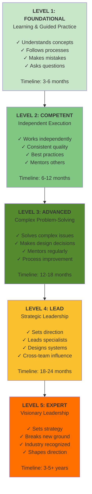

---

## 2. UNIVERSAL SKILLS (All 287 Agents)

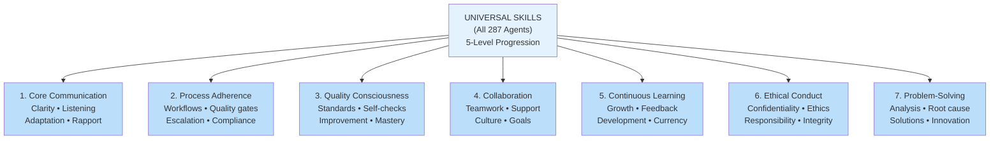

---

## 3. DESIGN DEPARTMENT SKILLS (6 Core Skills)

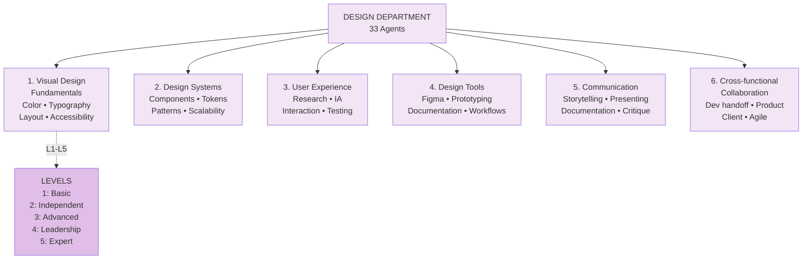

---

## 4. SOCIAL MEDIA DEPARTMENT SKILLS (6 Core Skills)

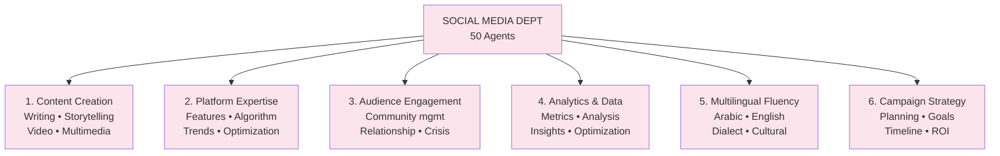

---

## 5. DEVELOPMENT DEPARTMENT SKILLS (6 Core Skills)

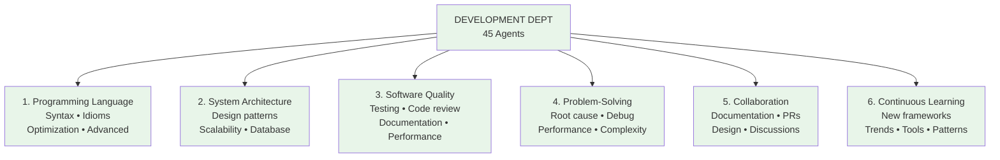

---

## 6. FINANCE DEPARTMENT SKILLS (6 Core Skills)

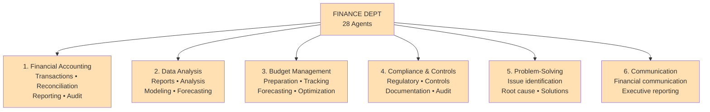

---

## 7. MANAGER SKILLS HIERARCHY

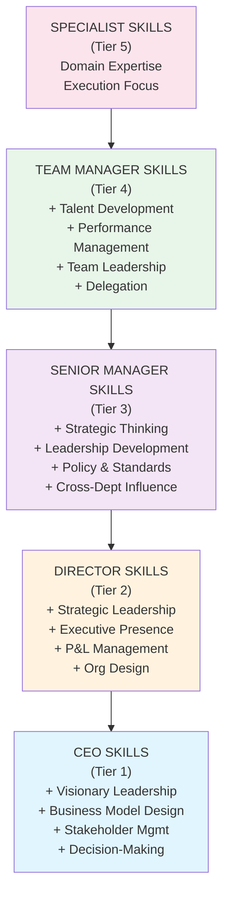

---

## 8. CAREER PATHWAYS (IC Track vs Management Track)

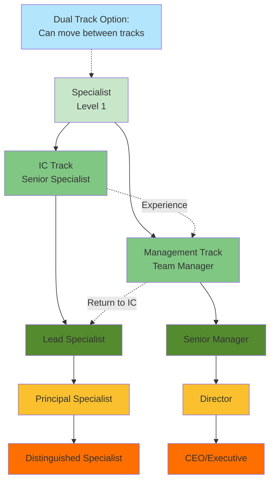

---

## 9. SKILLS ASSESSMENT METHODOLOGY (360-Degree)

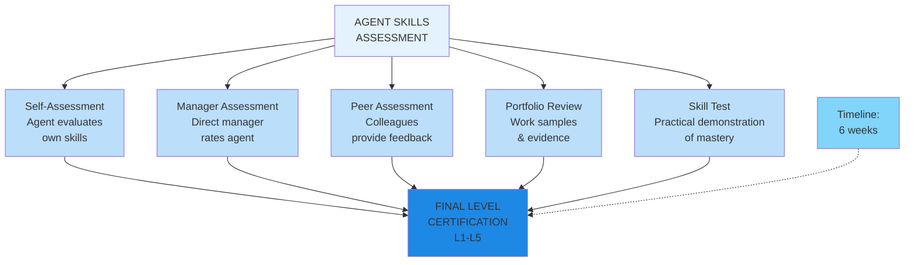

---

## 10. SKILL DEVELOPMENT TIMELINE BY LEVEL

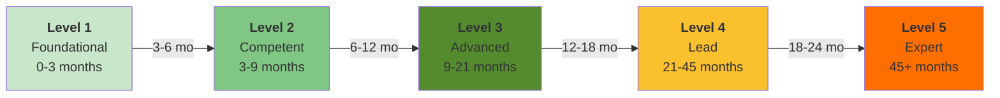

---

## 11. DESIGN SPECIALIST SKILL PROGRESSION

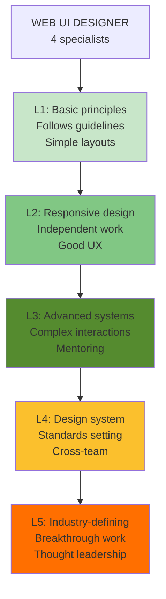

---

## 12. SOCIAL MEDIA SPECIALIST SKILL PROGRESSION

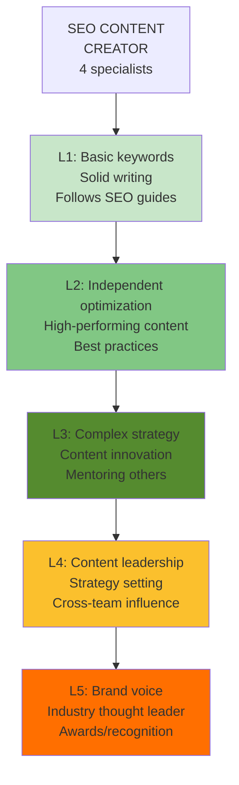

---

## 13. DEVELOPMENT ENGINEER SKILL PROGRESSION

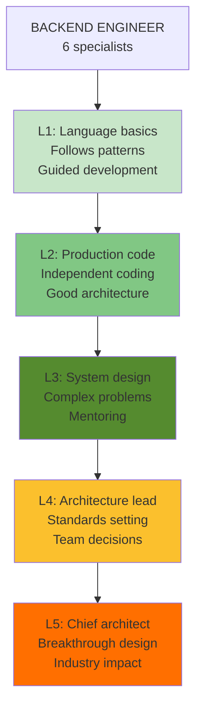

---

## 14. MANAGER SKILL PROGRESSION (Team Manager → Director)

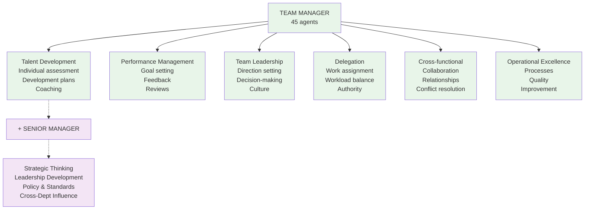

---

## 15. ANNUAL SKILLS INVESTMENT & ROI

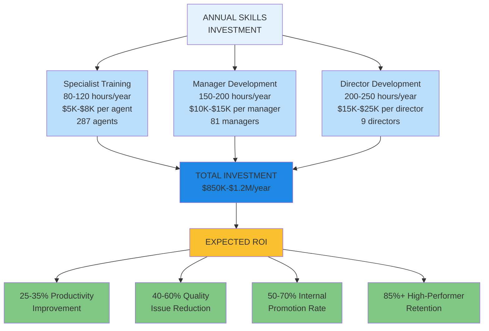

---

## 16. DEPARTMENT SPECIALIST TEAMS (Design)

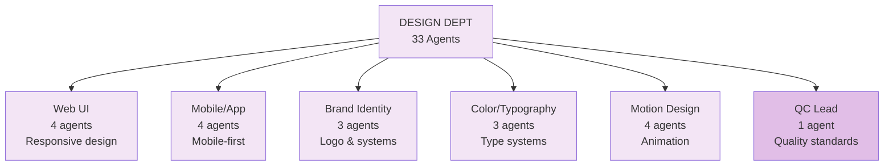

---

## 17. DEPARTMENT SPECIALIST TEAMS (Development)

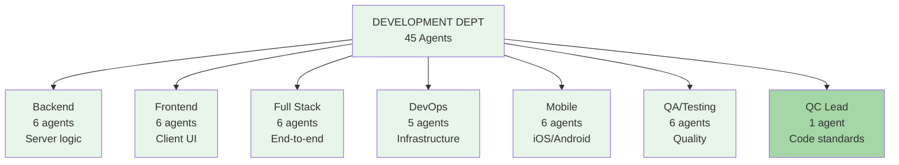

---

## 18. CONTINUOUS LEARNING CYCLE

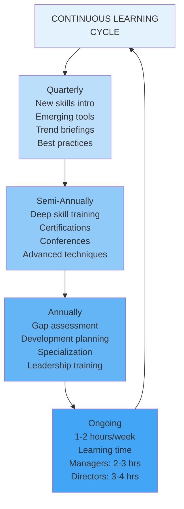

---

## 19. SKILLS BY DEPARTMENT - DISTRIBUTION

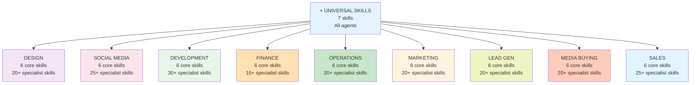

---

## 20. SKILLS ASSESSMENT CERTIFICATION LEVELS

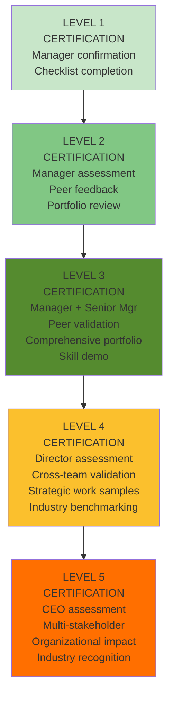

---

**All skills diagrams ready for implementation and training delivery.**
