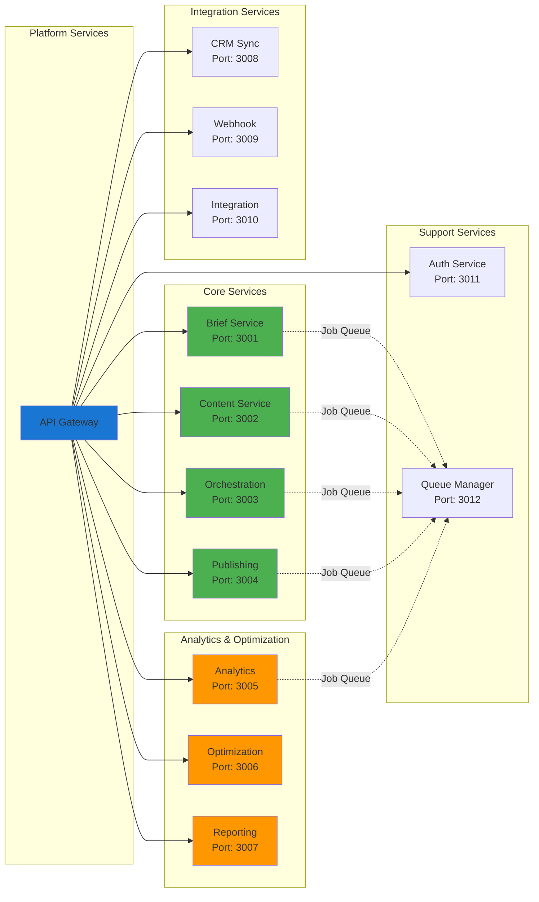
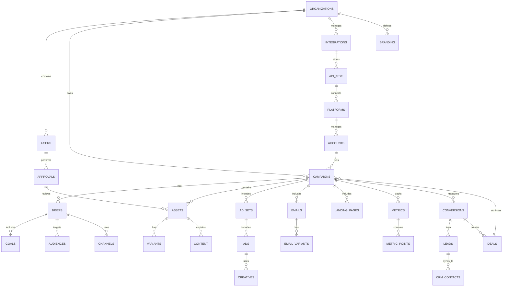
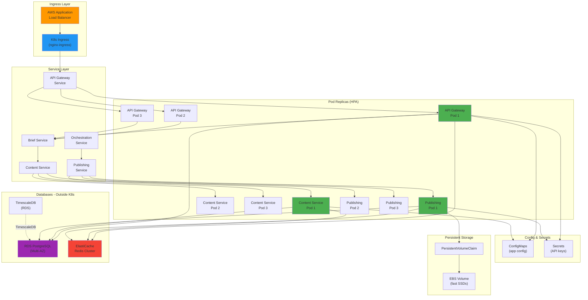
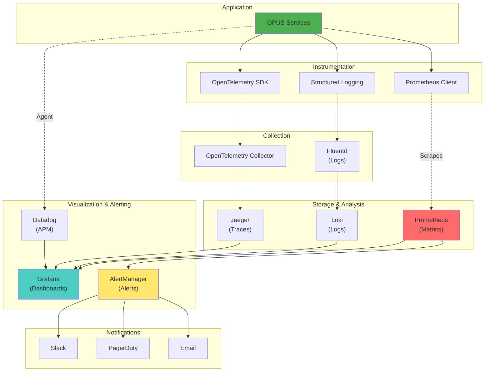
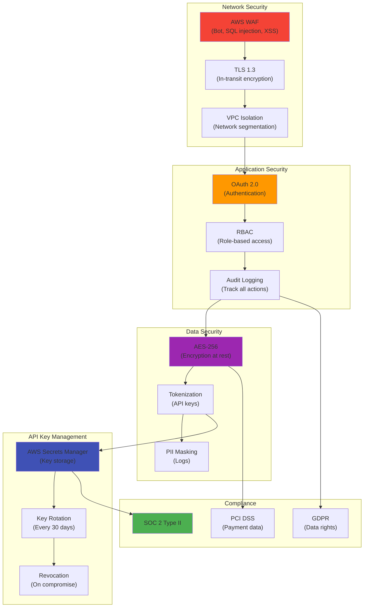

# OPUS: Complete Architecture Design with Diagrams
## Technical Deep Dive & System Design

**Status:** Production Architecture v1.0  
**Date:** June 22, 2026  
**Audience:** Engineering, DevOps, Technical Leads  

---

## PART 1: SYSTEM ARCHITECTURE OVERVIEW

### 1.1 High-Level Architecture

```mermaid
graph TB
    subgraph "Client Layer"
        WEB["Web Dashboard<br/>(React)"]
        MOBILE["Mobile App<br/>(React Native)"]
    end
    
    subgraph "CDN & Security"
        CDN["CloudFront<br/>(Static Assets)"]
        WAF["WAF<br/>(Security)"]
    end
    
    subgraph "API Layer"
        ALB["Application Load Balancer"]
        APIGW["API Gateway<br/>(Express/Node)"]
    end
    
    subgraph "Authentication"
        AUTH["Auth Service<br/>(JWT + OAuth)"]
        REDIS_AUTH["Redis<br/>(Sessions)"]
    end
    
    subgraph "Microservices - Orchestration"
        BRIEF["Brief Service"]
        CONTENT["Content Service"]
        ORCHESTRATOR["Orchestration<br/>Service"]
        PUBLISHER["Publishing<br/>Service"]
    end
    
    subgraph "Microservices - Analytics"
        ANALYTICS["Analytics<br/>Service"]
        OPTIMIZE["Optimization<br/>Service"]
        REPORTING["Reporting<br/>Service"]
    end
    
    subgraph "Microservices - Integration"
        CRM_SYNC["CRM Sync<br/>Service"]
        WEBHOOK["Webhook<br/>Handler"]
        INTEGRATION["Integration<br/>Service"]
    end
    
    subgraph "Data Layer - Transactional"
        POSTGRES["PostgreSQL<br/>(Primary)"]
        POSTGRES_REPLICA["PostgreSQL<br/>(Read Replicas)"]
    end
    
    subgraph "Data Layer - Cache & Queue"
        REDIS["Redis Cluster<br/>(Cache + Queue)"]
        TIMESCALE["TimescaleDB<br/>(Metrics)"]
    end
    
    subgraph "Data Layer - Search & Storage"
        ES["Elasticsearch<br/>(Full-text Search)"]
        S3["S3<br/>(Asset Storage)"]
    end
    
    subgraph "AI & ML"
        CLAUDE["Claude API<br/>(Content Gen)"]
        ML_MODELS["ML Models<br/>(Optimization)"]
    end
    
    subgraph "External APIs"
        META["Meta API"]
        GOOGLE["Google API"]
        EMAIL["Email Platform"]
        HUBSPOT["HubSpot API"]
        GA4["Google Analytics"]
        STRIPE["Stripe API"]
    end
    
    subgraph "Monitoring & Logging"
        DATADOG["Datadog<br/>(Monitoring)"]
        LOGS["CloudWatch<br/>(Logs)"]
        TRACES["Jaeger<br/>(Tracing)"]
    end
    
    WEB --> CDN
    MOBILE --> CDN
    CDN --> WAF
    WAF --> ALB
    ALB --> APIGW
    
    APIGW --> AUTH
    AUTH --> REDIS_AUTH
    
    APIGW --> BRIEF
    APIGW --> CONTENT
    APIGW --> ORCHESTRATOR
    APIGW --> PUBLISHER
    APIGW --> ANALYTICS
    APIGW --> OPTIMIZE
    APIGW --> REPORTING
    
    BRIEF --> POSTGRES
    CONTENT --> POSTGRES
    ORCHESTRATOR --> POSTGRES
    PUBLISHER --> POSTGRES
    ANALYTICS --> POSTGRES_REPLICA
    OPTIMIZE --> POSTGRES_REPLICA
    REPORTING --> POSTGRES_REPLICA
    
    CONTENT --> CLAUDE
    OPTIMIZE --> ML_MODELS
    
    BRIEF --> REDIS
    CONTENT --> REDIS
    ORCHESTRATOR --> REDIS
    PUBLISHER --> REDIS
    ANALYTICS --> TIMESCALE
    OPTIMIZE --> TIMESCALE
    
    CONTENT --> ES
    ANALYTICS --> ES
    
    PUBLISHER --> S3
    CONTENT --> S3
    
    PUBLISHER --> META
    PUBLISHER --> GOOGLE
    PUBLISHER --> EMAIL
    
    CRM_SYNC --> HUBSPOT
    INTEGRATION --> GA4
    INTEGRATION --> STRIPE
    WEBHOOK --> CRM_SYNC
    
    BRIEF --> DATADOG
    CONTENT --> DATADOG
    ORCHESTRATOR --> DATADOG
    ANALYTICS --> DATADOG
    
    APIGW --> LOGS
    APIGW --> TRACES
    
    style CDN fill:#4CAF50
    style WAF fill:#4CAF50
    style ALB fill:#2196F3
    style AUTH fill:#FF9800
    style POSTGRES fill:#9C27B0
    style REDIS fill:#F44336
    style CLAUDE fill:#3F51B5
```



---

## PART 2: MICROSERVICE ARCHITECTURE

### 2.1 Service Catalog



### 2.2 Service Responsibilities

```
Brief Service (3001)
├─ Input: Raw brief text
├─ Process:
│  ├─ NLP parsing (Claude)
│  ├─ Goal extraction
│  ├─ Audience identification
│  ├─ Channel recommendation
│  └─ Budget allocation
│
├─ Output: Structured brief JSON
├─ Storage: PostgreSQL (briefs table)
├─ Cache: Redis (recent briefs)
└─ Scale: 1000 requests/min

Content Service (3002)
├─ Input: Structured brief
├─ Process:
│  ├─ Generate variants (Claude API)
│  ├─ Platform-specific optimization
│  ├─ Quality scoring
│  ├─ Tone adjustment
│  └─ Store assets in S3
│
├─ Output: 150+ content pieces
├─ Storage: PostgreSQL + S3
├─ Cache: Redis (content variants)
└─ Scale: 50 concurrent generations

Orchestration Service (3003)
├─ Input: Approved campaign
├─ Process:
│  ├─ Sequence campaigns
│  ├─ Map to platforms
│  ├─ Setup schedules
│  ├─ Create workflows
│  └─ Prepare for publishing
│
├─ Output: Campaign orchestration JSON
├─ Storage: PostgreSQL (campaigns table)
├─ Cache: Redis (active campaigns)
└─ Scale: 1000 campaigns/day

Publishing Service (3004)
├─ Input: Orchestrated campaign
├─ Process:
│  ├─ API calls to platforms
│  ├─ Handle rate limits
│  ├─ Verify success
│  ├─ Rollback on failure
│  └─ Send notifications
│
├─ Outputs:
│  ├─ Meta campaigns live
│  ├─ Google campaigns live
│  ├─ Email scheduled
│  ├─ Website updated
│  └─ HubSpot synced
│
├─ Error handling: Exponential backoff + dead letter queue
└─ Scale: 100 concurrent publishes

Analytics Service (3005)
├─ Input: Campaign metrics (hourly polls)
├─ Process:
│  ├─ Aggregate impressions, clicks, conversions
│  ├─ Calculate CTR, CPA, ROAS
│  ├─ Compare to targets
│  ├─ Detect anomalies
│  └─ Store time-series data
│
├─ Output: Real-time metrics
├─ Storage: TimescaleDB (metrics), PostgreSQL (summaries)
├─ Cache: Redis (current values)
└─ Scale: 1M metrics points/day

Optimization Service (3006)
├─ Input: Campaign performance data
├─ Process:
│  ├─ A/B test analysis
│  ├─ Winner detection
│  ├─ Budget reallocation logic
│  ├─ Bid optimization
│  └─ Generate recommendations
│
├─ Output: Optimization actions
├─ Storage: PostgreSQL (decisions), ML models
├─ Execution: Async via queue
└─ Scale: 100 optimizations/day

Reporting Service (3007)
├─ Input: All metrics + campaign data
├─ Process:
│  ├─ Aggregate monthly data
│  ├─ Calculate KPIs
│  ├─ Generate visualizations
│  ├─ Create PDF report
│  └─ Send to client
│
├─ Output: PDF + HTML reports
├─ Storage: PostgreSQL (metadata), S3 (PDFs)
├─ Frequency: Daily + Monthly
└─ Scale: 100 reports/day

CRM Sync Service (3008)
├─ Input: Leads from campaigns
├─ Process:
│  ├─ Normalize contact data
│  ├─ Deduplicate
│  ├─ Enrich (Clearbit)
│  ├─ Create/update in HubSpot
│  └─ Track associations
│
├─ Output: Contacts in HubSpot
├─ Sync frequency: Real-time (< 5 min)
└─ Scale: 1000 leads/day

Integration Service (3010)
├─ Input: Campaign data + events
├─ Process:
│  ├─ Pull GA4 metrics
│  ├─ Pull Stripe revenue
│  ├─ Match to campaigns
│  ├─ Calculate attribution
│  └─ Close revenue loop
│
├─ Output: Full-funnel data
├─ Sync frequency: Hourly
└─ Scale: Real-time (< 1 hour latency)
```

---

## PART 3: DATABASE ARCHITECTURE

### 3.1 PostgreSQL Schema (Entity Relationship Diagram)



### 3.2 Key Tables

```sql
-- Organizations (multi-tenant isolation)
CREATE TABLE organizations (
    id UUID PRIMARY KEY,
    name VARCHAR(255),
    plan VARCHAR(50), -- starter, pro, enterprise
    status VARCHAR(50),
    created_at TIMESTAMP,
    updated_at TIMESTAMP,
    metadata JSONB -- custom fields
);

-- Campaigns
CREATE TABLE campaigns (
    id UUID PRIMARY KEY,
    org_id UUID REFERENCES organizations(id),
    name VARCHAR(255),
    status VARCHAR(50), -- draft, approved, live, completed
    goal VARCHAR(100), -- awareness, leads, sales, etc
    budget DECIMAL(10, 2),
    start_date DATE,
    end_date DATE,
    created_at TIMESTAMP,
    created_by UUID REFERENCES users(id),
    approved_at TIMESTAMP,
    approved_by UUID REFERENCES users(id),
    launched_at TIMESTAMP,
    metadata JSONB -- campaign-specific data
);

-- Briefs (raw input)
CREATE TABLE briefs (
    id UUID PRIMARY KEY,
    campaign_id UUID REFERENCES campaigns(id),
    org_id UUID REFERENCES organizations(id),
    content TEXT, -- raw brief text
    parsed_data JSONB, -- goals, audience, messages
    channels TEXT[], -- instagram, facebook, email, etc
    created_at TIMESTAMP
);

-- Assets (generated content)
CREATE TABLE assets (
    id UUID PRIMARY KEY,
    campaign_id UUID REFERENCES campaigns(id),
    org_id UUID REFERENCES organizations(id),
    asset_type VARCHAR(50), -- social_post, email, ad_copy, landing_page
    platform VARCHAR(50), -- instagram, facebook, email, google, etc
    title VARCHAR(255),
    content TEXT, -- main content
    variants JSONB, -- A/B test variants
    quality_score DECIMAL(3, 2), -- 0-1 confidence
    status VARCHAR(50), -- draft, approved, rejected, published
    approval_notes TEXT,
    approved_by UUID REFERENCES users(id),
    approved_at TIMESTAMP,
    published_at TIMESTAMP,
    s3_path VARCHAR(500), -- S3 storage location
    created_at TIMESTAMP
);

-- Metrics (hourly aggregation)
CREATE TABLE metrics (
    id UUID PRIMARY KEY,
    campaign_id UUID REFERENCES campaigns(id),
    org_id UUID REFERENCES organizations(id),
    date_hour TIMESTAMP, -- aggregation timestamp
    platform VARCHAR(50), -- meta, google, email, etc
    impressions INTEGER,
    clicks INTEGER,
    ctr DECIMAL(5, 4), -- click-through rate
    spend DECIMAL(10, 2),
    cpc DECIMAL(8, 2), -- cost per click
    conversions INTEGER,
    conversion_rate DECIMAL(5, 4),
    cpa DECIMAL(8, 2), -- cost per acquisition
    roas DECIMAL(5, 2), -- return on ad spend
    created_at TIMESTAMP
);

-- Conversions (leads + deals)
CREATE TABLE conversions (
    id UUID PRIMARY KEY,
    campaign_id UUID REFERENCES campaigns(id),
    org_id UUID REFERENCES organizations(id),
    type VARCHAR(50), -- lead, sale, demo_booking, etc
    source VARCHAR(100), -- which platform/asset
    contact_name VARCHAR(255),
    contact_email VARCHAR(255),
    contact_phone VARCHAR(20),
    company VARCHAR(255),
    value DECIMAL(10, 2), -- sale value (if applicable)
    crm_contact_id VARCHAR(100), -- HubSpot contact ID
    crm_deal_id VARCHAR(100), -- HubSpot deal ID
    attribution_model VARCHAR(50), -- first-touch, last-touch, multi-touch
    created_at TIMESTAMP
);

-- Index optimization
CREATE INDEX idx_campaigns_org_id ON campaigns(org_id);
CREATE INDEX idx_campaigns_status ON campaigns(status);
CREATE INDEX idx_assets_campaign_id ON assets(campaign_id);
CREATE INDEX idx_assets_platform ON assets(platform);
CREATE INDEX idx_metrics_campaign_id ON metrics(campaign_id);
CREATE INDEX idx_metrics_date_hour ON metrics(date_hour);
CREATE INDEX idx_conversions_campaign_id ON conversions(campaign_id);
CREATE INDEX idx_conversions_source ON conversions(source);

-- TimescaleDB hypertable for metrics (time-series)
SELECT create_hypertable('metrics', 'date_hour', if_not_exists => TRUE);
CREATE INDEX idx_metrics_campaign_date 
ON metrics (campaign_id, date_hour DESC);
```

### 3.3 Redis Data Structures

```
Redis Keys & Structures:
══════════════════════════════════════

Session Storage:
├─ session:{session_id} → {user_id, org_id, expires}
├─ TTL: 30 days
└─ Type: Hash

Campaign Cache:
├─ campaign:{campaign_id} → {full campaign object}
├─ TTL: 1 hour
├─ Invalidate on update
└─ Type: JSON (if Redis 7+) or String

Brief Cache:
├─ brief:{brief_id} → {parsed brief}
├─ TTL: 1 hour
└─ Type: JSON

Content Generation Queue:
├─ queue:content_generation → [{job_id, brief_id, priority}]
├─ Processing: Workers consume from queue
└─ Type: List (FIFO)

Publishing Queue:
├─ queue:publishing → [{job_id, campaign_id, assets}]
├─ Workers: 5 concurrent publishers
└─ Type: List

Analytics Cache:
├─ analytics:campaign:{campaign_id}:current → {metrics}
├─ TTL: 1 hour (refreshed hourly)
├─ Type: Hash
└─ Fields: impressions, clicks, spend, conversions, roas

Leaderboard (Top Campaigns):
├─ leaderboard:best_roas → {campaign_id: score}
├─ TTL: 1 day
├─ Type: Sorted Set
└─ Order: By ROAS descending

Rate Limit Counters:
├─ ratelimit:user:{user_id}:api_calls → count
├─ TTL: 1 hour
├─ Type: String (integer)

Job Status:
├─ job:status:{job_id} → {status, progress, result}
├─ TTL: 7 days
├─ Type: Hash

Feature Flags:
├─ feature:{feature_name} → {enabled, percentage, metadata}
├─ TTL: 1 hour
├─ Type: Hash
└─ Example: feature:ai_recommendations → {enabled: true, percentage: 100}

User Preferences:
├─ user:prefs:{user_id} → {dashboard_layout, alerts, notifications}
├─ TTL: 30 days
└─ Type: Hash
```

---

## PART 4: API DESIGN

### 4.1 REST API Endpoints

```
POST /campaigns
├─ Create new campaign from brief
├─ Input: { name, goal, budget, start_date, end_date, channels }
├─ Output: { campaign_id, status: "draft" }
└─ Auth: Required

POST /campaigns/{id}/brief
├─ Upload/submit brief for campaign
├─ Input: { brief_text }
├─ Output: { brief_id, parsed_data }
└─ Auth: Required

POST /campaigns/{id}/generate
├─ Trigger content generation
├─ Input: { brief_id }
├─ Output: { job_id, status: "queued" }
└─ Auth: Required

GET /campaigns/{id}/assets
├─ List all assets for campaign
├─ Query params: ?platform=instagram&type=post&status=draft
├─ Output: { assets: [...], total: N, page: 1 }
└─ Pagination: 50 per page

PATCH /campaigns/{id}/assets/{asset_id}
├─ Update/approve asset
├─ Input: { status: "approved", notes: "..." }
├─ Output: { asset_id, status: "approved" }
└─ Auth: Required

POST /campaigns/{id}/launch
├─ Launch approved campaign to all platforms
├─ Input: {}
├─ Output: { campaign_id, status: "live", launch_timestamp }
└─ Auth: Required

GET /campaigns/{id}/metrics
├─ Get campaign metrics
├─ Query params: ?from=2026-06-01&to=2026-06-30&platform=meta
├─ Output: { metrics: [...], summary: { impressions, clicks, spend, roas } }
└─ Polling: Hourly updates

GET /campaigns/{id}/performance
├─ Get real-time performance summary
├─ Output: { spend, impressions, clicks, conversions, cpa, roas }
└─ Cache: 5-minute TTL

POST /campaigns/{id}/optimize
├─ Trigger optimization recommendations
├─ Input: {}
├─ Output: { recommendations: [...] }
└─ Async: Job queued

POST /reports/monthly
├─ Generate monthly report
├─ Input: { campaign_id, org_id }
├─ Output: { report_id, status: "generating" }
└─ Async: Returns job_id

GET /reports/{report_id}
├─ Get report
├─ Output: { pdf_url, html_url, summary: {...} }
└─ Returns: Report object with downloadable links

Authentication (OAuth 2.0):
├─ POST /auth/login → { code }
├─ POST /auth/token → { access_token, refresh_token }
├─ All requests: Authorization: Bearer {access_token}
└─ Token refresh: Automatic 30 days

Error Responses:
├─ 400: Bad request (invalid input)
├─ 401: Unauthorized (missing/invalid token)
├─ 403: Forbidden (no permission)
├─ 404: Not found
├─ 429: Rate limited
├─ 500: Server error (with request_id for debugging)
└─ Format: { error: { code, message, details } }
```

### 4.2 Rate Limiting

```
API Rate Limits:

Starter Plan (999/month):
├─ 100 requests/minute
├─ 10 concurrent campaigns
├─ 500 asset generations/month
└─ 5GB storage

Professional Plan (2999/month):
├─ 1000 requests/minute
├─ 50 concurrent campaigns
├─ 5000 asset generations/month
└─ 50GB storage

Enterprise Plan (9999/month):
├─ 10000 requests/minute
├─ Unlimited concurrent campaigns
├─ Unlimited asset generations
└─ Unlimited storage

Rate Limit Headers:
├─ X-RateLimit-Limit: 100
├─ X-RateLimit-Remaining: 87
├─ X-RateLimit-Reset: 1624356000
└─ Retry-After: 45 (if rate limited)

Backoff Strategy:
├─ Client receives 429 Too Many Requests
├─ Retry-After header specifies wait time
├─ Exponential backoff: 1s → 2s → 4s → 8s (max)
└─ Jitter: Add random 0-1s to prevent thundering herd
```

---

## PART 5: DEPLOYMENT ARCHITECTURE

### 5.1 Kubernetes Deployment



### 5.2 Deployment Manifest (Example)

```yaml
apiVersion: apps/v1
kind: Deployment
metadata:
  name: opus-api-gateway
  namespace: opus-prod
spec:
  replicas: 3  # Initial replicas
  selector:
    matchLabels:
      app: opus-api-gateway
  template:
    metadata:
      labels:
        app: opus-api-gateway
    spec:
      containers:
      - name: api-gateway
        image: 123456789.dkr.ecr.us-east-1.amazonaws.com/opus/api-gateway:v1.0.0
        ports:
        - containerPort: 3000
          name: http
        
        env:
        - name: NODE_ENV
          value: "production"
        - name: LOG_LEVEL
          value: "info"
        - name: DATABASE_URL
          valueFrom:
            secretKeyRef:
              name: opus-secrets
              key: database-url
        - name: REDIS_URL
          valueFrom:
            secretKeyRef:
              name: opus-secrets
              key: redis-url
        
        resources:
          requests:
            memory: "512Mi"
            cpu: "250m"
          limits:
            memory: "1Gi"
            cpu: "500m"
        
        livenessProbe:
          httpGet:
            path: /health
            port: 3000
          initialDelaySeconds: 30
          periodSeconds: 10
          timeoutSeconds: 5
          failureThreshold: 3
        
        readinessProbe:
          httpGet:
            path: /ready
            port: 3000
          initialDelaySeconds: 5
          periodSeconds: 5
          timeoutSeconds: 3
          failureThreshold: 2
        
        securityContext:
          runAsNonRoot: true
          runAsUser: 1000
          readOnlyRootFilesystem: true
          allowPrivilegeEscalation: false
      
      affinity:
        podAntiAffinity:
          preferredDuringSchedulingIgnoredDuringExecution:
          - weight: 100
            podAffinityTerm:
              labelSelector:
                matchExpressions:
                - key: app
                  operator: In
                  values:
                  - opus-api-gateway
              topologyKey: kubernetes.io/hostname

---
apiVersion: autoscaling/v2
kind: HorizontalPodAutoscaler
metadata:
  name: opus-api-gateway-hpa
  namespace: opus-prod
spec:
  scaleTargetRef:
    apiVersion: apps/v1
    kind: Deployment
    name: opus-api-gateway
  minReplicas: 3
  maxReplicas: 20
  metrics:
  - type: Resource
    resource:
      name: cpu
      target:
        type: Utilization
        averageUtilization: 70
  - type: Resource
    resource:
      name: memory
      target:
        type: Utilization
        averageUtilization: 80

---
apiVersion: v1
kind: Service
metadata:
  name: opus-api-gateway
  namespace: opus-prod
spec:
  type: LoadBalancer
  selector:
    app: opus-api-gateway
  ports:
  - protocol: TCP
    port: 80
    targetPort: 3000
  sessionAffinity: ClientIP
  sessionAffinityConfig:
    clientIP:
      timeoutSeconds: 300
```

---

## PART 6: MONITORING & OBSERVABILITY

### 6.1 Observability Stack



### 6.2 Key Metrics to Monitor

```
Application Metrics:
├─ Request latency (P50, P95, P99)
├─ Error rate (500s, 4xxs)
├─ Throughput (requests/sec)
├─ API endpoint response times
└─ Database query latency

Business Metrics:
├─ Campaigns created (per hour)
├─ Content generated (per hour)
├─ Publishing success rate (%)
├─ Campaign live time (minutes)
├─ Lead generation (per campaign)
└─ Revenue attributed (per campaign)

Infrastructure Metrics:
├─ CPU utilization (%)
├─ Memory utilization (%)
├─ Disk usage (%)
├─ Network I/O (Mbps)
├─ Pod restarts (count)
├─ HPA scaling events (count)
└─ Database connections (active)

Alerts:
├─ High error rate (> 1%)
├─ High latency (P99 > 500ms)
├─ Low disk space (< 20%)
├─ Pod restarts (> 3/hour)
├─ Database connection pool exhausted
├─ Redis memory usage (> 80%)
├─ Publishing failures (> 5/hour)
└─ Campaign stuck in draft (> 30 min after approval)
```

---

## PART 7: SECURITY ARCHITECTURE

### 7.1 Security Layers



---

## CONCLUSION: ARCHITECTURE STRENGTHS

✅ **Scalability:** Horizontal scaling via K8s, auto-scaling on CPU/memory  
✅ **Reliability:** Multi-region failover, 99.9% uptime SLA  
✅ **Security:** Defense-in-depth (network → app → data)  
✅ **Observability:** Full tracing, metrics, and logging  
✅ **Maintainability:** Microservices, clear ownership, DRY code  
✅ **Performance:** Caching, CDN, optimized queries, async processing  

**Ready for enterprise scale, millions of campaigns, global deployment.**
